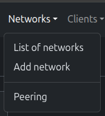
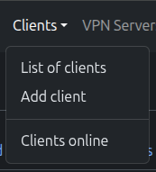
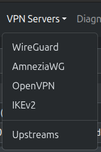
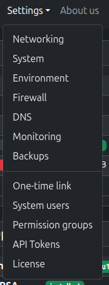

# Description


## Overview

**PUQVPNCP** is a comprehensive VPN server management panel that supports four VPN protocols simultaneously: **WireGuard**, **AmneziaWG**, **OpenVPN**, and **IKEv2/IPsec**. It provides a modern web interface for managing VPN networks, clients, firewall rules, traffic control, and monitoring — all from a single dashboard.

The panel is designed for VPN service providers, hosting companies, and system administrators who need to manage hundreds or thousands of VPN clients across multiple networks with fine-grained control over bandwidth, routing, and anti-censorship security.

---

## Key Features

### Multi-Protocol Support

PUQVPNCP is unique in supporting **four VPN protocols at once** on the same server:

| Protocol | Technology | Best For |
|----------|-----------|----------|
| **WireGuard** | Modern kernel-level VPN | Speed, low latency, mobile devices |
| **AmneziaWG** | Obfuscated WireGuard fork | Evading Deep Packet Inspection (DPI), strict censorship, ISP blocking |
| **OpenVPN** | Battle-tested SSL/TLS VPN | Compatibility, restrictive networks |
| **IKEv2/IPsec** | Native OS support (strongSwan) | iOS, macOS, Windows — native connection, no app required |

Each client can connect via **any** enabled protocol using the **same IP address**. The panel automatically generates configuration files, QR codes, and certificates for each protocol.

### Network Architecture

```
                   +--------------------------------------+
                   |          PUQVPNCP Server             |
                   |                                      |
Internet <---------|  Network A (10.0.0.0/24)             |
                   |    |-- WireGuard  (wg51820)          |
                   |    |-- AmneziaWG  (awg51821)         |
                   |    |-- OpenVPN    (ovpn1197)         |
                   |    +-- IKEv2      (strongSwan)       |
                   |                                      |
Upstream VPN <-----|  Network B (10.100.1.0/24)           |
(wgup0)            |    |-- WireGuard  (wg51822)          |
                   |    |-- AmneziaWG  (awg51823)         |
                   |    |-- OpenVPN    (ovpn1198)         |
                   |    +-- IKEv2      (strongSwan)       |
                   |                                      |
                   |  Network C (10.100.2.0/24)           |
                   |    +-- ...                           |
                   +--------------------------------------+
```

- **Networks** define subnets, upstream routing, bandwidth limits, and protocol settings
- **Clients** belong to a network and inherit its configuration
- **Upstreams** allow routing network traffic through external WireGuard VPN servers

### Upstream Tunnels

Route client traffic through external WireGuard VPN servers for:

- **Geographic IP rotation** — clients appear from different countries
- **Multi-hop privacy** — add an extra encryption layer
- **ISP bypass** — route traffic through a clean IP when your server IP is blocked
- **Dedicated exit nodes** — separate business and personal traffic

### Per-Network Control

Each network operates independently with its own:

- Subnet (IPv4 and IPv6)
- VPN protocol settings and ports
- Bandwidth limits (download/upload per network and per client)
- Firewall rules (filter, NAT, DNAT, mangle)
- Traffic control classes
- Upstream (direct internet or WireGuard tunnel)
- Custom routes pushed to clients
- Port forwarding rules

### Security & Access Control

- **Role-based access** — permission groups with 36+ granular permissions
- **Multi-user** — multiple administrators with different access levels
- **API tokens** — create tokens with IP restrictions and expiration dates
- **Session security** — IP-pinned sessions, login lockout protection
- **Automatic firewall** — per-network isolation via ipset, per-client mangle rules

### Operations

- **Traffic monitoring** — per-client and per-network traffic statistics with daily breakdown
- **Real-time bandwidth** — live traffic control with drops, overlimits, throughput
- **InfluxDB + Grafana** — export metrics for advanced dashboards
- **Backups** — automatic daily/hourly backups with FTP upload support
- **One-time links** — generate self-service configuration links for end users
- **REST API** — 170+ endpoints with full OpenAPI 3.0 documentation

---

## Navigation

The web interface is organized into dropdown menus:

| | | | |
|---|---|---|---|
|  |  |  |  |
| *Networks* | *Clients* | *VPN Servers* | *Settings* |

- **Networks** — list, add networks, and manage peering
- **Clients** — list, add clients, and view online connections
- **VPN Servers** — configure WireGuard, AmneziaWG, OpenVPN, IKEv2, and Upstreams
- **Settings** — networking, system, environment, firewall, DNS, monitoring, backups, OTL, users, permissions, API tokens, license

---

## Technical Specifications

| Component | Details |
|-----------|---------|
| **OS** | Debian 12/13, Ubuntu 22.04+ |
| **Protocols** | WireGuard, AmneziaWG, OpenVPN 2.6+, IKEv2 (strongSwan 6.x) |
| **Web Interface** | HTTPS with Let's Encrypt auto-SSL |
| **API** | REST API, 170+ endpoints, OpenAPI 3.0 |
| **DNS** | Built-in bind9 DNS server |
| **Firewall** | iptables/ip6tables with ipset |
| **Monitoring** | rsyslog + telegraf + InfluxDB |
| **Themes** | Light / Dark / Auto (system) |
| **Max Clients** | 16,383 per server (across all networks) |
| **Binary** | Single ~34MB Go binary, no runtime dependencies |

---

## Architecture Overview

```
+-----------------------------------------------------------------+
|                        Web Interface                            |
|                  (Bootstrap 5, jQuery, AJAX)                    |
+-----------------------------------------------------------------+
|                        REST API (Gin)                           |
|                   170+ endpoints, OpenAPI                       |
+-----------------------------------------------------------------+
|                       Core Engine (Go)                          |
|  +----------+ +-----------+ +---------+ +---------+ +---------+ |
|  |WireGuard | | AmneziaWG | | OpenVPN | | IKEv2   | |Firewall | |
|  |  (wg)    | |   (awg)   | |(openvpn)| |(strgSwn)| |(iptables)|
|  +----------+ +-----------+ +---------+ +---------+ +---------+ |
|  +----------+ +-----------+ +---------+ +---------+ +---------+ |
|  |Upstreams | |    DNS    | |   TC    | |Monitoring| |   OTL  | |
|  | (wgupN)  | |  (bind9)  | |  (tc)   | |(telegraf)| |(tokens)| |
|  +----------+ +-----------+ +---------+ +---------+ +---------+ |
+-----------------------------------------------------------------+
|                      Linux Kernel                               |
|   WireGuard / AmneziaWG module, Netfilter, TC, iproute2         |
+-----------------------------------------------------------------+
```

---

## License

PUQVPNCP requires an active license. Licenses can be purchased at:

**[https://puqcloud.com/store/puqvpncp](https://puqcloud.com/store/puqvpncp)**

The license defines the maximum number of VPN clients and is validated periodically through the PUQ Cloud license server.

---
