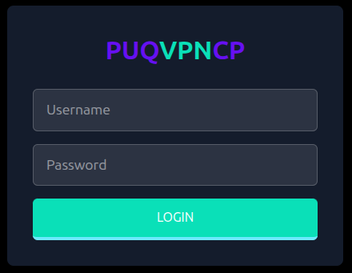

# Installation


## System Requirements

| Requirement | Minimum |
|-------------|---------|
| **OS** | Debian 12/13 or Ubuntu 22.04+ (amd64) |
| **CPU** | 1 core (2+ recommended for 500+ clients) |
| **RAM** | 512 MB (2+ GB recommended) |
| **Disk** | 1 GB free space |
| **Network** | Public IPv4 address, root access |

### Required Packages

The panel automatically manages its dependencies, but the following packages must be available in the system repositories:

| Category | Packages |
|----------|----------|
| **VPN Protocols** | `wireguard`, `wireguard-tools`, `amneziawg-dkms`, `amneziawg-tools`, `openvpn`, `easy-rsa`, `strongswan`, `strongswan-pki` |
| **Network & Firewall** | `iproute2`, `iptables`, `ipset` |
| **DNS** | `bind9`, `bind9-utils` |
| **Monitoring** | `rsyslog`, `telegraf` |
| **Security** | `openssl` |
| **Utilities** | `procps`, `uuid-runtime`, `bash`, `grep`, `gawk` |

> **Note:** You can verify all dependencies after installation using **Settings > Environment** page.

---

## Installation

### Step 1: Download

Download the latest `.deb` package:

```bash
wget https://puqvpncp.com/download/puqvpncp_latest_amd64.deb
```

> All versions are available at: [https://puqvpncp.com/download/](https://puqvpncp.com/download/)

### Step 2: Install Dependencies

```bash
apt update && apt install -y wireguard wireguard-tools openvpn easy-rsa \
  strongswan strongswan-pki iproute2 iptables ipset \
  bind9 bind9-utils rsyslog telegraf openssl \
  procps uuid-runtime bash grep gawk
```

#### Optional: AmneziaWG (Anti-Censorship DPI Bypass)

To enable AmneziaWG, add the official repository and install the kernel module and tools:

```bash
mkdir -p /etc/apt/keyrings && curl -fsSL "https://keyserver.ubuntu.com/pks/lookup?op=get&search=0x75C9DD72C799870E310542E24166F2C257290828" | gpg --dearmor --yes -o /etc/apt/keyrings/amnezia.gpg
echo "deb [signed-by=/etc/apt/keyrings/amnezia.gpg] https://ppa.launchpadcontent.net/amnezia/ppa/ubuntu noble main" > /etc/apt/sources.list.d/amnezia.list
apt update && apt install -y amneziawg-dkms amneziawg-tools
```

### Step 3: Install PUQVPNCP

```bash
dpkg -i puqvpncp_latest_amd64.deb
```

This will:
- Install the `puqvpncp` binary to `/usr/sbin/puqvpncp`
- Create the configuration directory `/etc/puqvpncp/`
- Create the data directory `/usr/local/puqvpncp/`
- Install and enable the `puqvpncp` systemd service

### Step 4: Start the Service

```bash
systemctl start puqvpncp
```

### Step 5: Access the Web Interface

Open your browser and navigate to:

```
http://<your-server-ip>:8098
```

Default credentials:

| Field | Value |
|-------|-------|
| **Username** | `admin` |
| **Password** | `admin` |

> **Important:** Change the default password immediately after first login via **Settings > System Users**.


*Login page -- enter your username and password*

---

## Configuration File

The main configuration file is located at `/etc/puqvpncp/puqvpncp.conf`. It is created automatically on first start with default values. Format: `Key=Value`, one per line. Lines starting with `#` are comments.

```ini
# The port on which the WWW server will be set up. (Default: 8098)
WebPort=8098

# The IPv4 or IPv6 on which the WWW server will be set up. (Default: 0.0.0.0)
WebIP=0.0.0.0

# The IPv4 or IPv6 address from which you can login to the web console.
# Supports multiple IPs delimited by comma. (Default: 0.0.0.0)
AllowedWebIP=0.0.0.0

# Directory for log files (Default: /var/log/puqvpncp/)
LogDir=/var/log/puqvpncp/

# Directory for data files (Default: /usr/local/puqvpncp/)
DataDir=/usr/local/puqvpncp/

# SSL certificate support Let's Encrypt yes/no (Default: no)
# If this option is enabled, then the panel is accessible on the standard port 443.
# The port in the non-ssl protocol is not serviced
LetsEncrypSSL=no

# Domain for SSL certificate generation
# Be sure to check that the domain resolves the IP address of this server
Domain=

# Remove tabs in the Wireguard client configuration.
# Sometimes necessary to support non-official Wireguard clients.
DeleteTabsFromConfig=no

# Session timeout in minutes (Default: 720)
SessionTimeout=720

# Log level: INFO, WARN, ERROR, DEBUG (Default: INFO)
LogLevel=INFO

# Trusted proxy IPs (comma-separated). Leave empty for default Gin behavior.
# Set to 'none' to trust no proxies.
TrustedProxies=

# HTTP request timeout in seconds (Default: 30)
HttpTimeout=30
```

| Parameter | Default | Description |
|-----------|---------|-------------|
| **WebPort** | `8098` | Web interface port. Ignored when `LetsEncrypSSL=yes` (uses 443) |
| **WebIP** | `0.0.0.0` | Listen address (IPv4 or IPv6) |
| **AllowedWebIP** | `0.0.0.0` | Restrict access to specific IPs (comma-separated). `0.0.0.0` = allow all |
| **LogDir** | `/var/log/puqvpncp/` | Log files directory |
| **DataDir** | `/usr/local/puqvpncp/` | Application data directory (networks, clients, configs) |
| **LetsEncrypSSL** | `no` | Enable Let's Encrypt SSL (`yes`/`no`). Requires `Domain` to be set |
| **Domain** | (empty) | Domain for SSL certificate. Must resolve to this server's IP |
| **DeleteTabsFromConfig** | `no` | Remove tabs from WireGuard client configs (for non-official clients) |
| **SessionTimeout** | `720` | Web session timeout in minutes (12 hours) |
| **LogLevel** | `INFO` | Logging verbosity: `DEBUG`, `INFO`, `WARN`, `ERROR` |
| **TrustedProxies** | (empty) | Comma-separated proxy IPs. `none` = trust no proxies |
| **HttpTimeout** | `30` | HTTP request timeout in seconds |

> After enabling `LetsEncrypSSL=yes` and setting `Domain`, restart the service. The web interface switches to port **443** (HTTPS) and obtains a certificate automatically.

---

## Update

### Step 1: Download the New Version

```bash
wget https://puqvpncp.com/download/puqvpncp_latest_amd64.deb
```

### Step 2: Stop the Service

```bash
systemctl stop puqvpncp
```

> **Important:** The service must be stopped before updating. The binary cannot be overwritten while it is running.

### Step 3: Install the Update

```bash
dpkg -i puqvpncp_latest_amd64.deb
```

### Step 4: Start the Service

```bash
systemctl start puqvpncp
```

Your configuration and data are preserved during updates.

---

## Uninstallation

```bash
systemctl stop puqvpncp
apt remove puqvpncp
```

> **Note:** Uninstalling the package does **not** remove your configuration (`/etc/puqvpncp/`) or data (`/usr/local/puqvpncp/`). Remove them manually if needed.

---
