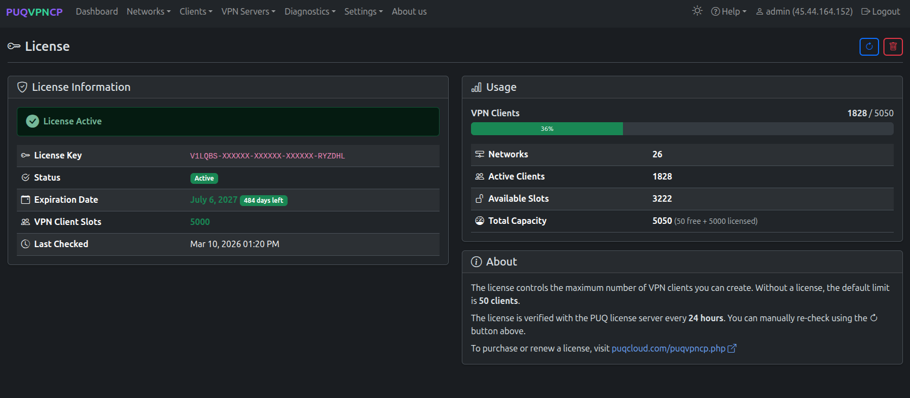
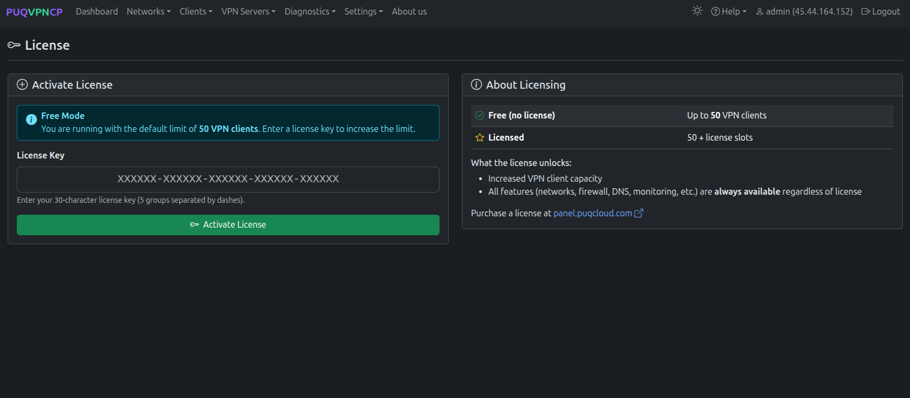
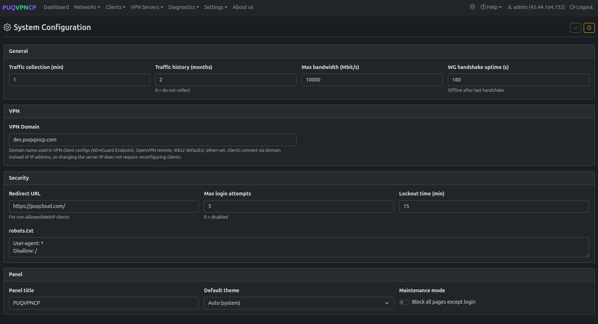
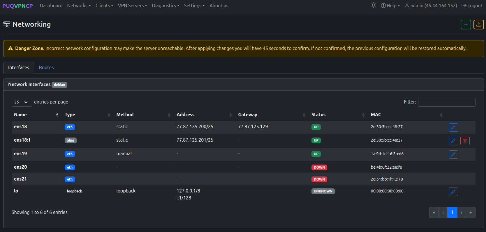
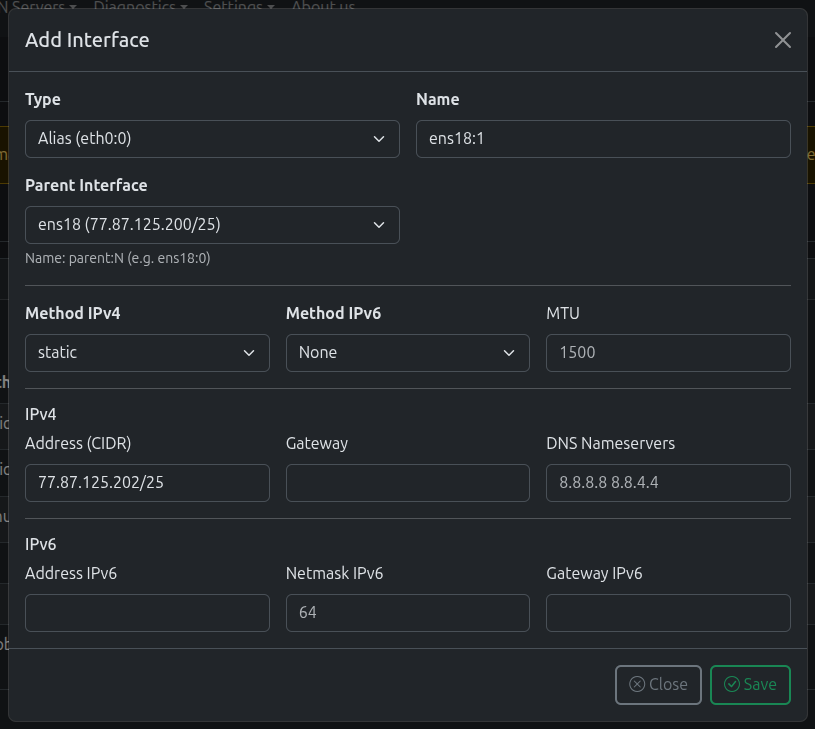
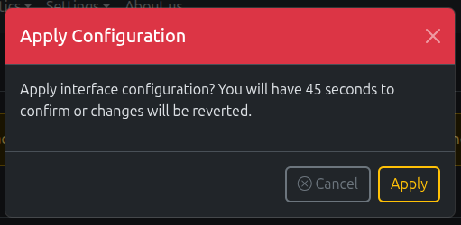
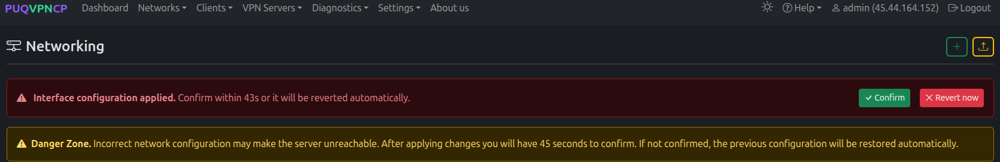
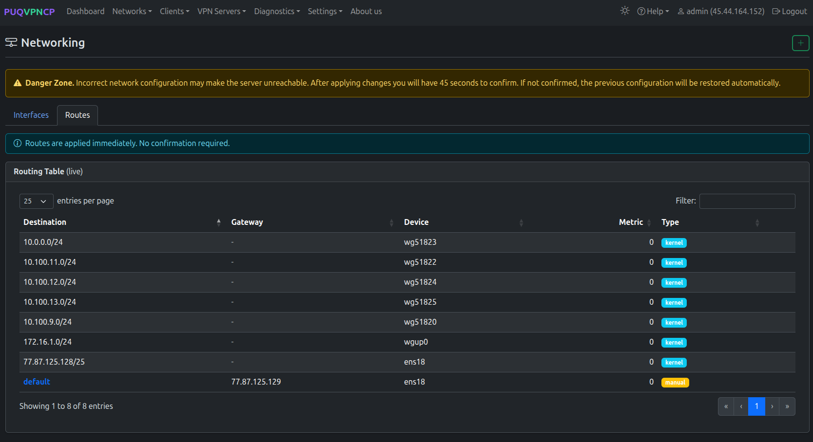
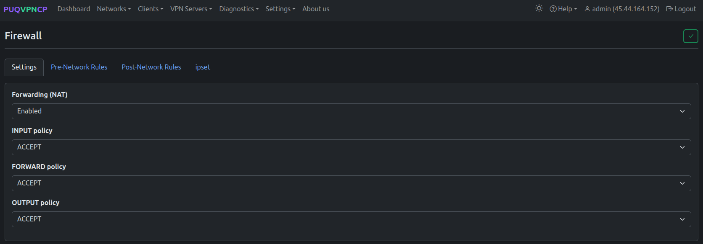
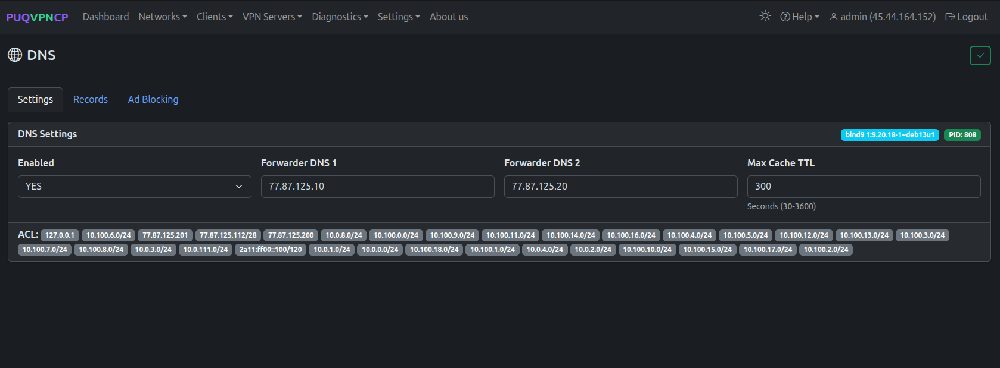

# Initial Setup

After installing PUQVPNCP, follow these steps to configure the server for production use.

## Step 1: Activate the License

1. Navigate to **Settings > License**
2. Enter your license key
3. Click **Save**

*License page — enter your license key*

After activation, the license status will show **Valid** with the expiration date.

*License activated successfully*

> **Purchase a license:** [https://puqcloud.com/store/puqvpncp](https://puqcloud.com/store/puqvpncp)

---

## Step 2: System Configuration

Navigate to **Settings > System** to configure the core settings.

*System configuration page*

### General Settings

| Setting | Description | Default |
|---------|-------------|---------|
| **Traffic collection (min)** | How often traffic counters are read from iptables | 1 |
| **Traffic history (months)** | How long traffic data is retained | 2 |
| **Max bandwidth (Mbit/s)** | Global server bandwidth limit for TC | 10000 |
| **WG handshake uptime (s)** | Client considered offline after this many seconds without a WireGuard handshake | 180 |
| **AWG handshake uptime (s)** | Client considered offline after this many seconds without an AmneziaWG handshake | 180 |

### VPN Domain

Set the **VPN Domain** field (e.g., `vpn.example.com`) to use a domain name instead of IP in client configurations. This way, if you change your server IP, clients will not need to be reconfigured.

> **Tip:** Point your domain's A record to the server IP before setting this field.

### Security

| Setting | Description |
|---------|-------------|
| **Redirect URL** | URL to redirect unauthorized web access attempts |
| **Max login attempts** | Lock the account after N failed attempts (0 = disabled) |
| **Lockout time (min)** | How long the account is locked |
| **robots.txt** | Content for `/robots.txt` (blocks search engines by default) |

### Panel

| Setting | Description |
|---------|-------------|
| **Panel title** | Browser tab title |
| **Default theme** | Auto (system) / Light / Dark |
| **Maintenance mode** | Block all pages except login |

---

## Step 3: Enable SSL (Let's Encrypt)

1. Ensure your domain points to the server IP (DNS A record)
2. Go to **Settings > System**
3. In the **SSL / Let's Encrypt** section, set:
   - **Enabled** = `Yes`
   - **Domain** = your domain (e.g., `vpn.example.com`)
   - **Email** = your email for Let's Encrypt notifications
4. Click **Save** and then **Reload**

After reload, the web interface will be available on `https://your-domain.com` (port 443).

---

## Step 4: Configure Networking

Navigate to **Settings > Networking** to manage server network interfaces and routes.

*Network interfaces list*

> **Danger Zone.** Incorrect network configuration may make the server unreachable. After applying changes you will have **45 seconds to confirm**. If not confirmed, the previous configuration will be restored automatically.

### Adding an Interface

Click the **+** button to add a new interface (alias or VLAN).

*Add network interface dialog*

### Applying Configuration

After making changes, click **Apply**. A confirmation dialog warns about the 45-second timeout:

*Apply configuration confirmation — 45-second safety timeout*

Once applied, you must confirm within the timeout or changes will be reverted:

*Configuration applied — confirm within 45 seconds or changes will be reverted*

### Routes

Switch to the **Routes** tab to view the current routing table.

*System routing table (live)*

---

## Step 5: Environment Check

Navigate to **Settings > Environment** to verify all required packages are installed.

*Environment check — VPN protocols section*

The page shows:
- **VPN Protocols** — wireguard, amneziawg, amneziawg-tools, openvpn, easy-rsa, strongswan
- **Network & Firewall** — iproute2, iptables, ipset
- **DNS** — bind9, bind9-utils
- **Monitoring** — rsyslog, telegraf
- **Security** — openssl
- **System Utilities** — procps, uuid-runtime, bash, grep, gawk

*Environment check — DNS, Monitoring, and Security sections*

Missing packages are highlighted and can be installed using the copy button.

---

## Step 6: Configure Firewall

Navigate to **Settings > Firewall** to set up global firewall policies.

*Firewall settings — global policies*

| Setting | Description |
|---------|-------------|
| **Forwarding (NAT)** | Enable/Disable NAT for VPN clients |
| **INPUT policy** | Default action for incoming packets |
| **FORWARD policy** | Default action for forwarded packets |
| **OUTPUT policy** | Default action for outgoing packets |

> **Important:** Keep **Forwarding (NAT)** enabled for VPN clients to access the internet.

---

## Step 7: Configure DNS

Navigate to **Settings > DNS** to configure the built-in bind9 DNS server.

*DNS server configuration*

Set the **Forwarders** field to upstream DNS servers (e.g., `8.8.8.8, 8.8.4.4`). This allows VPN clients to use the server as their DNS resolver.

---

## Next Steps

After completing the initial setup:

1. **[Create a Network](05-networks.md)** — define your first VPN network with a subnet
2. **[Add Clients](06-clients.md)** — create VPN client accounts
3. **[Configure VPN Protocols](07-wireguard.md)** — set up WireGuard, [AmneziaWG](22-amneziawg.md), OpenVPN, or IKEv2

---
