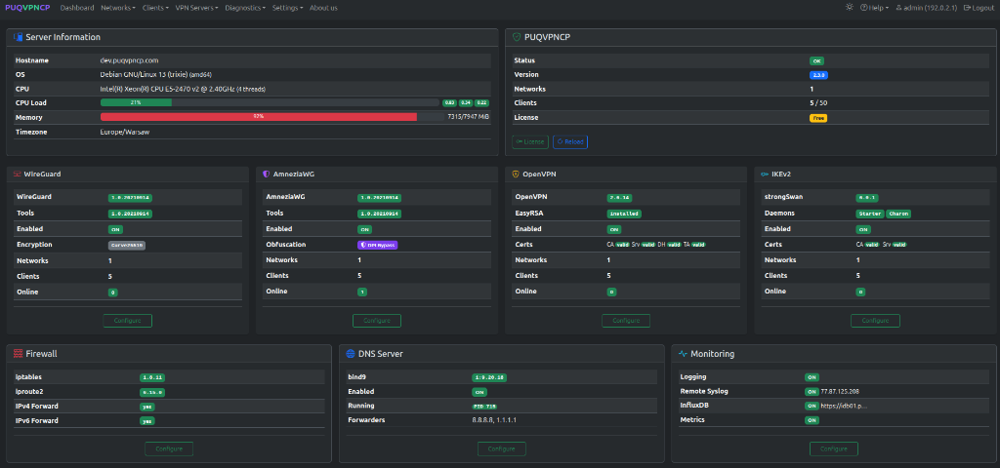
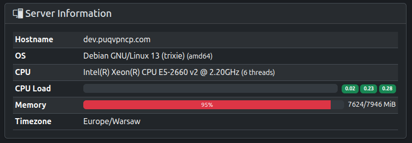
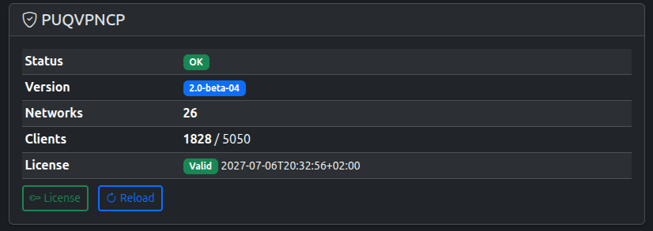
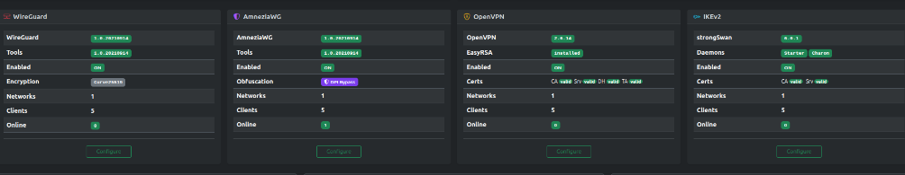
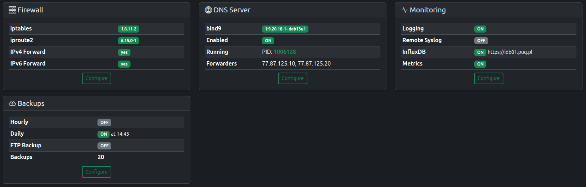

# Dashboard

The Dashboard is the main landing page after login. It provides a complete overview of the server status, VPN protocols, and services.

*PUQVPNCP v2.3 Dashboard — Server info, system status, 4 VPN protocols (WireGuard, AmneziaWG, OpenVPN, IKEv2), and services*

---

## Server Information

*Server information card*

| Field | Description |
|-------|-------------|
| **Hostname** | Server FQDN |
| **OS** | Operating system and architecture |
| **CPU** | Processor model and thread count |
| **CPU Load** | 1 / 5 / 15 minute load averages |
| **Memory** | Used / total with percentage bar |
| **Timezone** | Server timezone |

---

## PUQVPNCP Status

*PUQVPNCP status card*

| Field | Description |
|-------|-------------|
| **Status** | `OK` = fully loaded, `Loading` = starting up |
| **Version** | Current software version |
| **Networks** | Total number of configured networks |
| **Clients** | Active clients / license limit |
| **License** | Validity status and expiration date |

Quick action buttons:
- **License** — go to the license management page
- **Reload** — reload all VPN configurations (equivalent to system restart)

---

## VPN Protocols

*Four VPN protocol status cards: WireGuard, AmneziaWG, OpenVPN, IKEv2*

Each protocol card displays:

| Field | Description |
|-------|-------------|
| **Version / Package** | Installed package version (`wireguard`, `amneziawg`, `openvpn`, `strongswan`) |
| **Enabled** | ON/OFF operational status |
| **Encryption / Obfuscation** | Cryptographic cipher or obfuscation mode (e.g., Curve25519, DPI Bypass) |
| **Networks** | Number of networks with this protocol enabled |
| **Clients** | Total clients configured across those networks |
| **Online** | Currently connected active peers/sessions |

Click **Configure** on any card to go directly to that protocol's global settings page.

---

## Services

*Service cards with detailed configuration info*

### Firewall
- iptables and iproute2 versions
- IPv4/IPv6 forwarding status

### DNS Server
- bind9 version and running PID
- Configured forwarders

### Monitoring
- Logging, remote syslog, InfluxDB, and metrics status

### Backups
- Hourly/daily backup schedule
- FTP backup status
- Total backup count

---
