# Networks

Networks are the core organizational unit in PUQVPNCP. Each network defines a VPN subnet with its own protocol settings, firewall rules, bandwidth limits, and upstream routing.

## Networks List

Navigate to **Networks > List of networks** to see all configured networks.

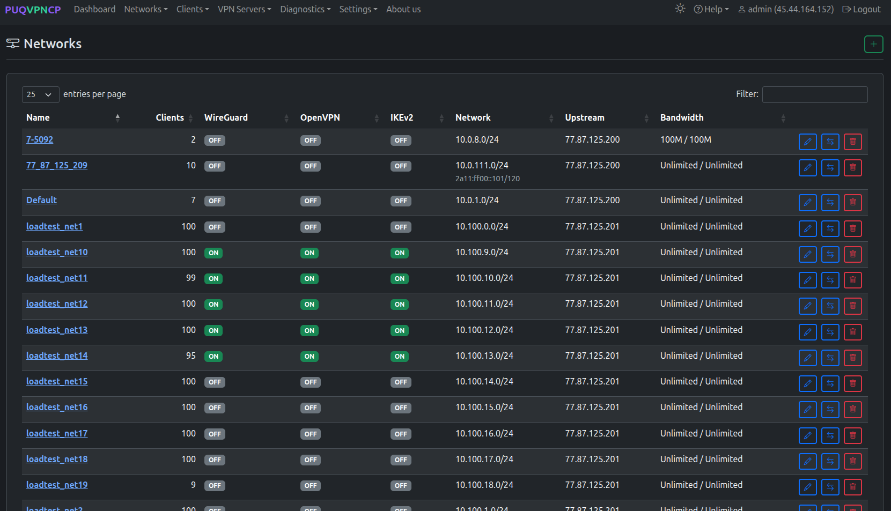
*Networks list — shows protocols, IP, upstream, and bandwidth for each network*

The table displays:

| Column | Description |
|--------|-------------|
| **Name** | Network identifier |
| **Clients** | Number of client accounts |
| **WireGuard / OpenVPN / IKEv2** | Protocol enabled status (ON/OFF) |
| **Network** | Subnet CIDR |
| **IP** | Server IP for the network |
| **Upstream** | Internet exit point (direct IP or WireGuard tunnel) |
| **Bandwidth** | Download/Upload limits in Mbit |

---

## Creating a Network

Navigate to **Networks > Add network** or click the **+** button.

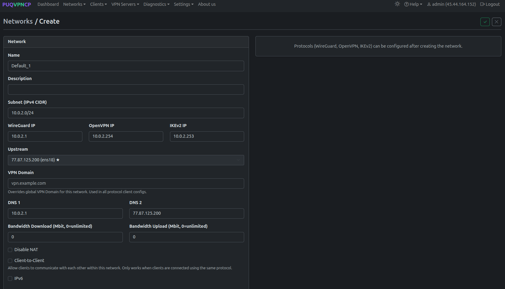
*Create a new network*

### Required Fields

| Field | Description | Example |
|-------|-------------|---------|
| **Name** | Unique network name (alphanumeric + underscore) | `office_vpn` |
| **Subnet (IPv4 CIDR)** | Network subnet | `10.0.0.0/24` |
| **WireGuard IP** | Server IP for WireGuard interface | `10.0.0.1` |
| **OpenVPN IP** | Server IP for OpenVPN interface | `10.0.0.254` |
| **IKEv2 IP** | Server IP for IKEv2 | `10.0.0.253` |

### Optional Fields

| Field | Description |
|-------|-------------|
| **Description** | Free-text description |
| **Upstream** | Select internet exit: server IP (direct) or WireGuard upstream tunnel |
| **VPN Domain** | Override the global VPN domain for this network |
| **DNS 1 / DNS 2** | DNS servers pushed to VPN clients |
| **Bandwidth Download / Upload** | Network-wide bandwidth limit (Mbit, 0 = unlimited) |
| **Disable NAT** | Disable SNAT for this network (for bridged setups) |
| **Client-to-Client** | Allow clients within the same network to communicate |
| **IPv6** | Enable IPv6 dual-stack |

> **Note:** VPN protocols (WireGuard, AmneziaWG, OpenVPN, IKEv2) can be enabled after creating the network.

---

## Editing a Network

Click the edit button on any network to open the tabbed editor.

### Main Tab

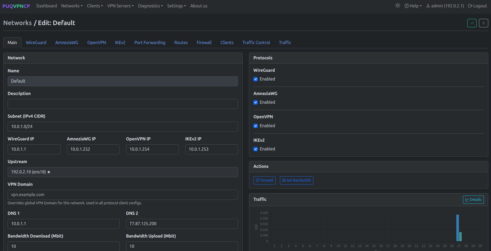
*Network edit — Main tab with protocols, actions, and traffic overview*

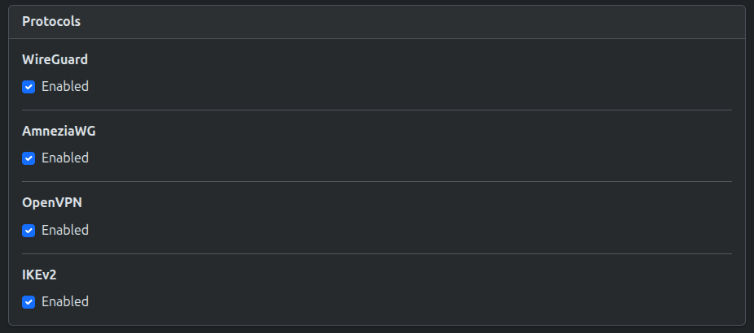
*Protocols selector — WireGuard, AmneziaWG, OpenVPN, IKEv2*

The Main tab shows:
- **Network settings** (left) — all fields from creation, plus the Upstream selector
- **Protocols** (right) — checkboxes to enable/disable WireGuard, AmneziaWG, OpenVPN, IKEv2
- **Actions** — Firewall and Set Bandwidth buttons
- **Traffic** — monthly traffic chart with download/upload totals

### WireGuard Tab

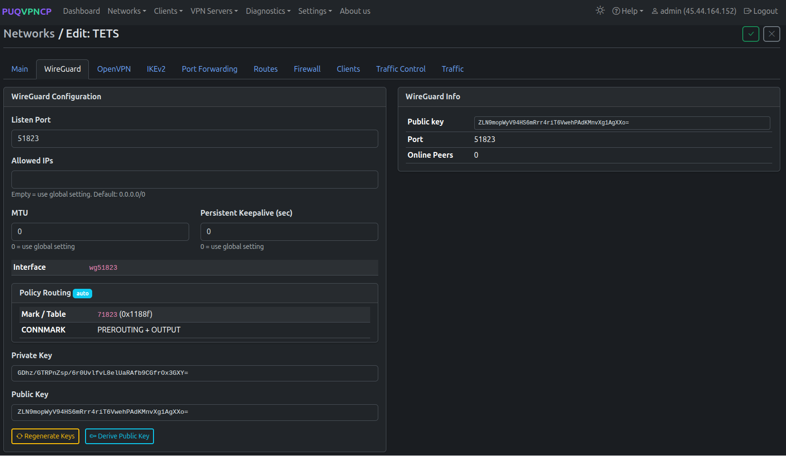
*Network edit — WireGuard tab*

| Field | Description |
|-------|-------------|
| **Listen Port** | WireGuard UDP port for this network |
| **Allowed IPs** | Allowed IPs for peers (empty = use global `0.0.0.0/0`) |
| **MTU** | Tunnel MTU (0 = use global setting) |
| **Persistent Keepalive** | Keepalive interval in seconds (0 = use global) |
| **Interface** | Auto-generated WireGuard interface name (e.g., `wg51823`) |
| **Policy Routing** | Mark/Table values and CONNMARK rules (auto-configured) |
| **Private / Public Key** | WireGuard key pair. Can be regenerated or derived. |

### AmneziaWG Tab

*Network edit — AmneziaWG tab with obfuscation parameters and interface info*

| Field | Description |
|-------|-------------|
| **Listen Port** | AmneziaWG UDP port for this network |
| **Allowed IPs** | Allowed IPs for peers (empty = use global `0.0.0.0/0`) |
| **MTU** | Tunnel MTU (0 = use global setting) |
| **Persistent Keepalive** | Keepalive interval in seconds (0 = use global) |
| **Interface** | Auto-generated AmneziaWG interface name (e.g., `awg51821`) |
| **Magic Headers (H1–H4)** | Custom or randomized packet headers to bypass DPI |
| **Junk Packet Controls** | Jc count, Jmin/Jmax size range, and S1/S2 junk sizes |
| **Private / Public Key** | Key pair for AmneziaWG encryption |

### OpenVPN Tab

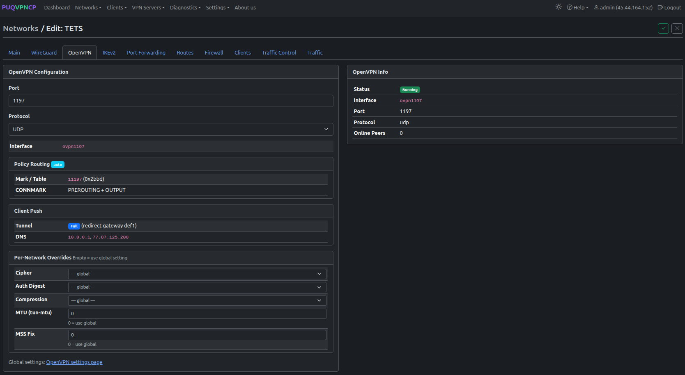
*Network edit — OpenVPN tab*

| Field | Description |
|-------|-------------|
| **Port** | OpenVPN port for this network |
| **Protocol** | UDP or TCP |
| **Interface** | Auto-generated interface name (e.g., `ovpn1197`) |
| **Policy Routing** | Mark/Table and CONNMARK (auto-configured) |
| **Client Push** | Full or split tunnel, DNS settings |
| **Per-Network Overrides** | Cipher, Auth Digest, Compression, MTU, MSS Fix |

### IKEv2 Tab

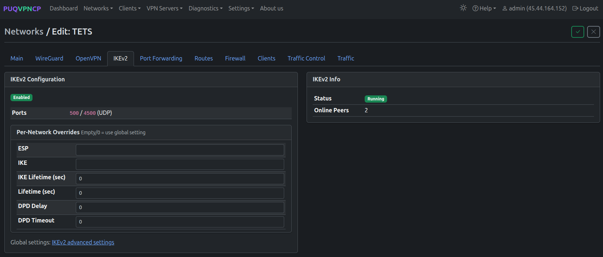
*Network edit — IKEv2 tab*

| Field | Description |
|-------|-------------|
| **Enabled** | IKEv2 enabled for this network |
| **Ports** | 500 / 4500 UDP (standard IPsec) |
| **Per-Network Overrides** | ESP, IKE proposals, lifetimes, DPD settings |

### Port Forwarding Tab

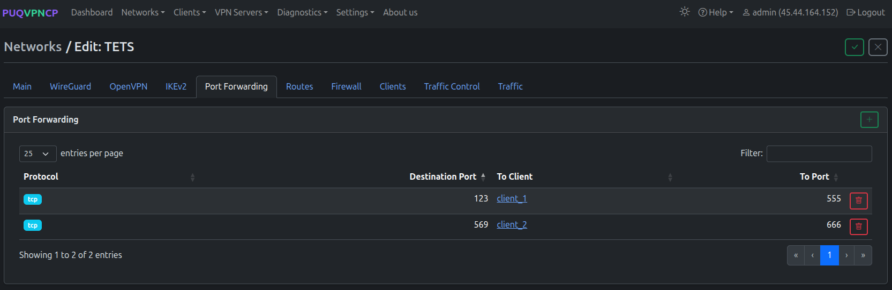
*Network edit — Port Forwarding tab*

Create DNAT rules to forward external ports to specific VPN clients. Each rule maps an external port to a client IP and destination port.

### Routes Tab

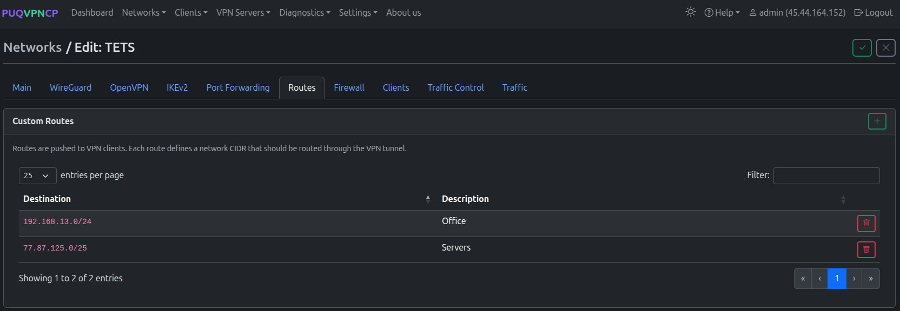
*Network edit — Routes tab*

Define custom routes that are pushed to VPN clients. Each route specifies a destination CIDR and description. Useful for split-tunnel configurations.

### Firewall Tab

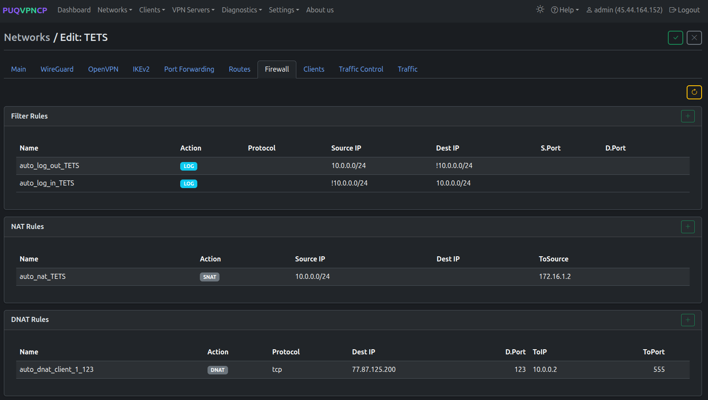
*Network edit — Firewall tab*

Per-network firewall rules organized by type:
- **Filter Rules** — traffic logging and filtering
- **NAT Rules** — SNAT rules (auto-generated for upstream)
- **DNAT Rules** — port forwarding rules (auto-generated from Port Forwarding tab)
- **Mangle Rules** — traffic marking for TC and policy routing (auto-generated)

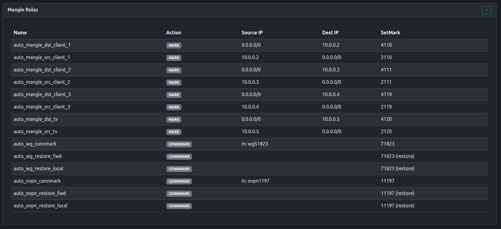
*Network edit — Mangle rules for traffic control*

### Clients Tab

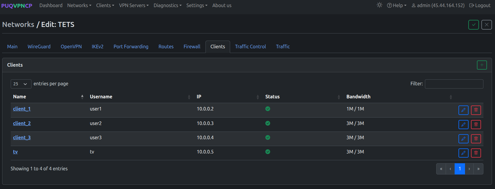
*Network edit — Clients tab*

Lists all clients in this network with their name, username, IP, status, and bandwidth.

### Traffic Control Tab

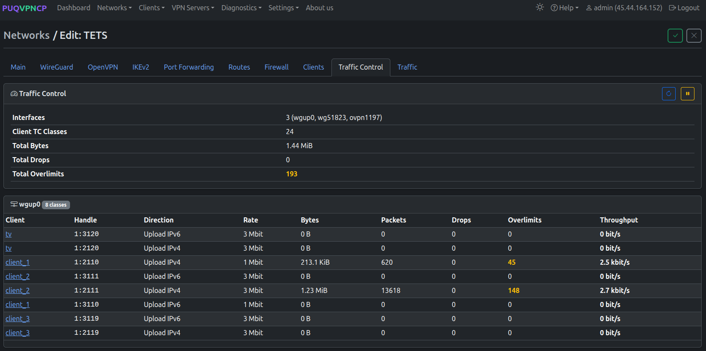
*Network edit — Traffic Control tab (upload classes)*

Real-time traffic control statistics showing TC classes for each client and direction:
- **Interfaces** — WireGuard, AmneziaWG, OpenVPN, and upstream interfaces
- **Per-client rows** — Handle, Direction, Rate, Bytes, Packets, Drops, Overlimits, Throughput

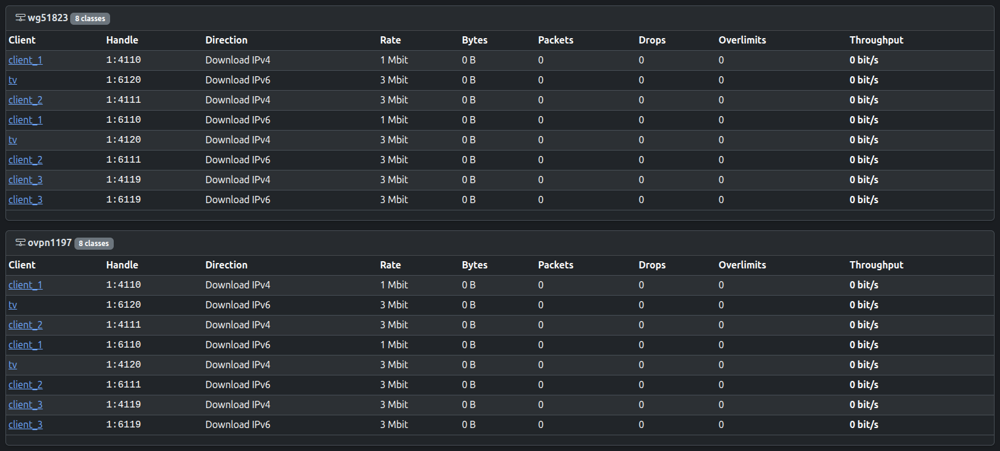
*Traffic Control — download classes*

### Traffic Tab

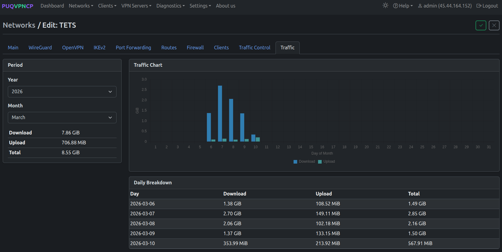
*Network edit — Traffic tab with monthly chart and daily breakdown*

Monthly traffic statistics with:
- **Traffic Chart** — daily download/upload bar chart
- **Period selector** — year and month
- **Download / Upload / Total** — aggregated numbers
- **Daily Breakdown** — per-day traffic table

---
