# Clients

Clients are VPN accounts assigned to a network. Each client gets a unique IP address, WireGuard keys, OpenVPN certificate, and IKEv2 credentials — and can connect via **any** protocol enabled on their network.

> [!TIP]
> **Automating Client Management with WHMCS**:
> Instead of manually creating and managing clients, you can automate account provisioning, suspension, cancellation, and configuration delivery using the official **[PUQVPNCP WHMCS Provisioning Module](https://puqcloud.com/whmcs-module-puqvpncp.php)**.

## Clients List

Navigate to **Clients > List of clients**.

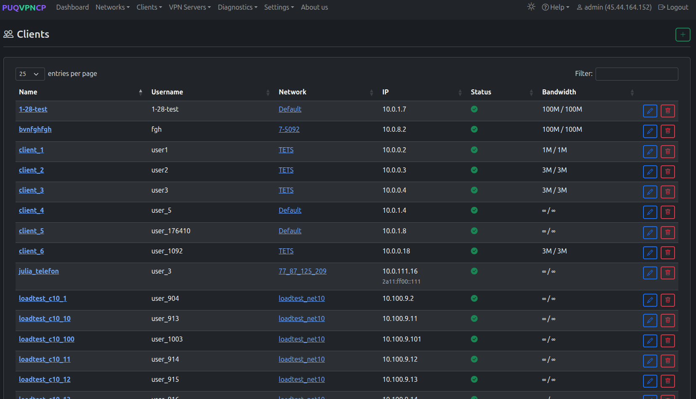
*Clients list with name, username, network, IP, status, and bandwidth*

| Column | Description |
|--------|-------------|
| **Name** | Client identifier |
| **Username** | VPN login username (for OpenVPN/IKEv2) |
| **Network** | The network the client belongs to |
| **IP** | Assigned IPv4 address (and IPv6 if enabled) |
| **Status** | Enable/Disable |
| **Bandwidth** | Download / Upload limits |

---

## Adding a Client

Navigate to **Clients > Add client** or click the **+** button.

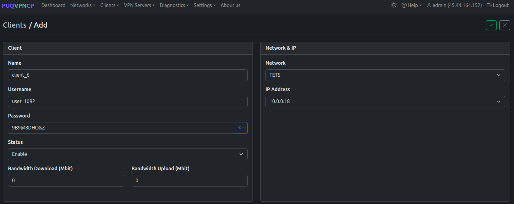
*Add a new client*

| Field | Description |
|-------|-------------|
| **Name** | Unique client name |
| **Username** | Login for OpenVPN and IKEv2 authentication |
| **Password** | Auto-generated or custom. Click the key icon to generate. |
| **Status** | Enable or Disable the account |
| **Bandwidth Download / Upload (Mbit)** | Per-client speed limit (0 = use network default) |
| **Network** | Select the target network |
| **IP Address** | Select from available IPs in the subnet |

---

## Editing a Client

Click edit on any client to open the tabbed editor.

### Main Tab

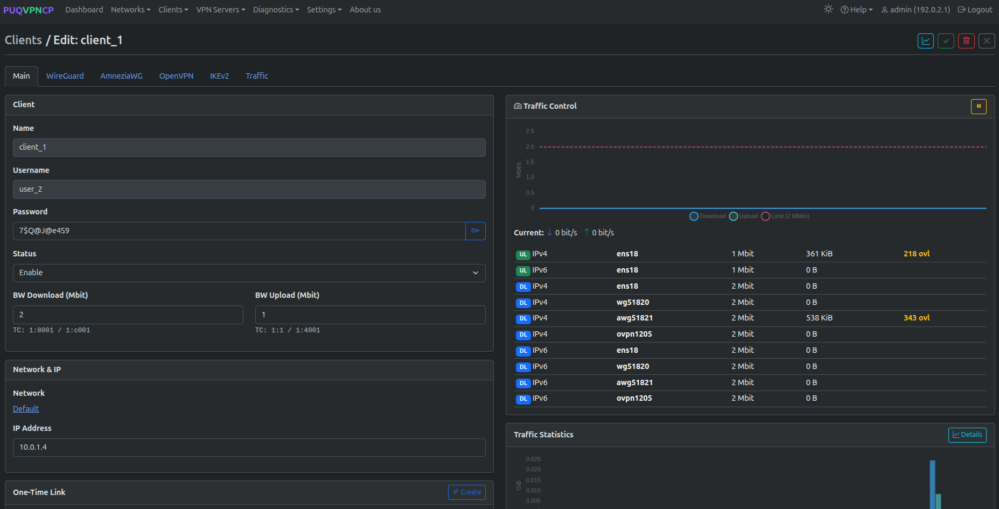
*Client edit — Main tab with traffic control and statistics*

The Main tab shows:
- **Client settings** (left) — name, username, password, status, bandwidth
- **Network & IP** (right) — network link and assigned IP
- **Traffic Control** (right) — real-time TC classes per interface and direction
- **Traffic Statistics** (right) — monthly chart with download/upload

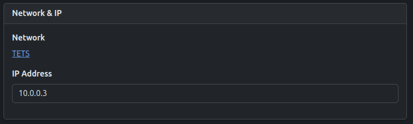
*Network & IP card — shows the assigned network and IP address*

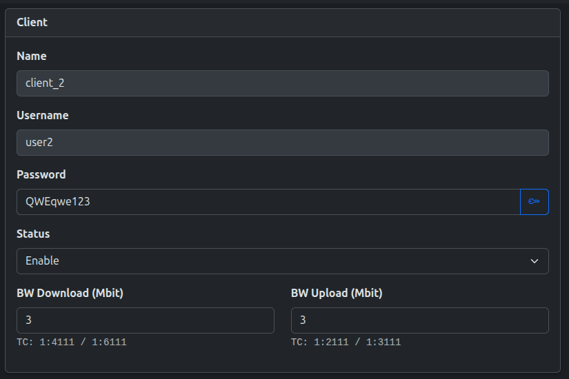
*Bandwidth settings with TC class identifiers*

The **TC** line below bandwidth fields shows the traffic control class IDs used for this client (e.g., `TC: 1:4111 / 1:6111` for download IPv4/IPv6).

### Traffic Control Card

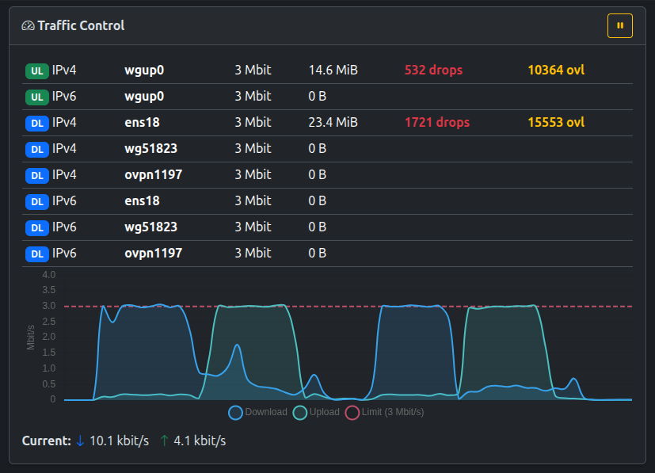
*Real-time traffic control with bandwidth graph*

The Traffic Control card provides:
- **Per-direction stats** — Upload/Download for IPv4/IPv6 on each interface
- **Live bandwidth graph** — real-time download, upload, and limit lines
- **Current speed** — current download and upload rates
- **Drops and overlimits** — highlighted in red/yellow when bandwidth is exceeded

### Traffic Statistics

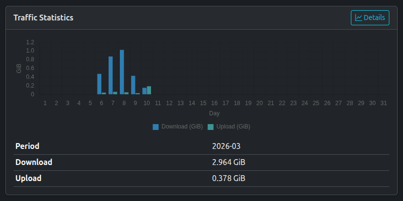
*Monthly traffic statistics*

### One-Time Link

From the Main tab, click **Create** in the One-Time Link section to generate a self-service configuration URL.

*One-time link generated successfully*

The link allows the end user to download their VPN configuration files, QR codes, and credentials without admin panel access. See [One-Time Links](14-one-time-links.md) for details.

### WireGuard Tab

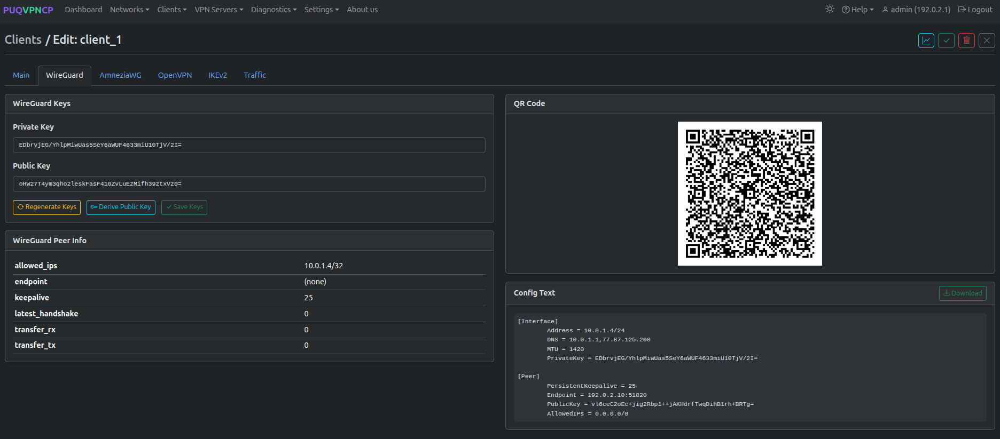
*Client edit — WireGuard tab*

Displays:
- **WireGuard Keys** — private/public key pair (regeneratable)
- **WireGuard Peer Info** — allowed IPs, endpoint, last handshake, transfer stats
- **QR Code** — scannable QR code for mobile client apps
- **Config Text** — full WireGuard configuration for copy/paste

### AmneziaWG Tab

*Client edit — AmneziaWG tab with keys and QR code*

Displays:
- **AmneziaWG Keys & Obfuscation** — private/public key pair and obfuscation parameters (H1–H4, Jc, Jmin, Jmax, S1, S2)
- **AmneziaWG Peer Info** — allowed IPs, endpoint, last handshake, transfer stats
- **QR Code** — scannable QR code for AmneziaWG mobile apps (iOS and Android)
- **Config Text & Download** — full AmneziaWG `.conf` configuration file

### OpenVPN Tab

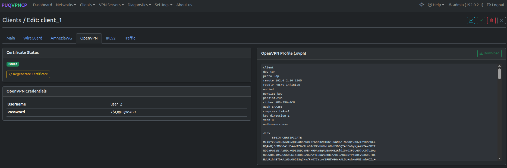
*Client edit — OpenVPN tab*

Displays:
- **Certificate Status** — Issued / Revoked with regeneration option
- **OpenVPN Credentials** — Username and password
- **OpenVPN Profile (.ovpn)** — full configuration file with embedded certificates, downloadable

### IKEv2 Tab

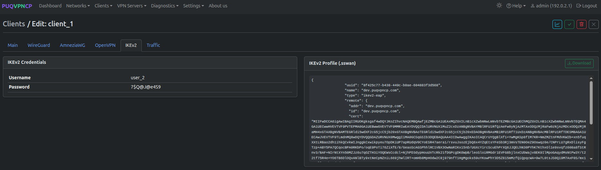
*Client edit — IKEv2 tab*

Displays:
- **IKEv2 Credentials** — username and password
- **IKEv2 Profile (.sswan)** — strongSwan configuration file, downloadable

### Traffic Tab

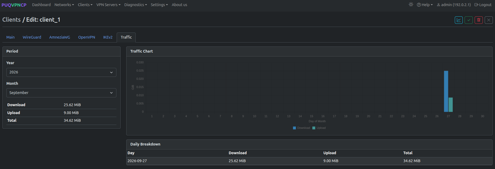
*Client edit — Traffic tab with chart and daily breakdown*

Monthly traffic view with:
- Period selector (year/month)
- Traffic Chart (daily bars)
- Download / Upload / Total aggregates
- Daily Breakdown table

---

## Clients Online

Navigate to **Clients > Clients online** to see currently connected VPN users across all protocols.

The page shows a unified view of:
- WireGuard peers with recent handshakes
- AmneziaWG peers with recent handshakes
- OpenVPN connected sessions
- IKEv2 active SAs (security associations)

Each entry displays the client name, protocol, IP address, and connection duration.

---
