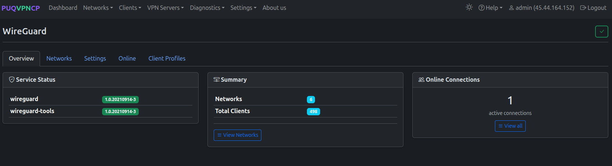
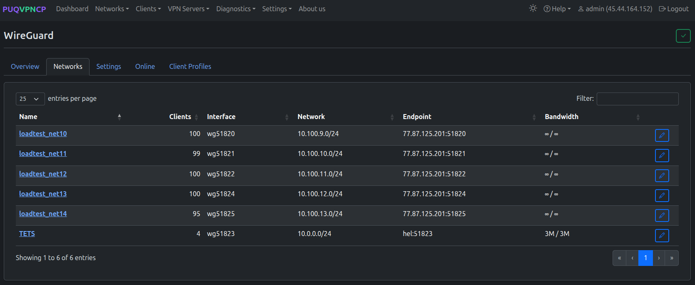
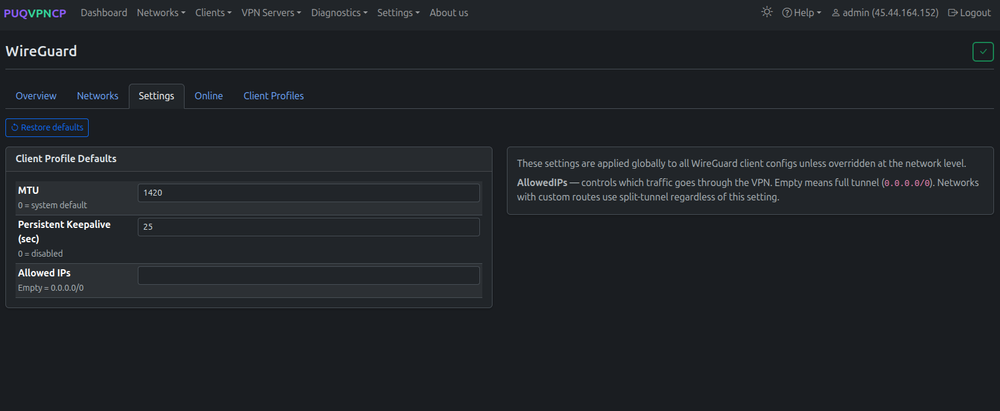
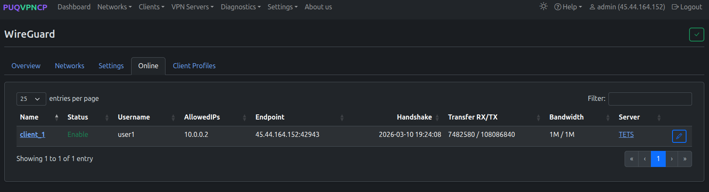
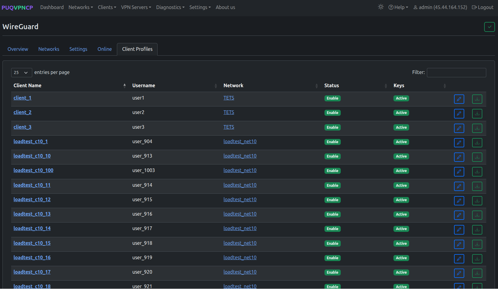

# WireGuard


## Overview

**WireGuard** is a modern, high-performance VPN protocol built into the Linux kernel. It is the fastest protocol supported by PUQVPNCP, offering:

- **Minimal overhead** — only ~60 bytes per packet
- **Quick connections** — sub-second handshake
- **Strong cryptography** — Curve25519, ChaCha20, Poly1305
- **Roaming support** — seamlessly switch between Wi-Fi and cellular

WireGuard is ideal for mobile devices, low-latency applications, and high-throughput scenarios.

> **Need Anti-Censorship or DPI Bypass?** If standard WireGuard packets are detected or throttled by deep packet inspection (DPI) firewalls, use **[AmneziaWG](22-amneziawg.md)** — a specialized WireGuard fork with header obfuscation and junk packet injection.

> **Requirement:** `wireguard` and `wireguard-tools` packages must be installed. Check via **Settings > Environment**.

Navigate to **VPN Servers > WireGuard** to access WireGuard management. The page has 5 tabs: Overview, Networks, Settings, Online, Client Profiles.

---

## Overview Tab


*WireGuard overview — service status, summary, online connections*

The Overview tab shows:

| Card | Description |
|------|-------------|
| **Service Status** | Installed `wireguard` and `wireguard-tools` package versions |
| **Summary** | Total number of WireGuard networks and clients |
| **Online Connections** | Number of currently active WireGuard connections with a link to view all |

---

## Networks Tab


*WireGuard networks — list of all WireGuard interfaces*

Shows all networks that have WireGuard enabled:

| Column | Description |
|--------|-------------|
| **Name** | Network name (link to network edit page) |
| **Clients** | Number of WireGuard clients in this network |
| **Interface** | WireGuard interface name (e.g., `wg51820`) |
| **Network** | Subnet assigned to this network |
| **Endpoint** | Server IP and UDP port for client connections |
| **Bandwidth** | Upload / download bandwidth limits |

Each network has its own WireGuard interface with independent settings. See the [Networks](05-networks.md) page for per-network WireGuard configuration.

---

## Settings Tab


*WireGuard settings — client profile defaults*

Configure global defaults for WireGuard client profiles. These settings are applied to all WireGuard client configs unless overridden at the network level.

| Setting | Description | Default |
|---------|-------------|---------|
| **MTU** | Tunnel MTU (0 = system default) | 1420 |
| **Persistent Keepalive (sec)** | Keepalive interval (0 = disabled) | 25 |
| **Allowed IPs** | Controls which traffic goes through VPN. Empty = full tunnel (`0.0.0.0/0`). Networks with custom routes use split-tunnel regardless of this setting | (empty) |

Use the **Restore defaults** button to reset all settings to their original values.

---

## Online Tab


*WireGuard online users — currently connected peers*

Shows all WireGuard peers with a recent handshake:

| Column | Description |
|--------|-------------|
| **Name** | Client name (link to client page) |
| **Status** | Enable/Disable |
| **Username** | System user who owns this client |
| **AllowedIPs** | Client's VPN IP address |
| **Endpoint** | Client's real IP address and port |
| **Handshake** | Last handshake timestamp |
| **Transfer RX/TX** | Bytes received / sent |
| **Bandwidth** | Configured bandwidth limit |
| **Server** | Network name |

---

## Client Profiles Tab


*WireGuard client profiles — all clients across all networks*

Lists all WireGuard clients across all networks:

| Column | Description |
|--------|-------------|
| **Client Name** | Client name (link to client page) |
| **Username** | System user who owns this client |
| **Network** | Network this client belongs to |
| **Status** | Enable/Disable |
| **Keys** | Key status (Active = keys generated) |

Each client row has buttons to edit the client and download the WireGuard configuration file.

---

## Client Configuration

Each client automatically gets:
- A unique **WireGuard key pair** (regeneratable)
- A **configuration file** ready to import into any WireGuard client
- A **QR code** for scanning on mobile devices

Supported client platforms:
- **Windows** — official WireGuard app
- **macOS** — official WireGuard app or App Store
- **Linux** — `wg-quick` or NetworkManager
- **Android** — WireGuard app from Google Play
- **iOS** — WireGuard app from App Store
- **Mikrotik** — RouterOS 7+ native WireGuard

---

## How It Works

```
Client App                    PUQVPNCP Server
----------                    ---------------
[WireGuard]  ---- UDP ----->  [wg51823 interface]
                                    |
                              iptables mangle (mark)
                                    |
                              policy routing (table)
                                    |
                              +-------------+
                              |  Upstream   |
                              | (direct or  |
                              |  wgupN)     |
                              +-------------+
                                    |
                              SNAT + forward
                                    |
                                Internet
```

1. Client connects to the WireGuard UDP port
2. Packets arrive on the network's WireGuard interface (e.g., `wg51823`)
3. iptables mangle rules mark the traffic for policy routing
4. Traffic is routed through the configured upstream (direct internet or WireGuard tunnel)
5. SNAT is applied for internet access

---
