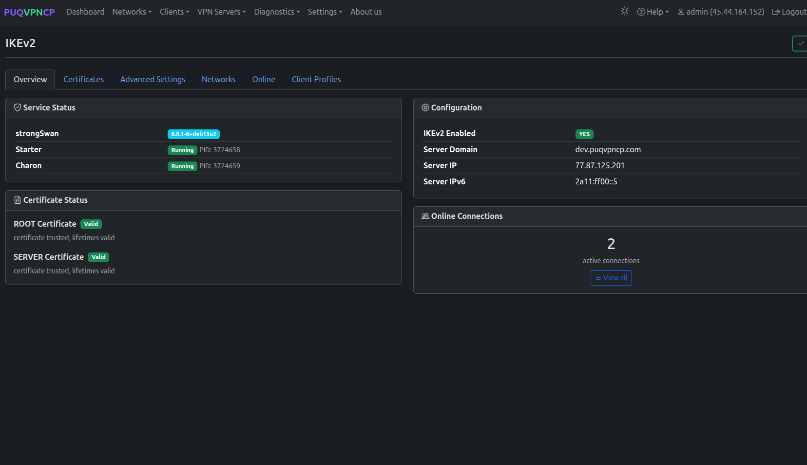
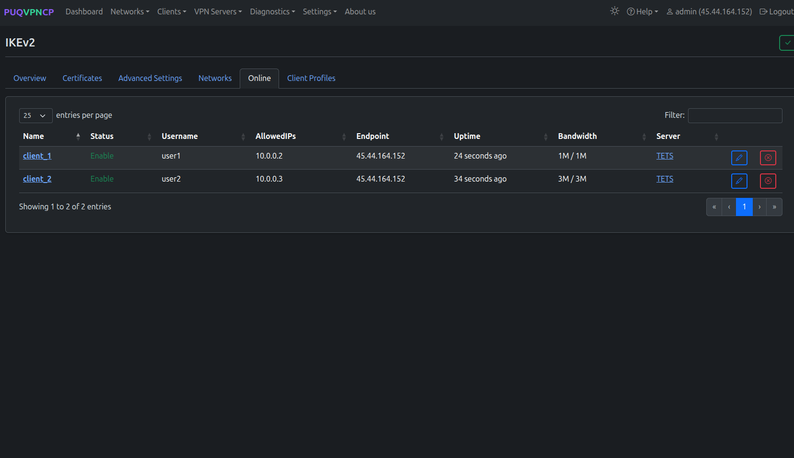
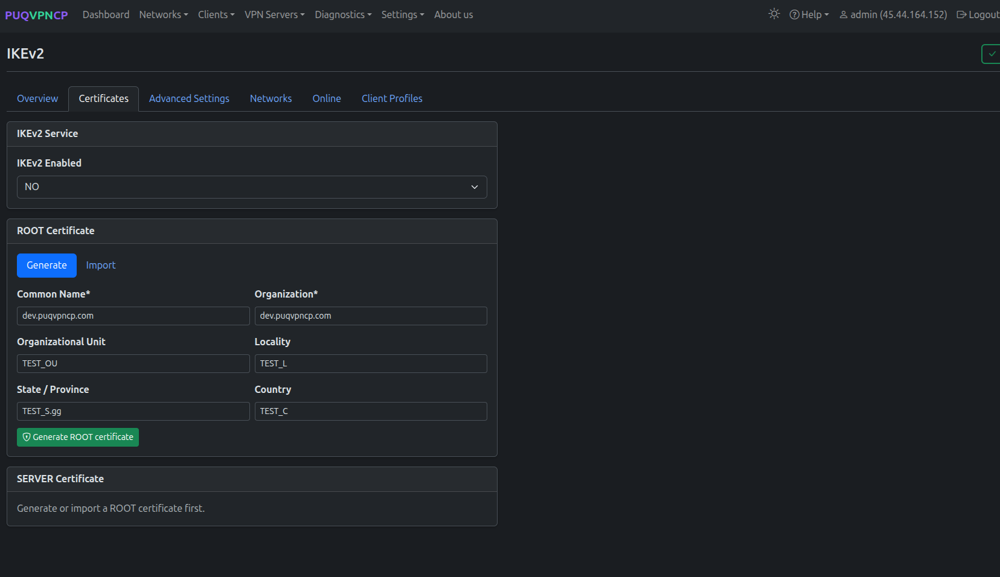
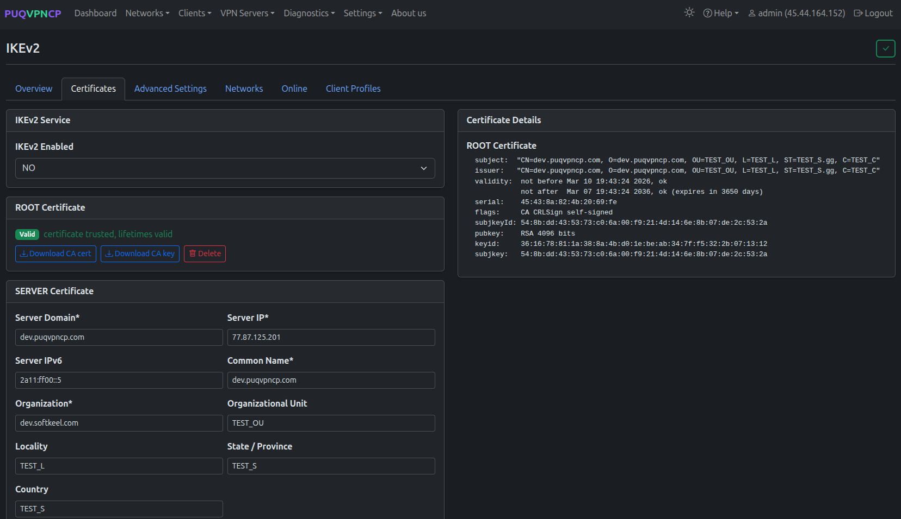
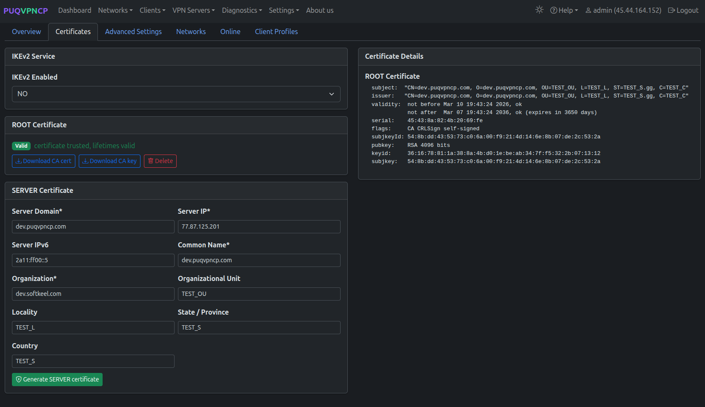
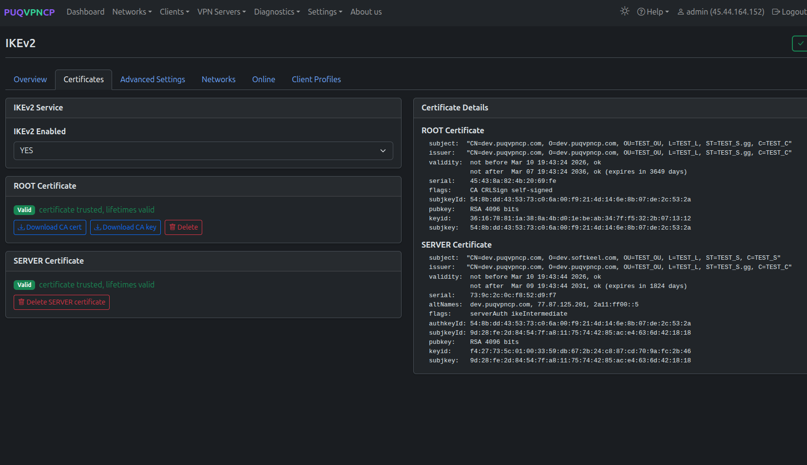
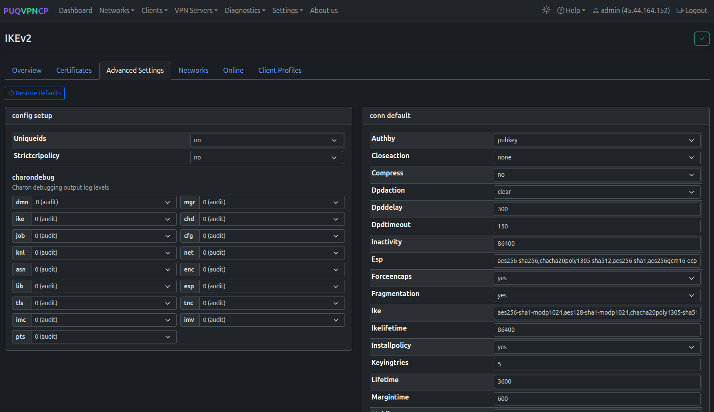
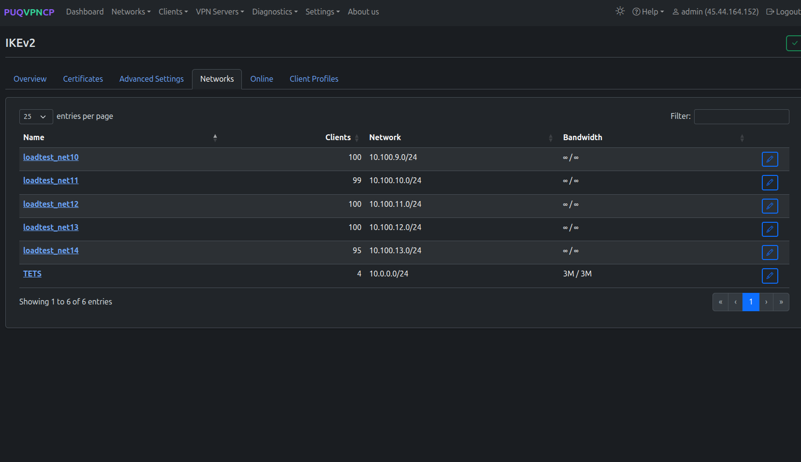
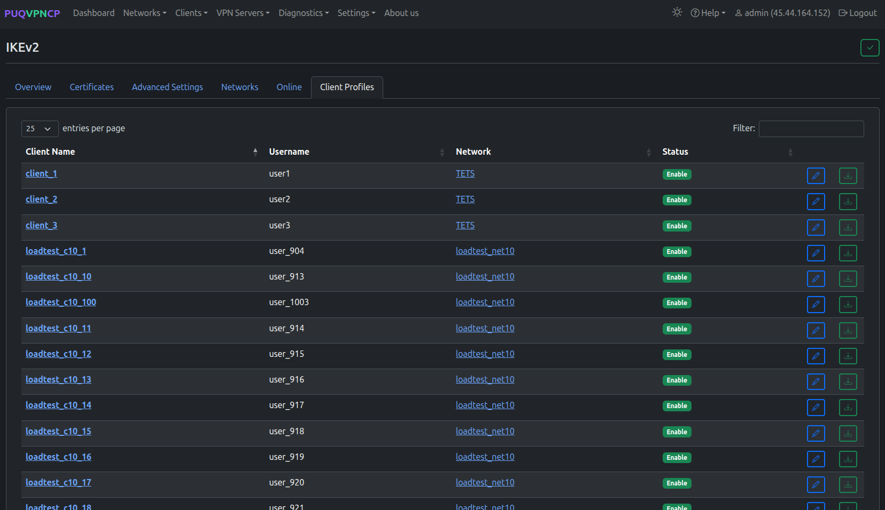

# IKEv2

## Overview

**IKEv2/IPsec** is a standards-based VPN protocol with native support in most operating systems. PUQVPNCP uses **strongSwan** as the IKEv2 implementation.

Key advantages:
- **No app required** — built into iOS, macOS, Windows, Android, Linux
- **MOBIKE support** — seamless switching between Wi-Fi and cellular without reconnection
- **Strong security** — certificate-based authentication with modern ciphers
- **Automatic reconnection** — reconnects transparently after network changes

IKEv2 is the best choice when you want **zero-install VPN** for end users — they can configure it using only the native OS settings.

> **Requirement:** `strongswan` and `strongswan-pki` packages must be installed.

---

## Global Settings

Navigate to **VPN Servers > IKEv2** to configure global IKEv2 settings.

*IKEv2 global settings*

| Setting | Description |
|---------|-------------|
| **Enabled** | Enable/disable IKEv2 globally |
| **Ports** | 500 / 4500 UDP (standard IPsec ports) |

### Advanced Settings

*IKEv2 advanced settings*

| Setting | Description | Default |
|---------|-------------|---------|
| **ESP** | ESP encryption proposals | `aes256gcm128-sha256` |
| **IKE** | IKE encryption proposals | `aes256-sha256-modp2048` |
| **IKE Lifetime (sec)** | IKE SA lifetime | 86400 |
| **Lifetime (sec)** | Child SA lifetime | 3600 |
| **DPD Delay** | Dead Peer Detection interval | 30 |
| **DPD Timeout** | DPD timeout | 150 |

---

## Certificates

IKEv2 uses X.509 certificates for server authentication. PUQVPNCP manages the full PKI chain.

### Root Certificate (CA)

*IKEv2 Root CA certificate*

The Root CA is created once and signs all server certificates. Clients must trust this CA.

### Server Certificate

*IKEv2 server certificate*

The server certificate is signed by the Root CA and presented to clients during the IKE handshake.

> **Important:** The server certificate's Subject Alternative Name (SAN) must match the VPN Domain or server IP.

### Import Certificate

*Import existing CA and server certificates*

If you have existing certificates from another strongSwan installation, you can import them instead of generating new ones.

---

## DNS

*IKEv2 DNS configuration*

Configure DNS servers pushed to IKEv2 clients.

---

## Status

*IKEv2 service status*

Shows the strongSwan daemon status, starter and charon PIDs, and current active SAs.

---

## Online Users

*IKEv2 online users*

Lists all active IKEv2 security associations with:
- Client name and network
- Virtual IP assigned
- Remote (real) IP
- IKE and ESP proposals in use
- Connection duration

---

## Client Profiles

*IKEv2 client profiles — all clients across all networks*

Lists all IKEv2 clients across all networks:

| Column | Description |
|--------|-------------|
| **Client Name** | Client name (link to client page) |
| **Username** | System user who owns this client |
| **Network** | Network this client belongs to |
| **Status** | Enable/Disable |

Each client row has buttons to edit the client and download the `.sswan` configuration file.

---

## Client Configuration

IKEv2 clients authenticate using **username/password** (EAP-MSCHAPv2) with server certificate validation.

### Configuration by Platform

| Platform | Method |
|----------|--------|
| **iOS** | Settings > VPN > Add Configuration > IKEv2. Or import `.mobileconfig` profile |
| **macOS** | System Preferences > Network > + > VPN > IKEv2 |
| **Windows** | Settings > Network > VPN > Add VPN > IKEv2 |
| **Android** | Settings > VPN > + > IKEv2/IPsec MSCHAPv2 (or use strongSwan app) |
| **Linux** | NetworkManager or `charon-cmd` |

### Required Client Settings

| Field | Value |
|-------|-------|
| **Server** | Your VPN domain or IP |
| **Remote ID** | Same as server (domain or IP) |
| **Authentication** | Username (EAP) |
| **Username / Password** | From client's IKEv2 tab |
| **CA Certificate** | The Root CA certificate (download from panel) |

> **Tip:** Use **One-Time Links** to give users a downloadable `.sswan` profile that imports all settings automatically.

---

## Per-Network Configuration

Each network can override the global IKEv2 settings:
- ESP and IKE proposals
- SA lifetimes
- DPD delay and timeout

See the IKEv2 tab in [Networks](05-networks.md) for details.

---
