# OpenVPN

## Overview

**OpenVPN** is a mature, widely-supported VPN protocol based on SSL/TLS. PUQVPNCP manages OpenVPN with full PKI (Easy-RSA) integration.

Key advantages:
- **Universal compatibility** — works on virtually every platform and device
- **TCP mode** — can bypass restrictive firewalls that block UDP
- **Highly configurable** — extensive cipher, compression, and routing options
- **Certificate-based** — each client gets a unique TLS certificate

OpenVPN is the best choice when you need **maximum compatibility** or when clients are behind restrictive firewalls that block WireGuard and IKEv2 traffic.

> **Requirement:** `openvpn` and `easy-rsa` packages must be installed.

Navigate to **VPN Servers > OpenVPN** to access OpenVPN management. The page has 6 tabs: Overview, Certificates, Settings, Networks, Online, Client Profiles.

---

## Overview Tab

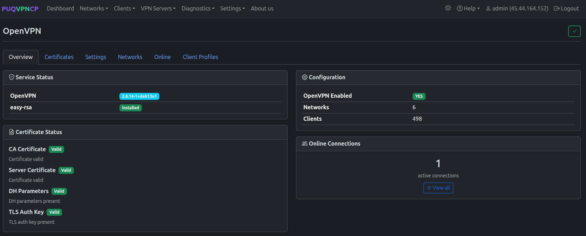
*OpenVPN overview — service status, certificates, configuration, online connections*

The Overview tab shows:

| Card | Description |
|------|-------------|
| **Service Status** | Installed `openvpn` and `easy-rsa` package versions |
| **Certificate Status** | Status of CA, Server Certificate, DH Parameters, and TLS Auth Key (Valid/Missing) |
| **Configuration** | OpenVPN enabled/disabled, number of networks and clients |
| **Online Connections** | Number of currently active OpenVPN connections with a link to view all |

---

## Certificates Tab

Before OpenVPN can be enabled, you must generate all required certificates. The Certificates tab guides you through the PKI setup step by step.

### Step 1: Generate CA Certificate

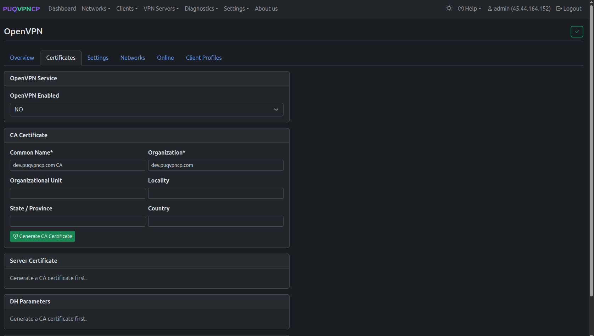
*Certificates tab — initial state, CA certificate form*

Fill in the CA Certificate fields:

| Field | Description | Example |
|-------|-------------|---------|
| **Common Name** | CA certificate name | `myserver.com CA` |
| **Organization** | Organization name | `myserver.com` |
| **Organizational Unit** | (optional) Department | |
| **Locality** | (optional) City | |
| **State / Province** | (optional) State | |
| **Country** | (optional) Country code | |

Click **Generate CA Certificate** to create the root CA.

### Step 2: Generate Server Certificate and DH Parameters

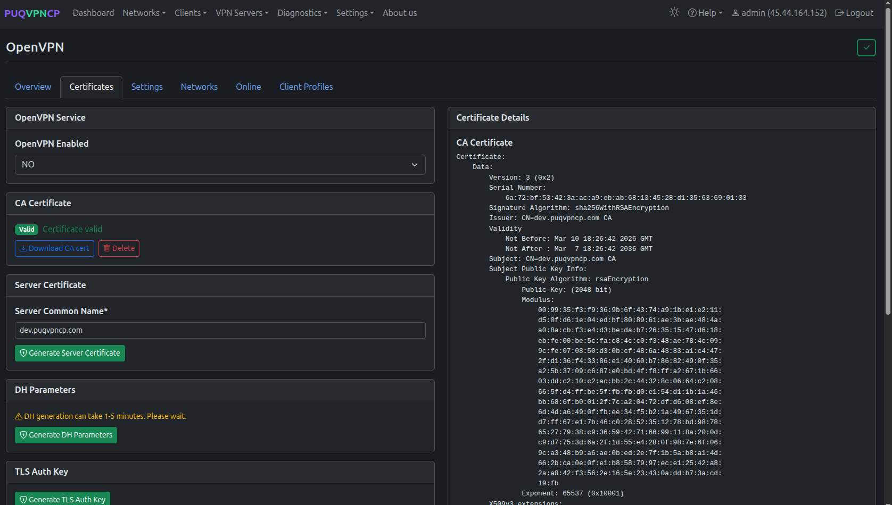
*Certificates tab — CA generated, generating server certificate*

After the CA is generated:
1. Click **Generate Server Certificate** — creates the server's TLS certificate signed by the CA
2. Click **Generate DH Parameters** — creates Diffie-Hellman parameters (takes ~1 minute)

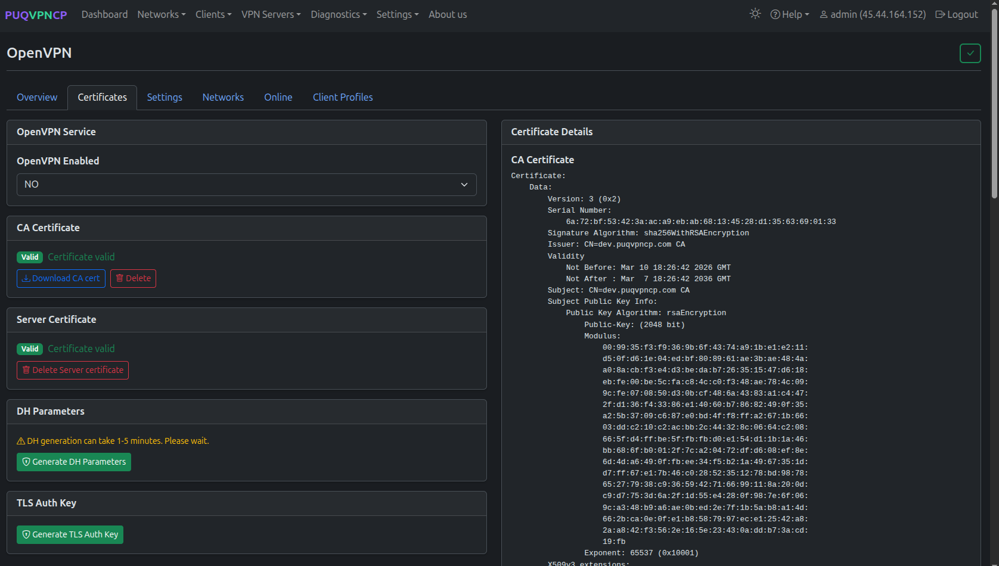
*Certificates tab — DH parameters generating*

### Step 3: Generate TLS Auth Key

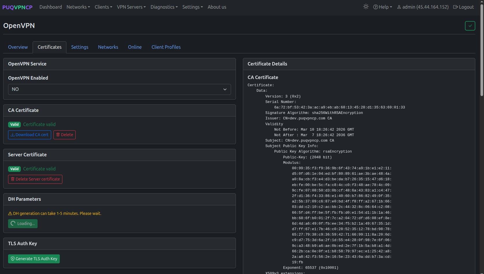
*Certificates tab — generating TLS Auth key*

Click **Generate TLS Auth Key** to create the HMAC authentication key.

### Step 4: All Certificates Ready

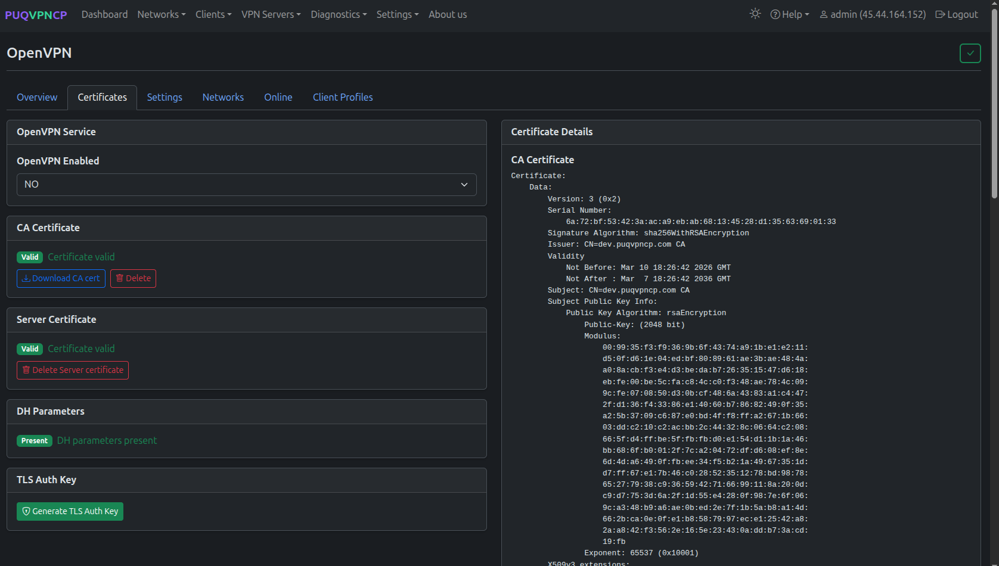
*Certificates tab — all certificates and keys generated*

*Certificates tab — all valid, certificate details panel*

Once all 4 components are generated (CA, Server, DH, TLS Auth), you can enable OpenVPN:

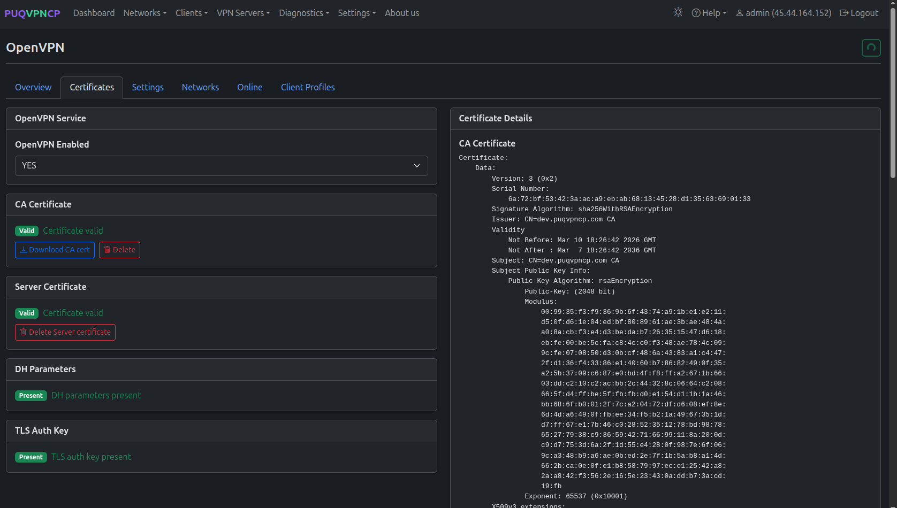
*Certificates tab — OpenVPN enabled*

Set **OpenVPN Enabled** to **YES** and save. The right panel shows the CA certificate details (issuer, validity dates, fingerprint).

---

## Settings Tab

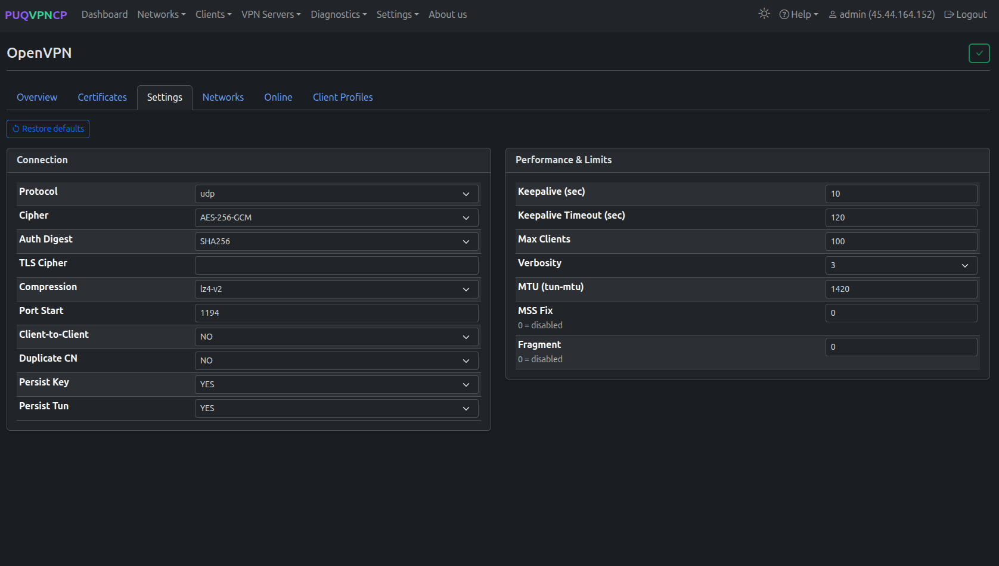
*OpenVPN settings — connection and performance defaults*

Configure global defaults for OpenVPN. These settings are applied to all networks unless overridden at the network level.

### Connection

| Setting | Description | Default |
|---------|-------------|---------|
| **Protocol** | UDP or TCP | udp |
| **Cipher** | Encryption cipher | AES-256-GCM |
| **Auth Digest** | HMAC authentication digest | SHA256 |
| **TLS Cipher** | TLS cipher suite (optional) | (empty) |
| **Compression** | lz4-v2, lzo, or disabled | lz4-v2 |
| **Port Start** | Starting port for network instances | 1194 |
| **Client-to-Client** | Allow clients to communicate directly | NO |
| **Duplicate CN** | Allow multiple connections with same certificate | NO |
| **Persist Key** | Keep keys across restarts | YES |
| **Persist Tun** | Keep tunnel device across restarts | YES |

### Performance & Limits

| Setting | Description | Default |
|---------|-------------|---------|
| **Keepalive (sec)** | Ping interval | 10 |
| **Keepalive Timeout (sec)** | Connection timeout | 120 |
| **Max Clients** | Maximum simultaneous clients per instance | 100 |
| **Verbosity** | Log verbosity level (0-11) | 3 |
| **MTU (tun-mtu)** | Tunnel MTU | 1420 |
| **MSS Fix** | Clamp MSS to avoid fragmentation (0 = disabled) | 0 |
| **Fragment** | Fragmentation size (0 = disabled) | 0 |

Use the **Restore defaults** button to reset all settings to their original values.

---

## Networks Tab

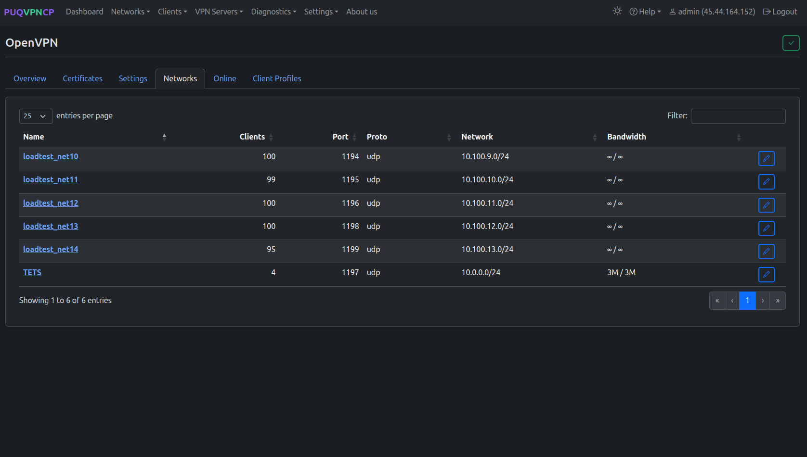
*OpenVPN networks — list of all OpenVPN instances*

Shows all networks that have OpenVPN enabled:

| Column | Description |
|--------|-------------|
| **Name** | Network name (link to network edit page) |
| **Clients** | Number of OpenVPN clients in this network |
| **Port** | UDP/TCP port for this network's OpenVPN instance |
| **Proto** | Protocol (udp/tcp) |
| **Network** | Subnet assigned to this network |
| **Bandwidth** | Upload / download bandwidth limits |

---

## Online Tab

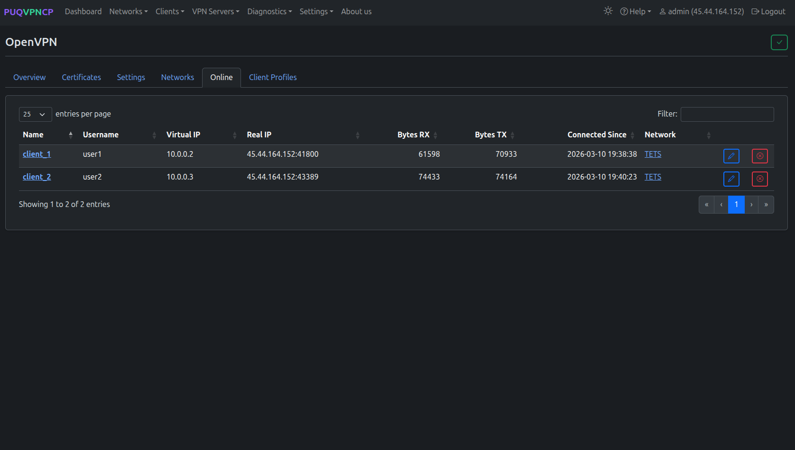
*OpenVPN online users — currently connected clients*

Shows all active OpenVPN sessions:

| Column | Description |
|--------|-------------|
| **Name** | Client name (link to client page) |
| **Username** | System user who owns this client |
| **Virtual IP** | IP assigned inside the VPN tunnel |
| **Real IP** | Client's real IP address and port |
| **Bytes RX** | Bytes received from client |
| **Bytes TX** | Bytes sent to client |
| **Connected Since** | Connection start timestamp |
| **Network** | Network name |

Each row has buttons to edit the client or disconnect the session.

---

## Client Profiles Tab

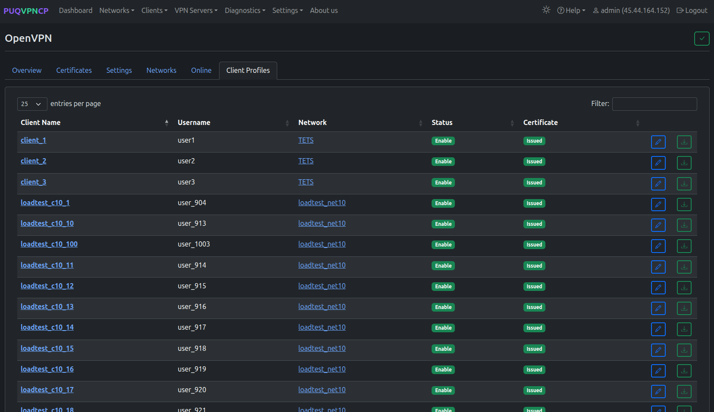
*OpenVPN client profiles — all clients across all networks*

Lists all OpenVPN clients across all networks:

| Column | Description |
|--------|-------------|
| **Client Name** | Client name (link to client page) |
| **Username** | System user who owns this client |
| **Network** | Network this client belongs to |
| **Status** | Enable/Disable |
| **Certificate** | Certificate status (Issued/Missing) |

Each client row has buttons to edit the client and download the `.ovpn` configuration file.

---

## Client Configuration

Each OpenVPN client automatically gets:
- A unique **X.509 client certificate** (issued by the PKI)
- A ready-to-use **`.ovpn` profile** with embedded certificates
- **Username/password** credentials for double authentication

The `.ovpn` profile contains everything needed to connect:
- Server address and port
- Encryption settings
- Embedded CA, client certificate, client key, and TLS-Auth key
- Authentication settings

### Supported Client Apps

| Platform | App |
|----------|-----|
| **Windows** | OpenVPN GUI, OpenVPN Connect |
| **macOS** | Tunnelblick, OpenVPN Connect |
| **Linux** | `openvpn` CLI, NetworkManager |
| **Android** | OpenVPN Connect (Play Store) |
| **iOS** | OpenVPN Connect (App Store) |
| **Mikrotik** | RouterOS 7+ OVPN client |

---

## Per-Network Configuration

Each network has its own OpenVPN instance with:
- Unique port and protocol
- Separate interface (e.g., `ovpn1197`)
- Per-network overrides for cipher, auth, compression, MTU, MSS
- Policy routing with mark/table
- Client push settings (full/split tunnel, DNS)

See the OpenVPN tab in [Networks](05-networks.md) for details.

---
