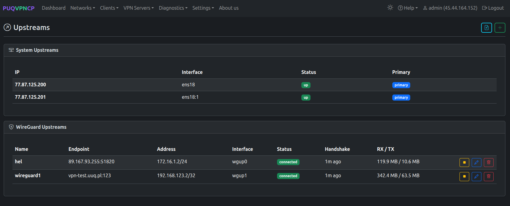
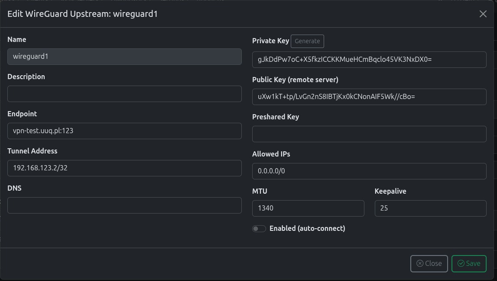
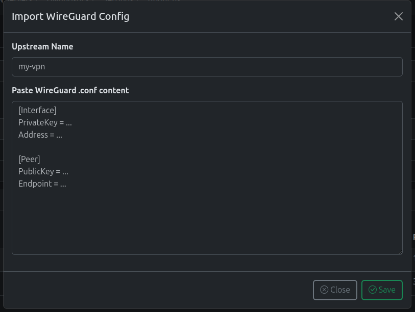

# Upstreams (WireGuard Tunnels)


## Overview

**Upstreams** allow you to route VPN client traffic through external WireGuard VPN servers instead of the PUQVPNCP server's own internet connection. This creates a **multi-hop VPN chain**:

```
VPN Client ---> PUQVPNCP Server ---> WireGuard Upstream ---> Internet
                                       (wgupN)
```

Each upstream is a WireGuard tunnel to a remote VPN server. Networks can be individually assigned to different upstreams, giving you full control over which exit IP each group of clients uses.

---

## Why Use Upstreams?

### 1. Geographic IP Rotation

Assign different networks to upstreams in different countries. Clients on "Network US" exit through a US server, clients on "Network EU" exit through a European server — all managed from a single PUQVPNCP instance.

```
                         +-- wgup0 (US server)  ---> US IP
                         |
Client ---> PUQVPNCP -----+-- wgup1 (EU server)  ---> EU IP
                         |
                         +-- direct (ens18)      ---> Server IP
```

### 2. Multi-Hop Privacy

Add an extra encryption layer between your server and the internet. Even if someone monitors your server's traffic, they see encrypted WireGuard traffic to the upstream, not the client's actual browsing.

### 3. ISP / IP Reputation Bypass

When your server's IP is blocked or blacklisted (e.g., by streaming services), route traffic through a clean upstream IP without migrating your entire infrastructure.

### 4. Dedicated Exit Nodes for Tenants

In a multi-tenant setup, give each customer their own exit IP:

| Network | Upstream | Exit IP | Customer |
|---------|----------|---------|----------|
| `corp_acme` | wgup0 (Frankfurt) | 185.x.x.1 | Acme Corp |
| `corp_globex` | wgup1 (London) | 51.x.x.2 | Globex Inc |
| `internal` | direct (ens18) | 77.x.x.200 | Internal |

### 5. Load Distribution

Spread bandwidth across multiple upstream tunnels to avoid congestion on a single exit point.

### 6. Failover Planning

If your primary upstream goes down, simply reassign the network to a backup upstream. Client configurations don't change — only the server-side routing updates.

---

## Upstreams Page

Navigate to **VPN Servers > Upstreams** to manage system and WireGuard upstreams.


*Upstreams page — System upstreams (server IPs) and WireGuard upstreams*

### System Upstreams

The top section shows all server IP addresses available as direct internet exits:

| Field | Description |
|-------|-------------|
| **IP** | Server IP address |
| **Interface** | Network interface (e.g., `ens18`, `ens18:1`) |
| **Status** | UP / DOWN |
| **Primary** | Whether this IP is marked as primary |

### WireGuard Upstreams

The bottom section shows configured WireGuard tunnels:

| Field | Description |
|-------|-------------|
| **Name** | Upstream identifier |
| **Endpoint** | Remote WireGuard server address:port |
| **Address** | Local tunnel IP (assigned by remote server) |
| **Interface** | Auto-generated interface name (`wgup0`, `wgup1`, ...) |
| **Status** | `connected` / `disconnected` |
| **Handshake** | Time since last successful handshake |
| **RX / TX** | Traffic through the tunnel |

---

## Creating an Upstream

Click the **+** button to add a new WireGuard upstream.


*Edit WireGuard upstream configuration*

| Field | Description |
|-------|-------------|
| **Name** | Unique name for this upstream |
| **Description** | Optional description |
| **Endpoint** | Remote server address and port (e.g., `vpn.example.com:51820`) |
| **Tunnel Address** | Your local IP in the tunnel (e.g., `172.16.1.2/24`) |
| **DNS** | Optional DNS through the tunnel |
| **Private Key** | Your WireGuard private key. Click **Generate** to create a new key pair. |
| **Public Key (remote server)** | The remote server's public key |
| **Preshared Key** | Optional pre-shared key for extra security |
| **Allowed IPs** | Which traffic to route through the tunnel (usually `0.0.0.0/0`) |
| **MTU** | Tunnel MTU (default: 1340 for double-encapsulation) |
| **Keepalive** | Persistent keepalive interval (default: 25) |
| **Enabled (auto-connect)** | Automatically connect on service start |

---

## Importing a WireGuard Config

Click the **Import** button to paste an existing WireGuard `.conf` file.


*Import WireGuard configuration from a .conf file*

Paste the content of a standard WireGuard configuration file:

```ini
[Interface]
PrivateKey = ...
Address = 172.16.1.2/24

[Peer]
PublicKey = ...
Endpoint = vpn.example.com:51820
AllowedIPs = 0.0.0.0/0
```

The parser automatically extracts all fields and creates the upstream.

---

## Assigning an Upstream to a Network

After creating an upstream, assign it to any network:

1. Go to **Networks > Edit** your network
2. In the **Upstream** dropdown, select the WireGuard upstream
3. Click **Save** and **Reload**

The network's traffic will now be routed through the selected upstream tunnel.


*Network edit — Upstream field showing a WireGuard upstream selection*

---

## How It Works Internally

When a network uses a WireGuard upstream:

```
1. Client traffic arrives on VPN interface (wg51823, ovpn1197, etc.)
2. iptables mangle marks traffic with CONNMARK
3. Policy routing (ip rule + ip route) directs marked traffic to wgupN
4. SNAT replaces the source IP with the upstream tunnel IP
5. Traffic exits through the WireGuard upstream to the internet
6. Return traffic follows the same path back to the client
```

### Routing Chain

```
VPN Client (10.0.0.2)
    |
    ▼
WireGuard/OpenVPN/IKEv2 interface
    |
    ▼
iptables CONNMARK (set mark on wg/ovpn interface)
    |
    ▼
ip rule: fwmark → lookup table N
    |
    ▼
ip route: default via wgupN (in table N)
    |
    ▼
iptables SNAT: source → tunnel IP (172.16.1.2)
    |
    ▼
WireGuard upstream tunnel (wgupN)
    |
    ▼
Remote VPN server → Internet
```

> **Note:** The upstream tunnel uses a reduced MTU (1340 by default) to accommodate double encapsulation.

---

## Practical Setup Example

### Scenario: Route office network through a US VPN server

**Step 1:** Get a WireGuard VPN account from a US provider (e.g., Mullvad, ProtonVPN, or your own server).

**Step 2:** In PUQVPNCP, go to **VPN Servers > Upstreams**, click **Import**, paste the `.conf` file.

**Step 3:** Connect the upstream (click the **Play** button).

**Step 4:** Verify the upstream is connected (Status: `connected`, Handshake: recent).

**Step 5:** Go to **Networks**, edit your office network, select the new upstream in the **Upstream** dropdown.

**Step 6:** Save and Reload. All clients on that network now exit through the US IP.

---

## Troubleshooting

| Issue | Solution |
|-------|----------|
| Upstream shows `disconnected` | Check endpoint address, keys, and firewall on both sides |
| No handshake | Verify the remote server's public key and that UDP port is open |
| Clients have no internet | Check that Allowed IPs is `0.0.0.0/0` and SNAT is working |
| Slow speeds | Reduce MTU, check upstream bandwidth, ensure keepalive is set |

---
