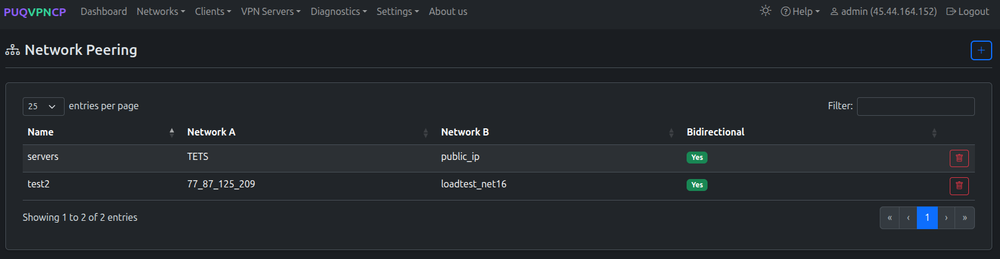
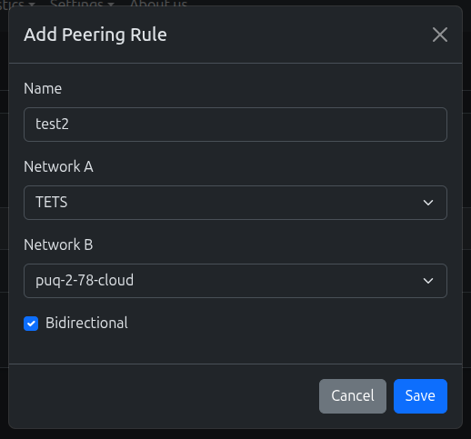
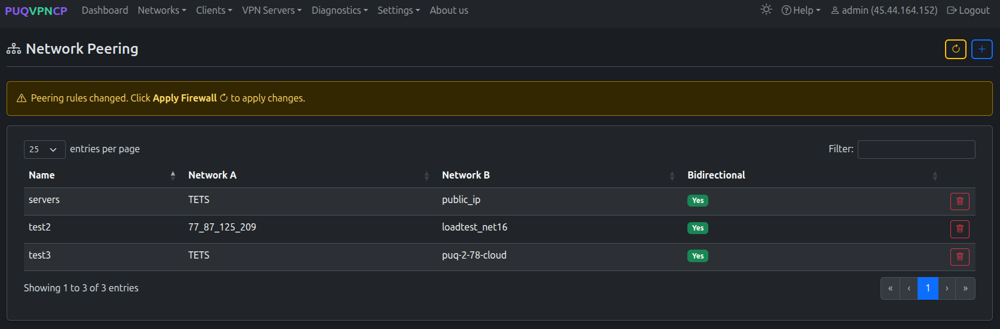
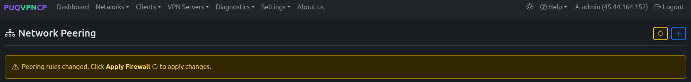

# Network Peering

## Overview

**Network Peering** allows VPN clients from different networks to communicate with each other. By default, networks are isolated — clients in Network A cannot reach clients in Network B. Peering rules create explicit exceptions.

---

## Peering List

Navigate to **Networks > Peering**.

*Network peering rules*

| Column | Description |
|--------|-------------|
| **Name** | Rule identifier |
| **Network A** | First network |
| **Network B** | Second network |
| **Bidirectional** | Whether traffic flows both ways |

---

## Adding a Peering Rule

Click the **+** button to create a new peering rule.

*Add a new peering rule*

| Field | Description |
|-------|-------------|
| **Name** | Rule name |
| **Network A** | First network |
| **Network B** | Second network |
| **Bidirectional** | If enabled, both networks can reach each other. If disabled, only A can reach B. |

After adding a rule, the panel shows a warning to apply the firewall.

*Peering rules updated — 3 rules configured*

Click **Apply Firewall** to activate the new rules.

*Warning: Peering rules changed, click Apply Firewall to apply*

*Applying firewall rules with countdown*

---

## Use Cases

### Office-to-Office Communication

Connect clients from two office networks:
- `office_us` (10.0.1.0/24) ↔ `office_eu` (10.0.2.0/24)
- Bidirectional: Yes

### Server Access from VPN

Allow VPN clients to access a management network:
- `vpn_clients` (10.100.1.0/24) → `servers` (10.0.0.0/24)
- Bidirectional: No (clients access servers, but not vice versa)

### IoT Monitoring

Allow monitoring network to reach IoT devices:
- `monitoring` (10.0.3.0/24) → `iot_devices` (10.0.4.0/24)
- Bidirectional: No

---

## How It Works

Peering rules create `iptables FORWARD` rules that allow traffic between the specified network subnets. Without peering, the default `auto_isolation_ipset` rule in Pre-Network Rules drops inter-network traffic.

---
