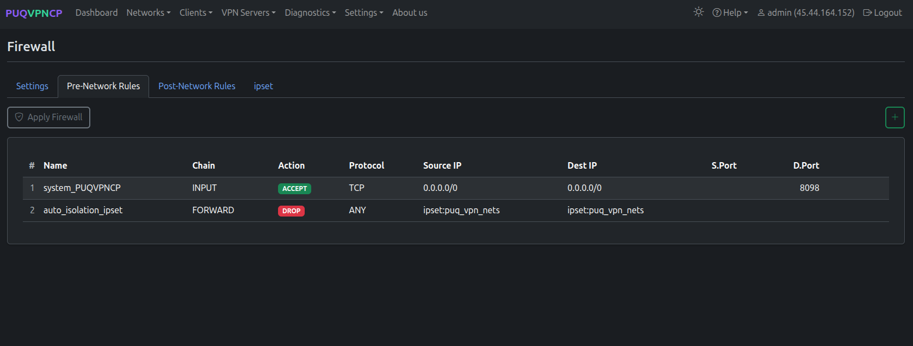
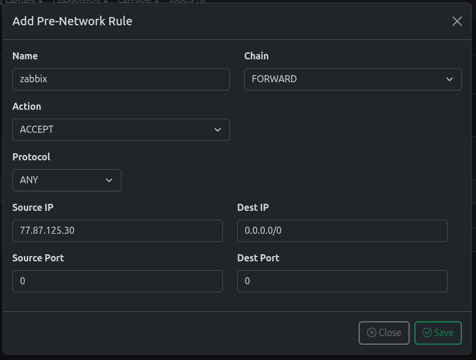
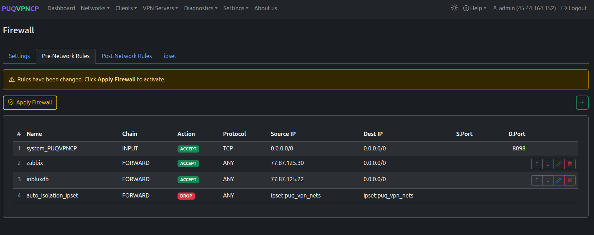
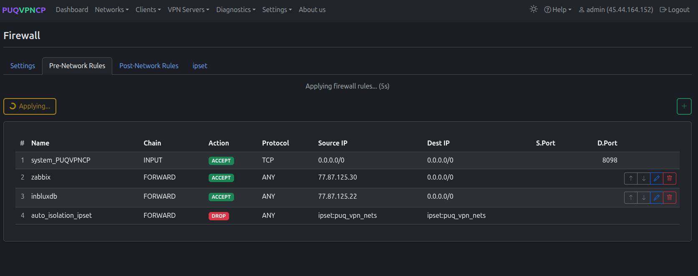
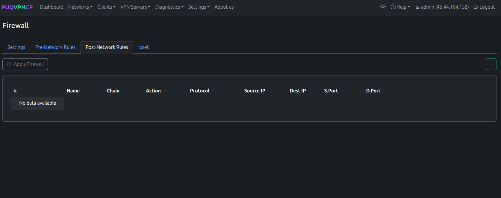
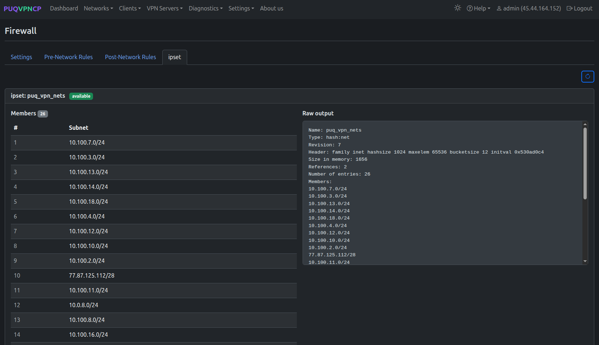

# Firewall


## Overview

PUQVPNCP manages the Linux firewall (`iptables` / `ip6tables`) with two layers:

1. **Global firewall** — server-wide policies, Pre-Network and Post-Network custom rules, ipset
2. **Per-network firewall** — auto-generated filter, NAT, DNAT, and mangle rules per network

---

## Global Firewall

Navigate to **Settings > Firewall**.

### Settings Tab


*Firewall settings — global policies*

| Setting | Description | Recommended |
|---------|-------------|-------------|
| **Forwarding (NAT)** | Enable SNAT for VPN clients | Enabled |
| **INPUT policy** | Default for incoming traffic | ACCEPT |
| **FORWARD policy** | Default for forwarded traffic | ACCEPT |
| **OUTPUT policy** | Default for outgoing traffic | ACCEPT |

### Pre-Network Rules


*Pre-Network rules — executed before per-network rules*

Pre-Network rules are applied **before** any per-network rules. Use them for:
- Allowing access to external services (monitoring, backups)
- Blocking specific IPs globally
- Custom INPUT rules for the server itself


*Adding a custom pre-network rule*

| Field | Description |
|-------|-------------|
| **Name** | Rule identifier |
| **Chain** | INPUT, FORWARD, or OUTPUT |
| **Action** | ACCEPT, DROP, REJECT, LOG |
| **Protocol** | TCP, UDP, ICMP, or ANY |
| **Source IP / Dest IP** | IP addresses or CIDR ranges |
| **Source Port / Dest Port** | Port numbers (0 = any) |

After adding rules, click **Apply Firewall** to activate.


*Rules modified — warning to apply*


*Applying firewall rules*

### Post-Network Rules


*Post-Network rules — executed after per-network rules*

Same format as Pre-Network rules, but applied **after** per-network rules.

### ipset Tab


*ipset — VPN network subnets for global isolation*

The `puq_vpn_nets` ipset contains all VPN network subnets and is used by the `auto_isolation_ipset` rule to prevent inter-network traffic (unless [Peering](11-peering.md) rules allow it).

---

## Per-Network Firewall

Each network has its own firewall tab with auto-generated rules.


*Per-network firewall — Filter, NAT, DNAT rules*

### Rule Types

| Type | Description |
|------|-------------|
| **Filter Rules** | Traffic logging (auto_log_out/in) and custom filter rules |
| **NAT Rules** | SNAT for internet access (auto_nat_NETWORK → upstream IP) |
| **DNAT Rules** | Port forwarding rules (from Port Forwarding tab) |
| **Mangle Rules** | Traffic marking for TC bandwidth control and policy routing |


*Mangle rules — per-client traffic marks and CONNMARK for policy routing*

Mangle rules are fully auto-generated:
- `auto_mangle_dst_CLIENT` / `auto_mangle_src_CLIENT` — mark packets for traffic control
- `auto_wg_connmark` / `auto_ovpn_connmark` — CONNMARK on VPN interfaces for policy routing
- `auto_wg_restore_fwd` / `auto_wg_restore_local` — CONNMARK restore for return traffic

---

## Rule Execution Order

```
1. Pre-Network Rules    (global, custom)
2. Per-Network Rules    (auto-generated per network)
   +-- Filter Rules     (logging, custom filters)
   +-- NAT Rules        (SNAT for upstream)
   +-- DNAT Rules       (port forwarding)
   +-- Mangle Rules     (TC marks, CONNMARK)
3. Post-Network Rules   (global, custom)
4. Global Policies      (INPUT/FORWARD/OUTPUT defaults)
```

---
