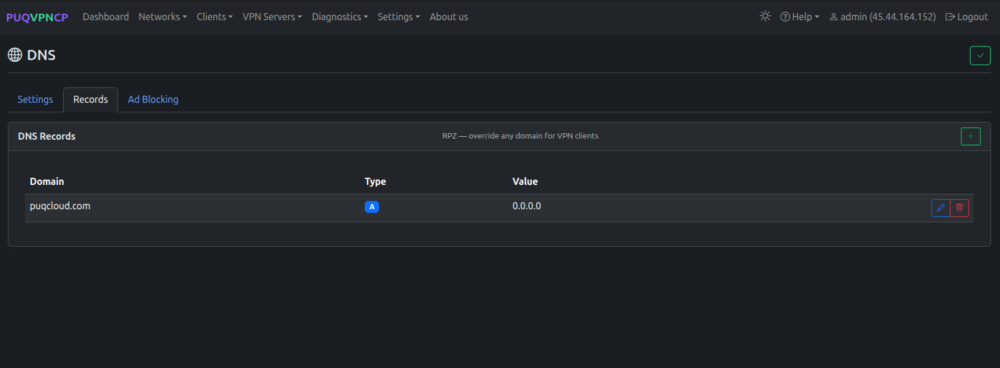
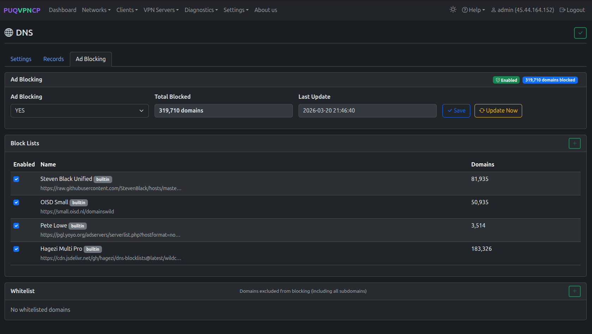

# DNS

## Overview

PUQVPNCP includes a built-in **bind9** DNS server that provides DNS resolution for all VPN clients. The DNS page is organized into three tabs: **Settings**, **Records**, and **Ad Blocking**.

> **Requirement:** `bind9` and `bind9-utils` packages must be installed.

---

## Settings

The **Settings** tab controls the bind9 DNS server configuration.

*DNS Settings tab — server configuration and ACL*

| Setting | Description |
|---------|-------------|
| **Enabled** | Enable or disable the bind9 DNS server |
| **Forwarder DNS 1** | Primary upstream DNS server for recursive queries |
| **Forwarder DNS 2** | Secondary upstream DNS server |
| **Max Cache TTL** | Maximum time (30–3600 seconds) DNS responses are cached |

The **ACL** section at the bottom displays all IP addresses and subnets that are allowed to query this DNS server. This list is automatically generated from your VPN network configurations — it includes localhost, server IPs, and all VPN network subnets.

> **Tip:** Set the network's DNS 1 to the VPN gateway IP (e.g., `10.0.0.1`) so clients use this built-in resolver. This prevents DNS leaks and enables ad blocking.

Click the **checkmark button** in the top right to save changes.

---

## Records

The **Records** tab manages custom DNS entries using bind9 Response Policy Zone (RPZ). These records override public DNS for all VPN clients.

*DNS Records tab — RPZ overrides for VPN clients*

| Column | Description |
|--------|-------------|
| **Domain** | Full domain name (e.g., `puqcloud.com`, `internal.vpn`) |
| **Type** | Record type — **A** (IPv4), **AAAA** (IPv6), **CNAME**, etc. |
| **Value** | Target IP address or hostname |

Click the **+** button to add a new record. Each record can be edited or deleted using the action buttons on the right.

**Use cases:**
- Block specific domains by pointing them to `0.0.0.0`
- Create internal DNS names for VPN resources (e.g., `wiki.vpn` → `10.0.0.5`)
- Override public DNS entries for split-horizon DNS

---

## Ad Blocking

The **Ad Blocking** tab provides DNS-level ad and tracker blocking for all VPN clients. No client-side software is needed — it works automatically for any device connected to the VPN.

*Ad Blocking tab — enable/disable, block lists, whitelist*

### How It Works

When a VPN client requests a domain that is on a block list (e.g., `ads.google.com`), the DNS server responds with **NXDOMAIN** (domain does not exist) instead of the real IP address. This prevents ads, trackers, and malware from loading across all apps and browsers.

Ad blocking uses a **separate RPZ zone** (`rpz.adblock`) that is independent of your static DNS records in the Records tab.

### Configuration

| Setting | Description |
|---------|-------------|
| **Ad Blocking** | Enable or disable ad blocking (YES/NO) |
| **Total Blocked** | Number of unique domains currently blocked |
| **Last Update** | Timestamp of the last block list update |

- Click **Save** to apply the enable/disable setting
- Click **Update Now** to force an immediate download of all enabled block lists

### Block Lists

PUQVPNCP ships with 4 built-in block lists that cover ads, trackers, and malware domains:

| List | Description | Domains |
|------|-------------|---------|
| **Steven Black Unified** | Ads, malware, fakenews — most popular community list | ~82,000 |
| **OISD Small** | Curated list with minimal false positives | ~51,000 |
| **Pete Lowe** | Only verified ad servers — very conservative | ~3,500 |
| **Hagezi Multi Pro** | Comprehensive, actively maintained | ~183,000 |

Built-in lists are marked with a **builtin** badge. They cannot be deleted but can be toggled on/off using the checkbox.

With all lists enabled, approximately **320,000 unique domains** are blocked (after deduplication).

**Supported blocklist formats:**
- **Hosts format** — `0.0.0.0 domain.com` or `127.0.0.1 domain.com`
- **Domain-per-line** — one domain per line
- **Wildcard** — `*.domain.com`
- **Adblock filter** — `||domain.com^`

### Custom Lists

Click the **+** button in the Block Lists card to add a custom blocklist URL:

| Field | Description |
|-------|-------------|
| **Name** | Display name for the list |
| **URL** | HTTP/HTTPS URL to the blocklist file |
| **Enabled** | Whether the list is active |

Custom lists can be deleted; built-in lists cannot.

### Whitelist

The **Whitelist** section allows you to exclude specific domains from blocking. When a domain is whitelisted, it and **all its subdomains** are excluded from ad blocking.

For example, whitelisting `example.com` will also unblock `sub.example.com`, `api.example.com`, etc.

Click the **+** button in the Whitelist card to add a domain.

### Auto-Update

Block lists are automatically refreshed **every 24 hours**. The **Last Update** timestamp and per-list domain counts are shown on the Ad Blocking tab.

To force an immediate update, click **Update Now**. This downloads all enabled lists, deduplicates domains, applies the whitelist, and reloads bind9.

---

## API

DNS and ad blocking can be fully managed via the REST API:

| Method | Endpoint | Description |
|--------|----------|-------------|
| `GET` | `/api/v1/dns` | Get DNS configuration |
| `PUT` | `/api/v1/dns` | Update DNS settings |
| `GET` | `/api/v1/dns/adblock` | Get ad blocking configuration and statistics |
| `PUT` | `/api/v1/dns/adblock` | Enable/disable ad blocking, toggle lists |
| `POST` | `/api/v1/dns/adblock/update` | Force update block lists |
| `POST` | `/api/v1/dns/adblock/lists` | Add custom block list |
| `DELETE` | `/api/v1/dns/adblock/lists/{name}` | Delete custom list |
| `GET` | `/api/v1/dns/adblock/whitelist` | List whitelisted domains |
| `POST` | `/api/v1/dns/adblock/whitelist` | Add domain to whitelist |
| `DELETE` | `/api/v1/dns/adblock/whitelist/{name}` | Remove domain from whitelist |

See [API Reference](https://puqvpncp.com/api/) for full endpoint documentation with request/response examples.

---
