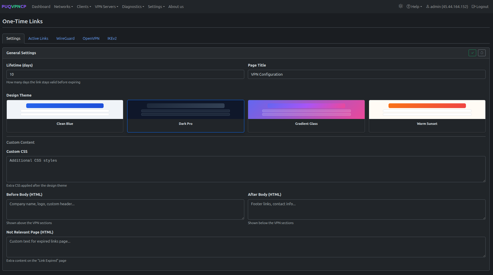
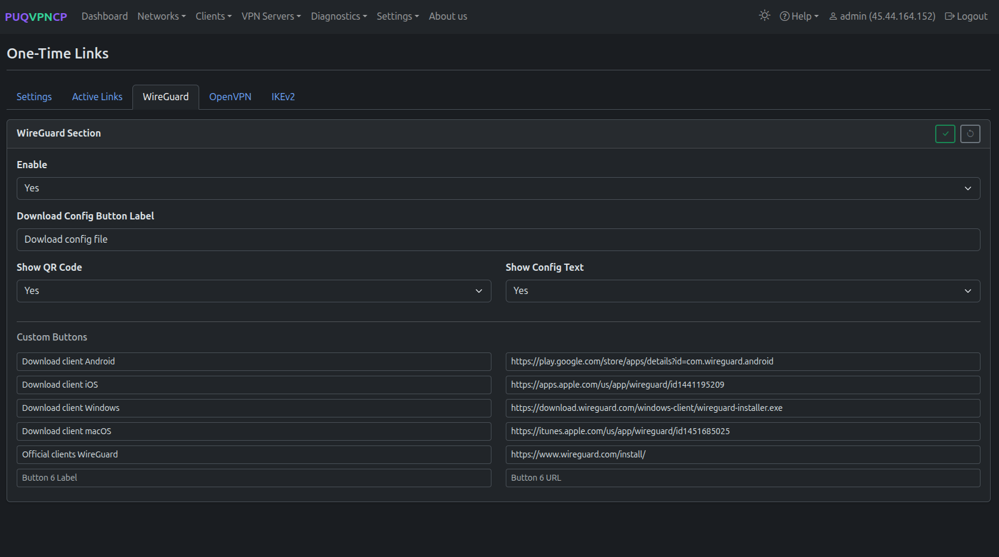
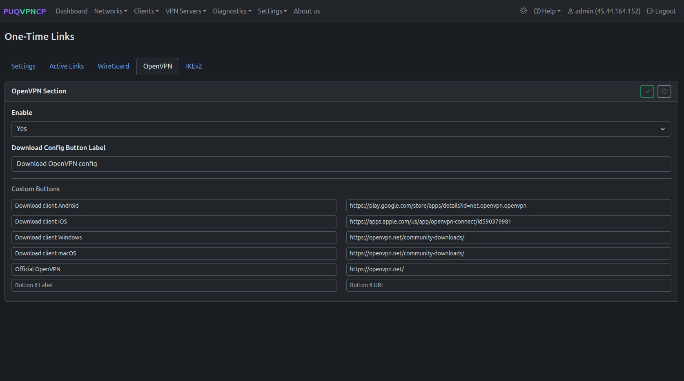
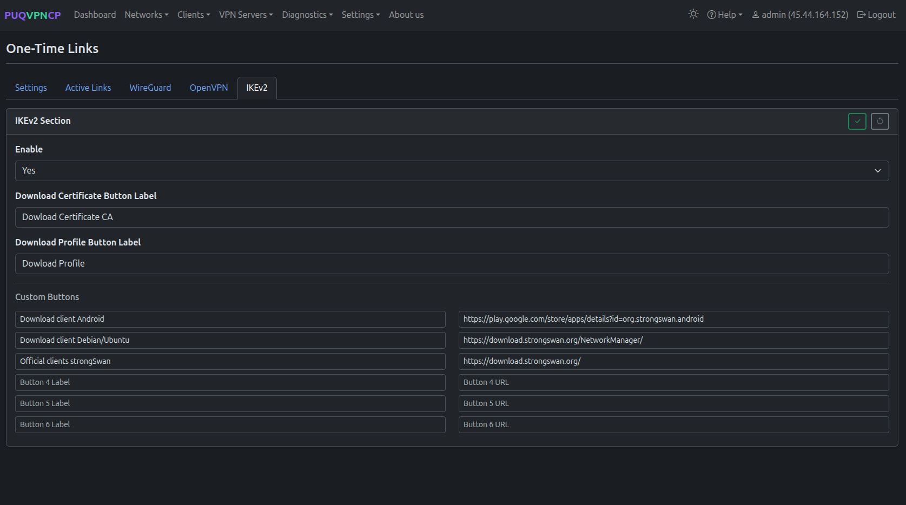
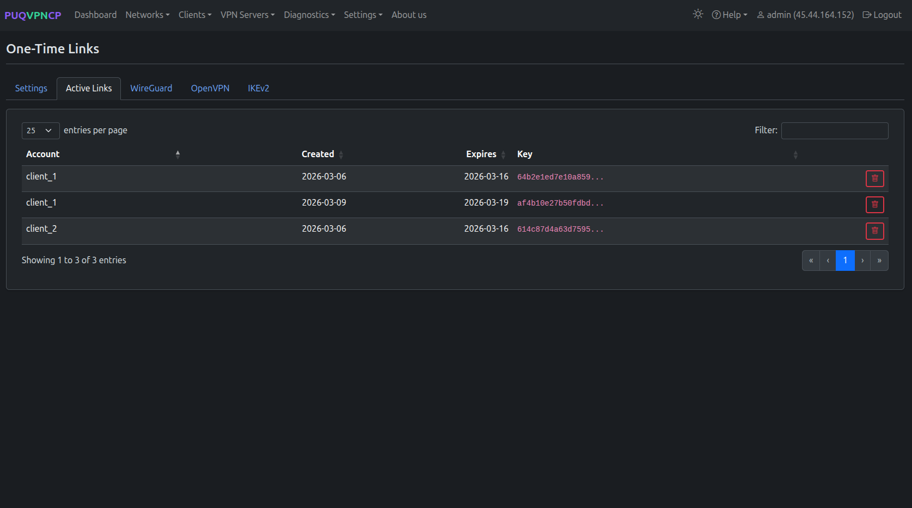
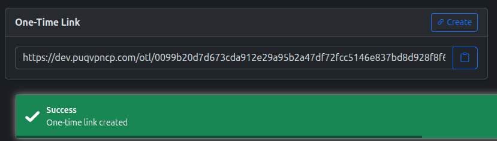
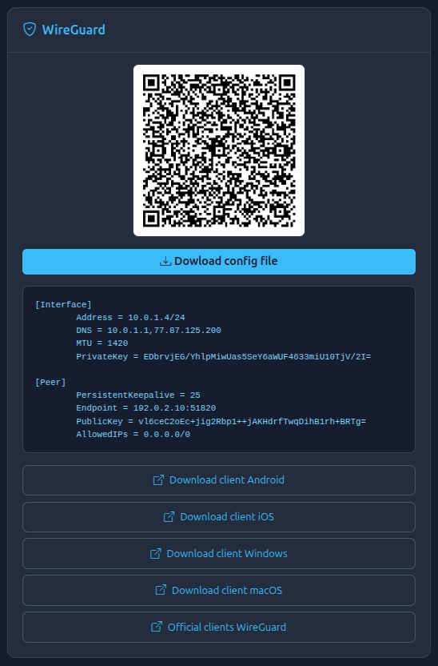
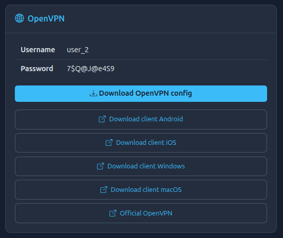
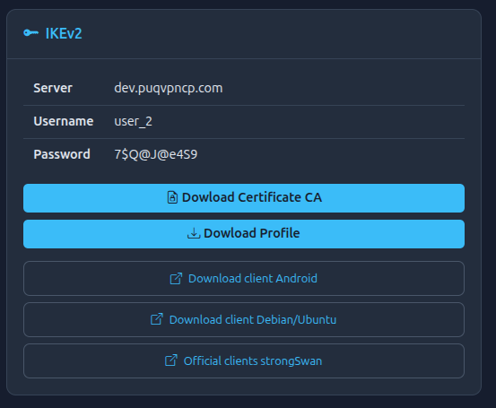

# One-Time Links

## Overview

**One-Time Links (OTL)** provide a self-service way for end users to download their VPN configuration files without accessing the admin panel. When a link is generated for a client, the user can:

- View VPN connection instructions
- Download WireGuard configuration and scan a QR code
- Download AmneziaWG obfuscated configuration and scan a QR code
- Download the OpenVPN `.ovpn` profile
- Download the IKEv2 `.sswan` profile
- See their credentials

Each link is a unique, cryptographically secure URL that can be used once or multiple times (configurable).

---

## OTL Configuration

Navigate to **Settings > One-time link**.

*One-Time Link configuration*

| Setting | Description |
|---------|-------------|
| **Enabled** | Enable/disable the OTL feature |
| **Expiration** | How long a link remains valid |
| **Max uses** | Number of times a link can be accessed (0 = unlimited) |

### Protocol-Specific Configuration

Configure what is shown on the OTL page for each protocol:

*OTL WireGuard page configuration*

*OTL AmneziaWG page configuration*

*OTL IKEv2 page configuration*

*OTL OpenVPN page configuration*

---

## Active Links

*Active one-time links*

The list shows all generated links with their creation date, client, and usage count.

---

## Generating a Link

Links can be generated from two places:

### From the Clients List

1. Go to **Clients > List of clients**
2. Click the **OTL** button on any client row

### From the Client Edit Page

1. Open any client for editing
2. In the **One-Time Link** section, click **Create**

*One-time link created for a client*

Copy the URL and send it to the end user. They will see a branded page with their VPN configuration for all enabled protocols.

---

## End User Experience

When the user opens the OTL URL, they see a clean, modern self-service interface with tabs for each enabled VPN protocol. The user can download client apps, configurations, credentials, and scan mobile QR codes.

### WireGuard

*One-Time Link — WireGuard view with scannable QR code, config download, and official client links (Android, iOS, Windows, macOS)*

### AmneziaWG (Anti-Censorship)

*One-Time Link — AmneziaWG view with obfuscated parameters, QR code, and AmneziaWG client links*

### OpenVPN

*One-Time Link — OpenVPN view with user credentials and downloadable profile*

### IKEv2

*One-Time Link — IKEv2 view with server hostname, credentials, Root CA certificate, `.sswan` profile, and strongSwan client links*

---
