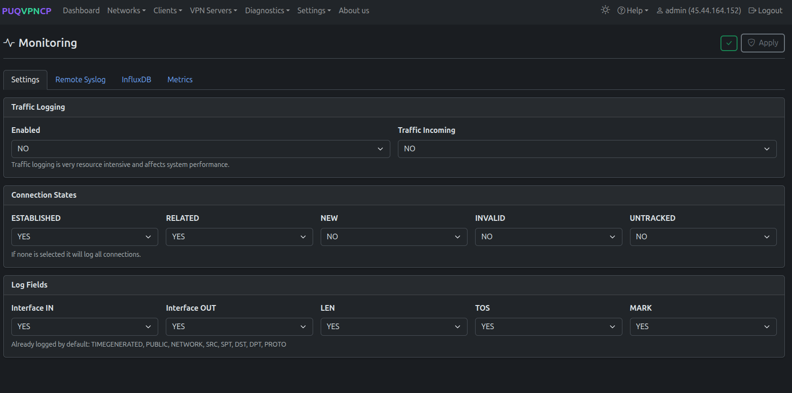
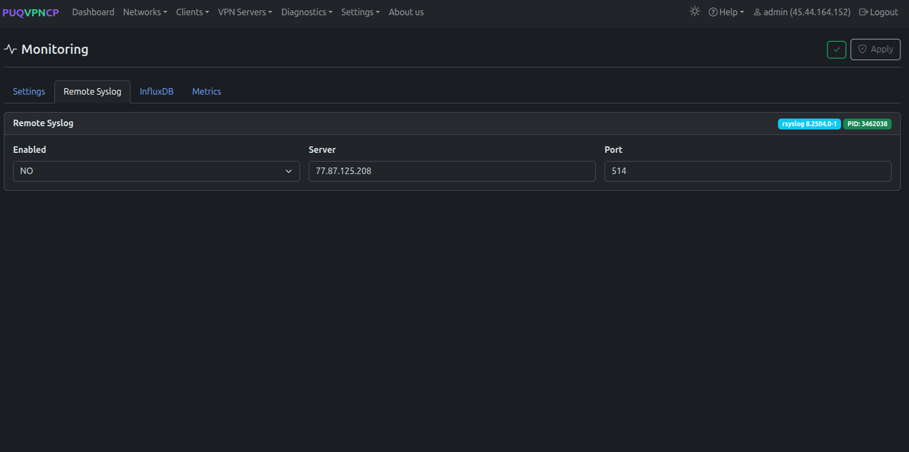
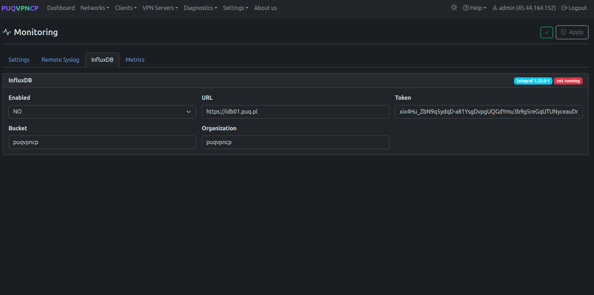
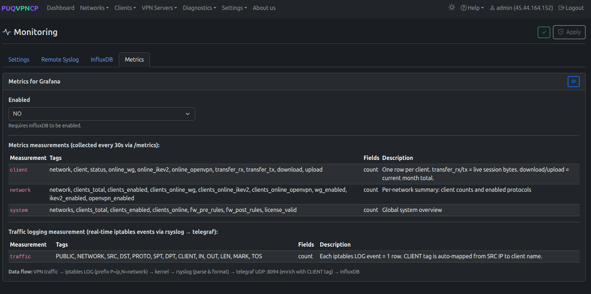
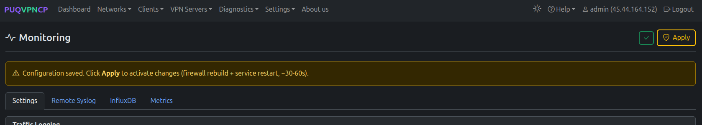
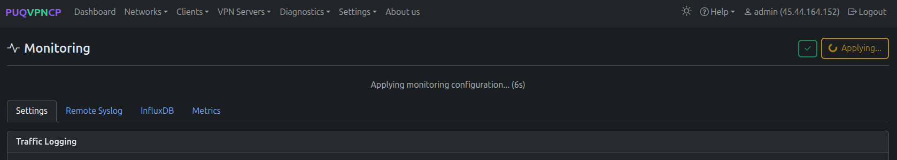
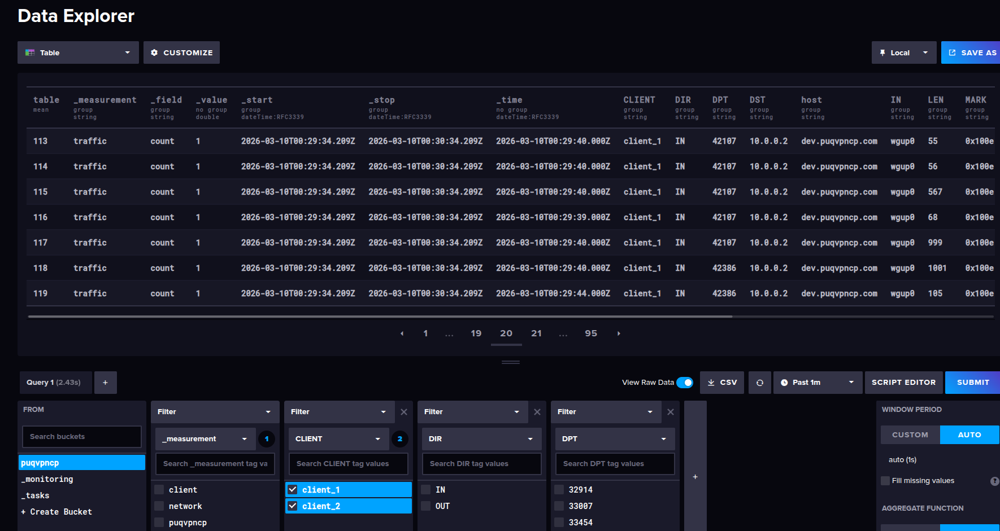

# Monitoring

## Overview

PUQVPNCP provides comprehensive traffic monitoring:

- **Built-in traffic statistics** — per-client and per-network, stored in local JSON files
- **rsyslog integration** — iptables traffic logging via syslog
- **InfluxDB export** — push metrics to InfluxDB for Grafana dashboards
- **Prometheus-compatible metrics** — HTTP metrics endpoint

---

## Configuration

Navigate to **Settings > Monitoring**.

### Traffic Logging

*Monitoring configuration — traffic logging*

| Setting | Description |
|---------|-------------|
| **Logging** | Enable iptables traffic logging via rsyslog |
| **Log format** | Log format template |

### Remote Syslog

*Remote syslog configuration*

Forward traffic logs to a remote syslog server for centralized logging.

### InfluxDB

*InfluxDB configuration*

| Setting | Description |
|---------|-------------|
| **Enabled** | Enable InfluxDB export |
| **URL** | InfluxDB server URL (e.g., `https://idb01.example.com`) |
| **Token** | Authentication token |
| **Organization** | InfluxDB organization |
| **Bucket** | Target bucket |

### Metrics Endpoint

*Metrics endpoint configuration*

Enable a Prometheus-compatible HTTP metrics endpoint at `http://127.0.0.1:8098/metrics`.

---

## Monitoring Status

*Monitoring services status*

Shows the current state of all monitoring components:
- rsyslog service status
- telegraf service status
- InfluxDB connection status
- Metrics endpoint status

After changing monitoring settings and clicking **Save**, the configuration is applied with a countdown:

*Applying monitoring configuration*

---

## Grafana Integration

Connect Grafana to your InfluxDB instance to create custom VPN dashboards.

*Example Grafana dashboard with VPN traffic metrics*

### Available Metrics

| Metric | Description |
|--------|-------------|
| **client_download_bytes** | Per-client download traffic |
| **client_upload_bytes** | Per-client upload traffic |
| **network_download_bytes** | Per-network download traffic |
| **network_upload_bytes** | Per-network upload traffic |
| **online_wireguard** | WireGuard online peer count |
| **online_openvpn** | OpenVPN connected session count |
| **online_ikev2** | IKEv2 active SA count |

---
