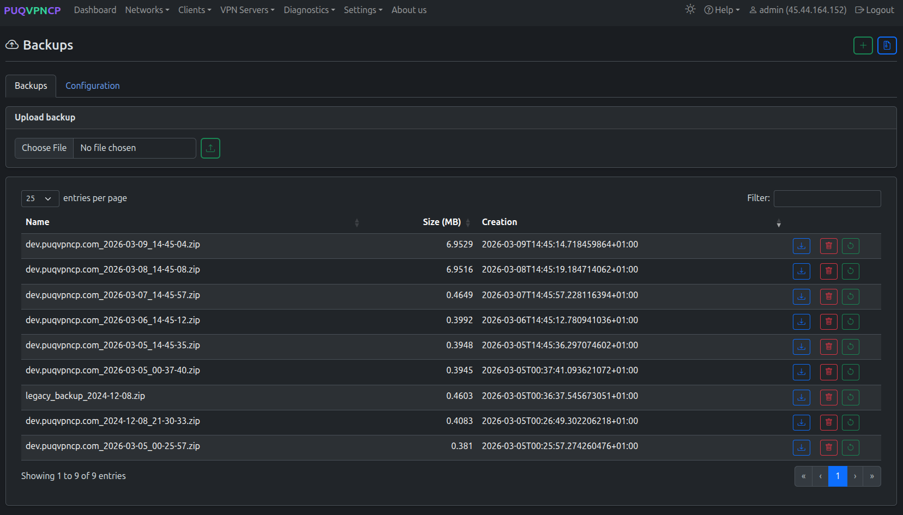
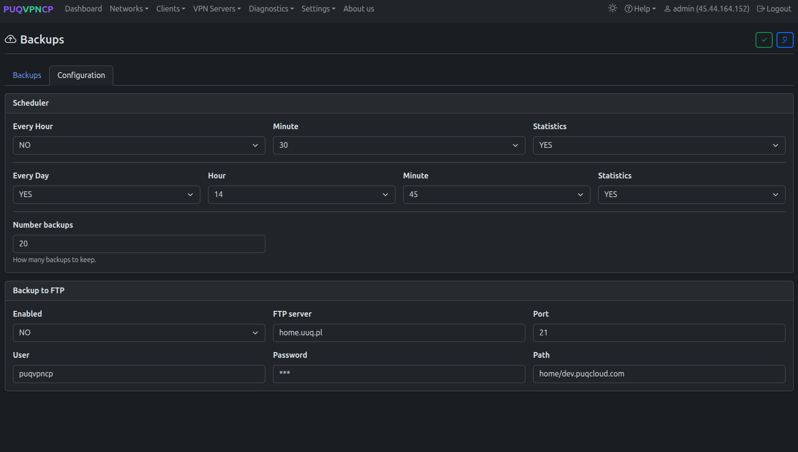

# Backups

## Overview

PUQVPNCP provides automatic and manual backup/restore functionality with optional FTP upload for offsite storage.

---

## Backup List

Navigate to **Settings > Backups**.

*Backup list with create, restore, download, and delete actions*

Each backup includes:
- All network and client configurations
- WireGuard keys, OpenVPN certificates, IKEv2 certificates
- Firewall rules, DNS settings, system configuration
- Traffic statistics data
- User accounts, permissions, API tokens

### Actions

| Action | Description |
|--------|-------------|
| **Create** | Create a new backup immediately |
| **Restore** | Restore the server to the backup state |
| **Download** | Download the backup archive |
| **Delete** | Delete the backup file |
| **Upload** | Upload a backup file |

---

## Backup Configuration

*Backup scheduler configuration*

### Automatic Backups

| Setting | Description |
|---------|-------------|
| **Hourly** | Enable/disable hourly backups |
| **Daily** | Enable/disable daily backups |
| **Daily time** | Time for daily backup (e.g., `14:45`) |
| **Max backups** | Maximum number of backups to keep (oldest are deleted) |

### FTP Backup

| Setting | Description |
|---------|-------------|
| **FTP Backup** | Enable/disable FTP upload after each backup |
| **FTP Server** | FTP server address |
| **FTP Port** | FTP port (default: 21) |
| **FTP Username** | FTP login |
| **FTP Password** | FTP password |
| **FTP Directory** | Remote directory for backups |

> **Tip:** Use **Test FTP** button to verify the FTP connection before enabling automatic uploads.

---

## Restoring a Backup

1. Go to **Settings > Backups**
2. Click **Restore** on the desired backup
3. Confirm the restore operation
4. The system will reload automatically after restoration

> **Warning:** Restoring a backup overwrites all current configurations and data. Create a backup of the current state before restoring.

---
