# System Settings


## System Users

Navigate to **Settings > System users**.

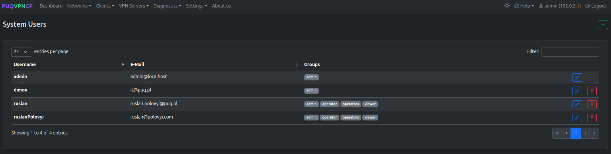
*System users list*

PUQVPNCP supports multiple administrator accounts with role-based access control.

### Adding a User

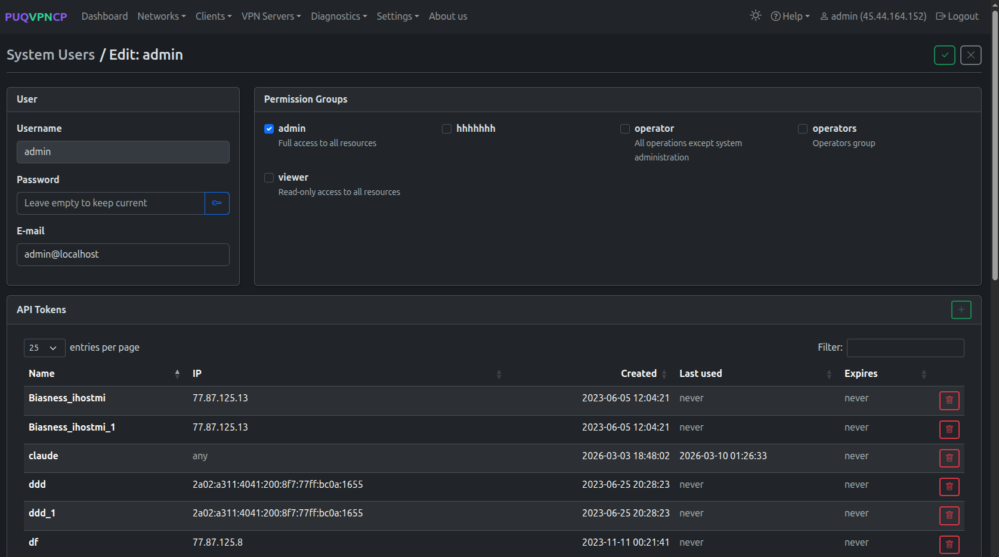
*Add a new system user*

| Field | Description |
|-------|-------------|
| **Username** | Unique login name |
| **Email** | User email |
| **Password** | Account password |
| **Groups** | Permission groups assigned to this user |

### Editing a User

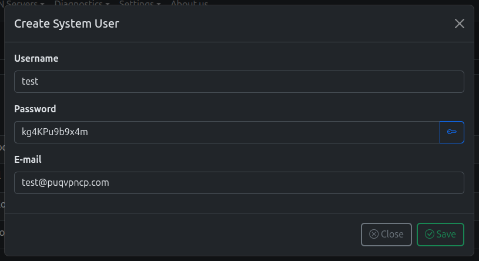
*Edit system user*

---

## Permission Groups

Navigate to **Settings > Permission groups**.

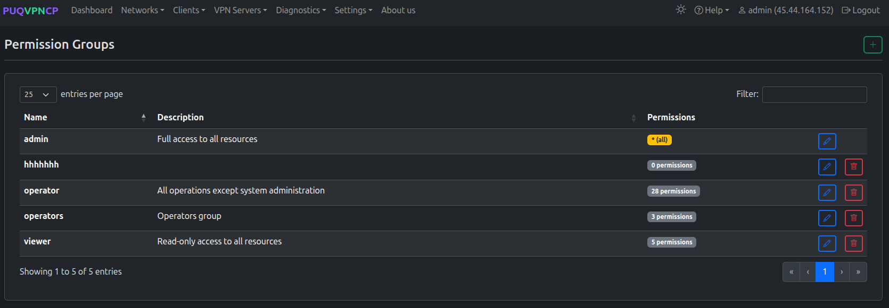
*Permission groups list*

Permission groups define what actions a user can perform. PUQVPNCP includes 36+ granular permissions across 17 resource categories.

### Default Groups

| Group | Access Level |
|-------|-------------|
| **admin** | Full access to everything |
| **operator** | All operations except system settings |
| **viewer** | Read-only access to all pages |

### Creating a Custom Group

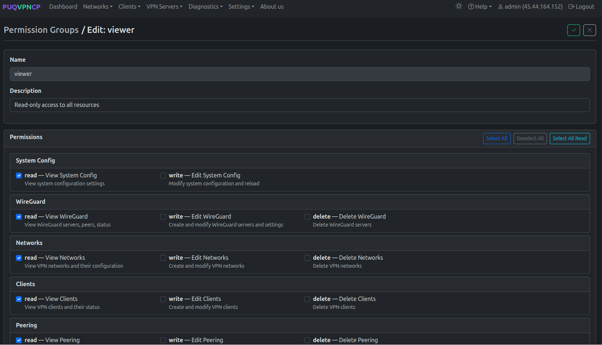
*Create a new permission group*

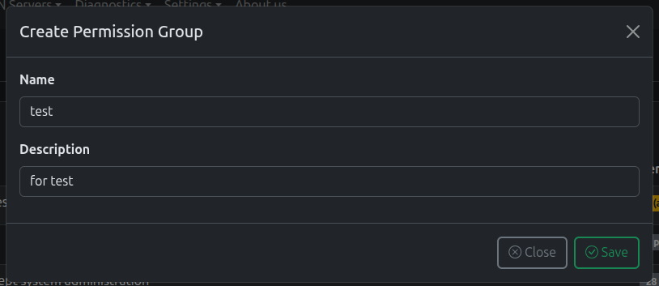
*Edit permission group — select permissions by resource*

Permissions are organized by resource:

| Resource | Permissions |
|----------|-------------|
| **system_config** | read, write |
| **wireguard** | read, write |
| **amneziawg** | read, write |
| **network** | read, write |
| **client** | read, write |
| **peering** | read, write |
| **account** | read, write |
| **openvpn** | read, write |
| **ikev2** | read, write |
| **diagnostics** | read, write |
| **firewall** | read, write |
| **dns** | read, write |
| **otl** | read, write |
| **traffic (Monitoring)** | read, write |
| **backups** | read, write |
| **license** | read, write |
| **api_tokens** | read, write |
| **system_users** | read, write |
| **permission_groups** | read, write |

---

## API Tokens

Navigate to **Settings > API Tokens**.

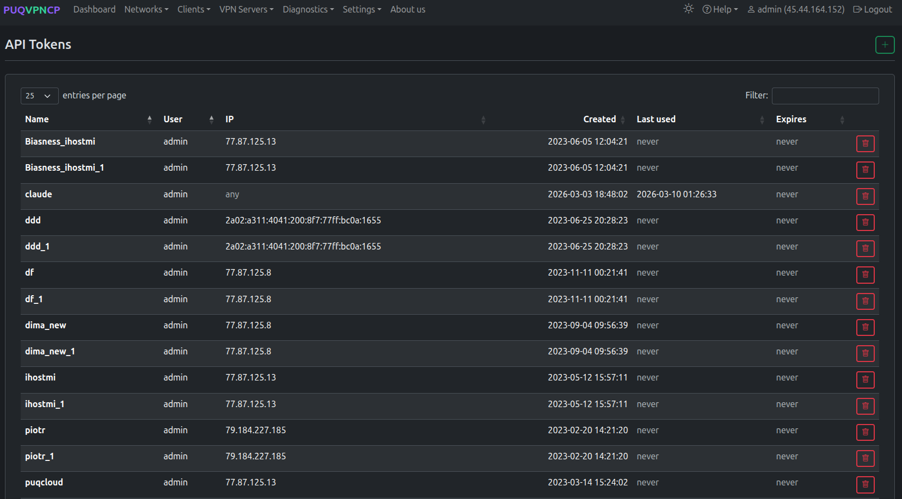
*API tokens list*

API tokens provide programmatic access to the REST API without using session cookies.

### Creating a Token

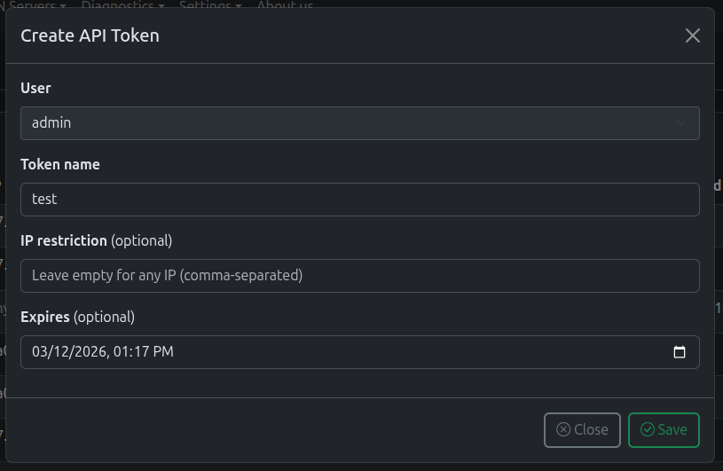
*Create a new API token*

| Field | Description |
|-------|-------------|
| **Name** | Token description |
| **Username** | The user this token belongs to (inherits permissions) |
| **Allowed IP** | Restrict token to a specific IP (empty = any) |
| **Expires At** | Token expiration date (empty = never) |

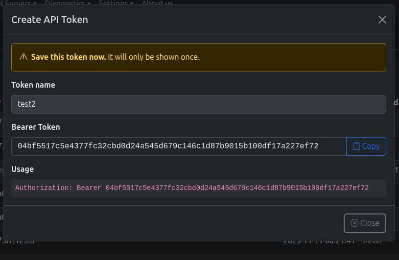
*Token created — copy the token now, it won't be shown again*

> **Important:** The token value is shown only once. Copy it immediately after creation.

### Usage

Include the token in the `Authorization` header:

```bash
curl -sk https://vpn.example.com/api/v1/system/status \
  -H "Authorization: Bearer YOUR_TOKEN_HERE"
```

---

## Environment Check

Navigate to **Settings > Environment**.

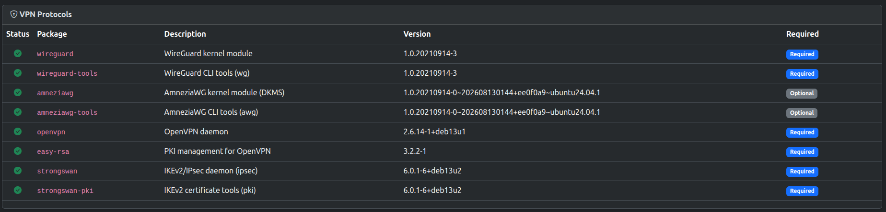
*Environment check — verify all required packages*

The Environment page scans for all required and optional system packages:

- **VPN Protocols** — wireguard, amneziawg, openvpn, easy-rsa, strongswan
- **Network & Firewall** — iproute2, iptables, ipset
- **DNS** — bind9, bind9-utils
- **Monitoring** — rsyslog, telegraf
- **Security** — openssl
- **System Utilities** — procps, uuid-runtime, bash, grep, gawk
- **Network Configuration** — ifupdown2 (Debian) or netplan.io (Ubuntu)

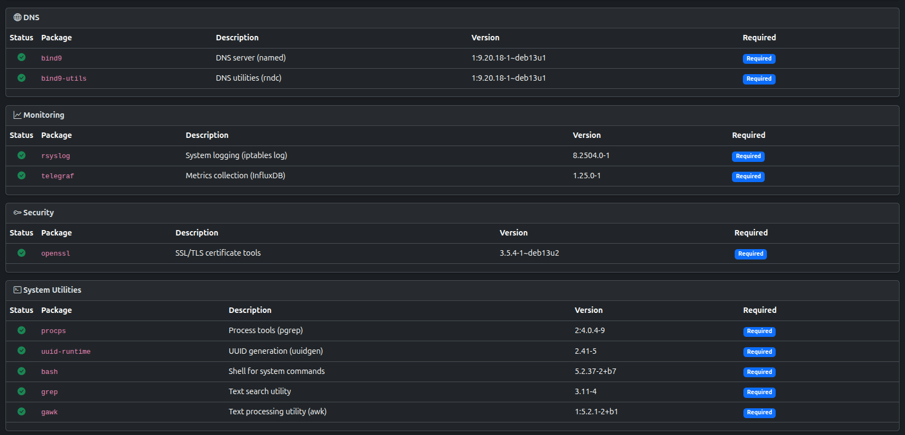
*Environment check — DNS, Monitoring, Security, System Utilities*

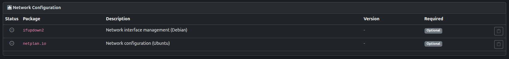
*Environment check — Network Configuration (ifupdown2 / netplan.io)*

Missing packages are highlighted and can be installed via the system package manager.

---

## About Us & Project Support

Navigate to **About us** in the top navigation bar.

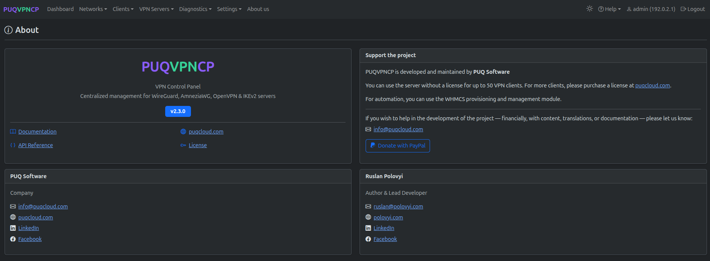
*About Us — licensing information, WHMCS provisioning module integration, and support links*

The About page displays project license limits (up to 50 VPN clients without license, unlimited with license from puqcloud.com), integration options including the official WHMCS provisioning module, and links to documentation and support.

