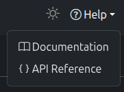
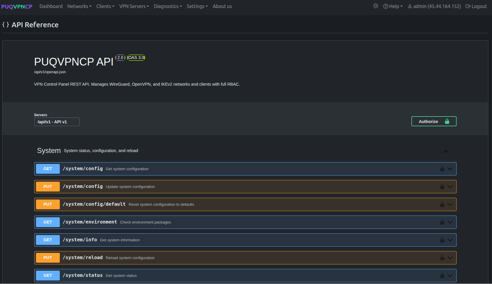

# REST API


## Overview

PUQVPNCP provides a comprehensive REST API with **240+ endpoints** covering all panel functionality. The API uses JSON for requests and responses.

---

## Authentication

All API endpoints require authentication via Bearer token:

```bash
curl -sk https://vpn.example.com/api/v1/system/status \
  -H "Authorization: Bearer YOUR_TOKEN_HERE"
```

Create API tokens in **Settings > API Tokens**. See [System Settings](17-system-settings.md) for details.

---

## Base URL

```
https://your-server.com/api/v1/
```

---

## OpenAPI / Swagger Documentation

PUQVPNCP includes built-in interactive API documentation.

### Swagger UI

Navigate to the **API** page in the web interface to access Swagger UI.


*Swagger UI — interactive API documentation*


*Swagger UI — endpoint groups*

### OpenAPI Spec

The OpenAPI 3.0 JSON specification is available at:

```
https://your-server.com/api/v1/openapi.json
```

This endpoint does not require authentication and can be imported into Postman, Insomnia, or any OpenAPI-compatible tool.

---

## API Endpoint Groups

| Group | Endpoints | Description |
|-------|-----------|-------------|
| **System** | 8 | Status, info, reload, config, environment |
| **Networks** | 11 | CRUD + suggested data + keys regeneration |
| **Clients** | 17 | CRUD + online clients + config/QR per protocol |
| **Peering** | 3 | CRUD for peering rules |
| **WireGuard** | 17 | Server config + settings + keys + clients list |
| **AmneziaWG** | 18 | Server config, settings, client keys & profiles, obfuscation parameters, magic headers, QR codes |
| **OpenVPN** | 12 | Server config + clients list |
| **IKEv2** | 13 | Server config + clients list |
| **Upstreams** | 10 | CRUD + connect/disconnect + import |
| **Firewall** | 12 | Settings + pre/post rules CRUD |
| **DNS** | 2 | Config GET/PUT |
| **One-Time Links** | 12 | Config + links CRUD per protocol |
| **Monitoring** | 4 | Config, status, metrics |
| **Backups** | 9 | List, create, restore, config, FTP |
| **License** | 3 | Save, delete, check |
| **API Tokens** | 4 | CRUD |
| **Permission Groups** | 5 | CRUD + registry |
| **System Users** | 6 | CRUD + profile |
| **Diagnostics** | 5 | Protocol logs (WG, AWG, OpenVPN, IKEv2, firewall, system), info, TC stats |

---

## Response Format

### Success Response

```json
{
  "result": "OK",
  "message": "Operation completed successfully",
  "data": { ... }
}
```

### Error Response

```json
{
  "result": "ERROR",
  "message": "Descriptive error message",
  "errors": {
    "field_name": "Validation error for this field"
  }
}
```

---

## Common API Examples

### Get System Status

```bash
curl -sk https://vpn.example.com/api/v1/system/status \
  -H "Authorization: Bearer TOKEN"
```

### List All Networks

```bash
curl -sk https://vpn.example.com/api/v1/network \
  -H "Authorization: Bearer TOKEN"
```

### Create a Client

```bash
curl -sk -X POST https://vpn.example.com/api/v1/client \
  -H "Authorization: Bearer TOKEN" \
  -H "Content-Type: application/json" \
  -d '{
    "name": "new_client",
    "username": "user1",
    "password": "SecurePass123",
    "network": "office_vpn",
    "status": "Enable",
    "bandwidth_download": 10,
    "bandwidth_upload": 5
  }'
```

### Get Client WireGuard Config

```bash
curl -sk https://vpn.example.com/api/v1/client/new_client/wireguard \
  -H "Authorization: Bearer TOKEN"
```

### Get Client AmneziaWG Config

```bash
curl -sk https://vpn.example.com/api/v1/client/new_client/amneziawg/config \
  -H "Authorization: Bearer TOKEN"
```

### Reload System

```bash
curl -sk -X POST https://vpn.example.com/api/v1/system/reload \
  -H "Authorization: Bearer TOKEN"
```

---

## Integration

The API enables integration with:

- **WHMCS** — automated VPN provisioning for hosting clients
- **Billing systems** — create/suspend/delete clients via API
- **Monitoring systems** — pull metrics and status
- **Custom portals** — build your own user-facing VPN management interface
- **Automation scripts** — batch client creation, network management

---
