# Diagnostics

## Overview

The **Diagnostics** section provides real-time monitoring, log viewing, and system integrity checking across all VPN protocols, traffic control, monitoring services, and the panel itself.

Navigate to **Diagnostics** in the main menu to access the following pages:

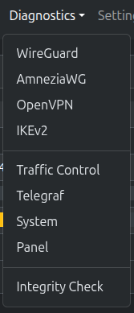
*Diagnostics dropdown menu*

| Page | Description |
|------|-------------|
| **WireGuard** | WireGuard service status, `wg show` output, kernel logs |
| **AmneziaWG** | AmneziaWG service status, `awg show` output, kernel logs |
| **OpenVPN** | OpenVPN service status, certificates, instances, connection events, auth log, server logs |
| **IKEv2** | strongSwan service status, certificates, `ipsec statusall` output, IKEv2 logs |
| **Traffic Control** | Overview of TC classes, per-interface bandwidth statistics with live throughput |
| **Telegraf** | Telegraf service status, InfluxDB output config, inputs, Telegraf logs |
| **System** | Server uptime, memory, disk usage, network interfaces, system logs |
| **Panel** | PUQVPNCP application log viewer (`puqvpncp.log`) |
| **Integrity Check** | Full system integrity audit — verifies firewall rules, ipset, routing, TC classes, interfaces |

> **Permission:** All diagnostics pages require the `diagnostics:read` permission. Integrity Check requires `firewall:read` (audit) and `firewall:write` (fix).

All log viewers feature:
- **Auto-refresh** every 3 seconds
- **Pause / Resume** button to stop auto-refresh
- **Line count selector** (50, 100, 200, 500 lines)
- **Color-coded** log entries (errors in red, warnings in yellow, connections in green)

---

## WireGuard

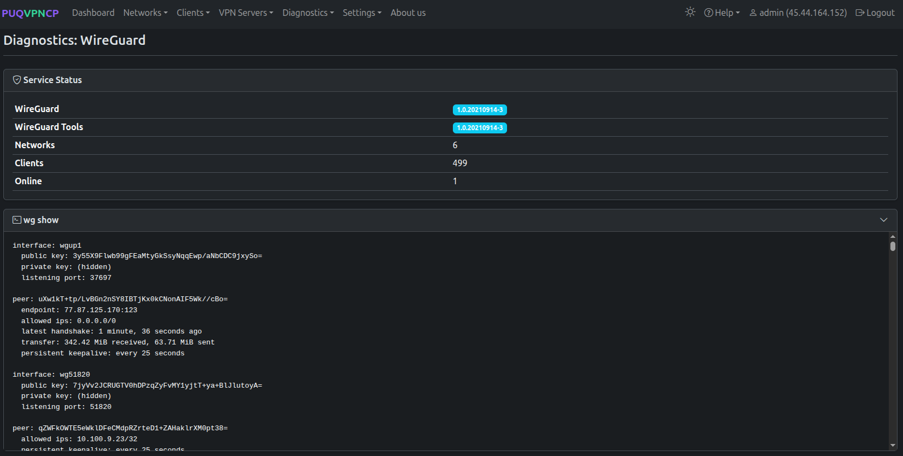
*Diagnostics: WireGuard — service status, wg show, kernel logs*

### Service Status

| Field | Description |
|-------|-------------|
| **WireGuard** | Installed WireGuard kernel module version |
| **WireGuard Tools** | Installed `wireguard-tools` package version |
| **Networks** | Number of WireGuard-enabled networks |
| **Clients** | Total number of WireGuard clients |
| **Online** | Number of currently connected WireGuard peers |

If WireGuard or WireGuard Tools are not installed, or no networks are configured, a warning alert is displayed with instructions.

### wg show

Displays the raw output of the `wg show` command — the standard WireGuard status tool. Shows all active WireGuard interfaces with their public keys, listening ports, and connected peers with handshake times and transfer statistics.

This section is collapsible. Click the header to expand/collapse.

### WireGuard Kernel Logs

Displays WireGuard-related kernel messages from `journalctl`. These logs show low-level WireGuard events such as interface creation, peer handshake failures, and kernel module messages.

---

## AmneziaWG

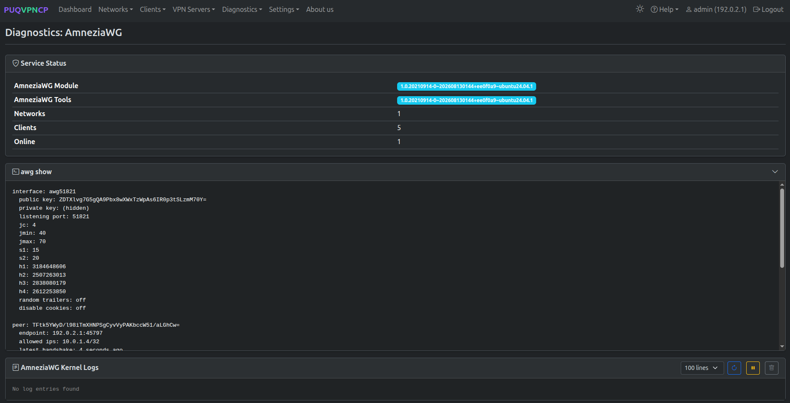
*Diagnostics: AmneziaWG — service status, awg show, and kernel logs*

### Service Status

| Field | Description |
|-------|-------------|
| **AmneziaWG** | Installed AmneziaWG kernel module (DKMS) version |
| **AmneziaWG Tools** | Installed `amneziawg-tools` package CLI version (`awg`) |
| **Networks** | Number of AmneziaWG-enabled networks |
| **Clients** | Total number of AmneziaWG clients |
| **Online** | Number of currently connected AmneziaWG peers |

If AmneziaWG or AmneziaWG Tools are not installed, or no networks are configured, an informative warning alert is displayed with repository and package installation instructions (`add-apt-repository -y ppa:amnezia/ppa && apt-get update && apt-get install -y amneziawg amneziawg-tools`).

### awg show

Displays the raw output of the `awg show` command — the standard AmneziaWG status tool. Shows all active AmneziaWG interfaces with obfuscation parameters (`Jc`, `Jmin`, `Jmax`, `S1`, `S2`, `H1`, `H2`, `H3`, `H4`), public keys, listening ports, and connected peers with handshake times and transfer statistics.

This section is collapsible. Click the header to expand/collapse.

### AmneziaWG Kernel Logs

Displays AmneziaWG-related kernel messages from `journalctl`. These logs show low-level AmneziaWG events such as interface creation, handshake negotiations, and kernel module messages.

---

## OpenVPN

### Service Status and Certificates

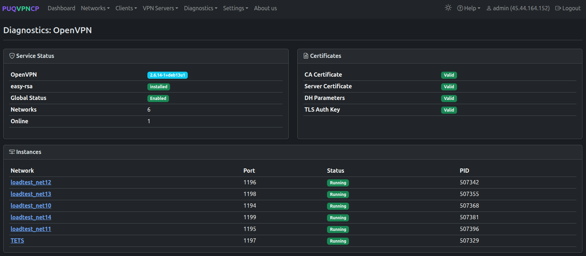
*Diagnostics: OpenVPN — service status, certificates, instances*

The page displays two cards side by side:

**Service Status:**

| Field | Description |
|-------|-------------|
| **OpenVPN** | Installed OpenVPN package version |
| **easy-rsa** | Installed easy-rsa package version |
| **Global Status** | Whether OpenVPN is globally enabled or disabled |
| **Networks** | Number of OpenVPN-enabled networks |
| **Online** | Number of currently connected OpenVPN clients |

**Certificates:**

| Field | Description |
|-------|-------------|
| **CA Certificate** | Root CA certificate status (Valid / Not generated / Invalid) |
| **Server Certificate** | Server TLS certificate status |
| **DH Parameters** | Diffie-Hellman parameters status |
| **TLS Auth Key** | HMAC authentication key status |

### Instances

Shows a table of all OpenVPN network instances:

| Column | Description |
|--------|-------------|
| **Network** | Network name (link to network edit page) |
| **Port** | UDP/TCP port for this instance |
| **Status** | Running (green) or Stopped (red) |
| **PID** | Process ID (if running) |

Each OpenVPN-enabled network runs as a separate `openvpn` process with its own PID file.

### Connection Events

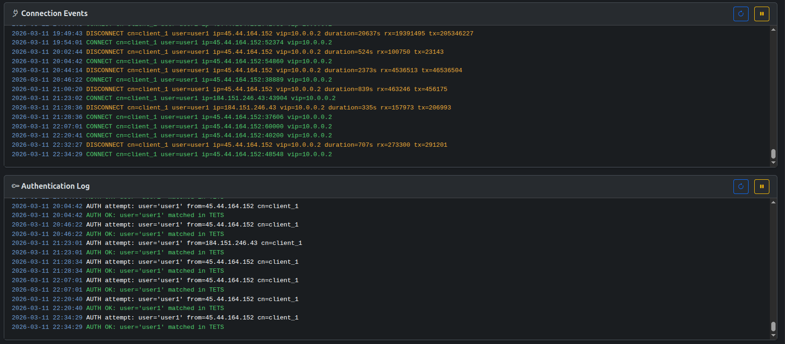
*Diagnostics: OpenVPN — connection events and authentication log*

Displays the OpenVPN connection log (`/etc/openvpn/puqvpncp/logs/connections.log`). Shows client connect and disconnect events with color coding:
- **Green** — `CONNECT` events
- **Yellow** — `DISCONNECT` events

### Authentication Log

Displays the OpenVPN authentication log (`/etc/openvpn/puqvpncp/logs/auth.log`). Shows authentication attempts with color coding:
- **Green** — `AUTH OK` events
- **Red** — `AUTH FAILED` or `AUTH ERROR` events

### Server Logs

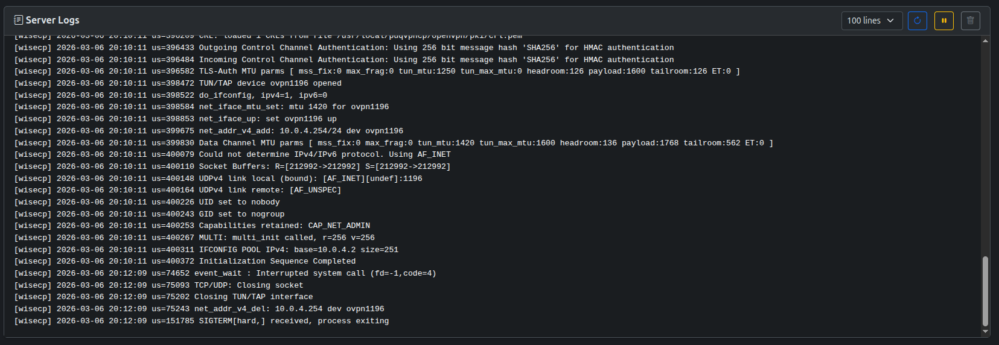
*Diagnostics: OpenVPN — server logs from all network instances*

Displays combined server logs from all OpenVPN network instances (`/etc/openvpn/puqvpncp/logs/*.log`). Each log line is prefixed with the network name in square brackets (e.g., `[net1] ...`).

---

## IKEv2

### Service Status and Certificates

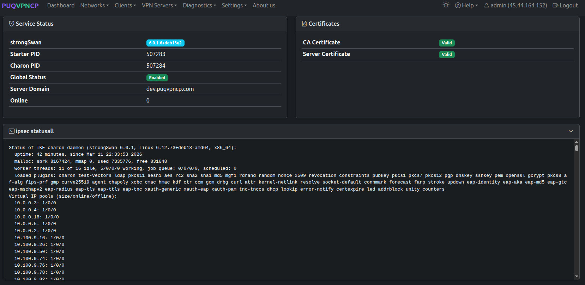
*Diagnostics: IKEv2 — service status, certificates, ipsec statusall*

The page displays two cards side by side:

**Service Status:**

| Field | Description |
|-------|-------------|
| **strongSwan** | Installed strongSwan version |
| **Starter PID** | PID of the strongSwan starter process |
| **Charon PID** | PID of the IKE daemon (charon) |
| **Global Status** | Whether IKEv2 is globally enabled or disabled |
| **Server Domain** | Domain configured for IKEv2 server certificates |
| **Online** | Number of currently connected IKEv2 clients |

**Certificates:**

| Field | Description |
|-------|-------------|
| **CA Certificate** | Root CA certificate status (Valid / Not generated / Invalid) |
| **Server Certificate** | Server certificate status |

### ipsec statusall

Displays the raw output of the `ipsec statusall` command — the standard strongSwan status tool. Shows detailed information about:
- IKE charon daemon status (version, uptime, memory, threads, plugins)
- Virtual IP pools with size/online/offline counters
- Active security associations (SAs)
- Connection definitions

This section is collapsible.

### IKEv2 / strongSwan Logs

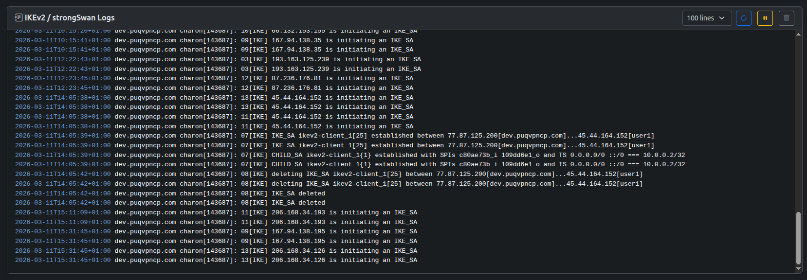
*Diagnostics: IKEv2 — strongSwan logs*

Displays strongSwan logs from `journalctl`. Shows IKE negotiation events, connection establishments, certificate validations, and authentication messages. The system tries `strongswan` unit first, then falls back to `charon` syslog tag.

---

## Traffic Control

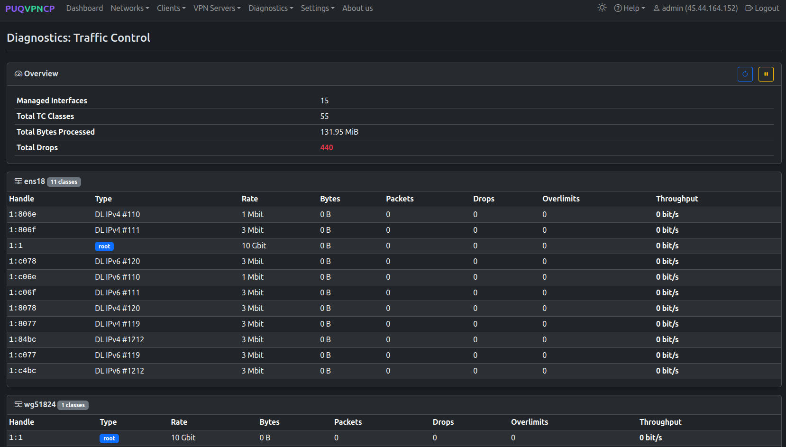
*Diagnostics: Traffic Control — overview and per-interface TC classes*

### Overview

| Field | Description |
|-------|-------------|
| **Managed Interfaces** | Total number of network interfaces with TC rules |
| **Total TC Classes** | Total number of HTB traffic control classes across all interfaces |
| **Total Bytes Processed** | Sum of all bytes processed by TC classes |
| **Total Drops** | Sum of all dropped packets (highlighted in red if > 0) |

The overview auto-refreshes every 2 seconds.

### Per-Interface Tables

Below the overview, each managed interface is displayed as a separate card showing all its TC classes:

| Column | Description |
|--------|-------------|
| **Handle** | TC class handle (e.g., `1:806e`) |
| **Type** | Class type — `root` for the root class, or direction + protocol (e.g., `DL IPv4 #110`, `UL IPv6 #119`) |
| **Rate** | Configured bandwidth rate |
| **Bytes** | Total bytes processed by this class |
| **Packets** | Total packets processed |
| **Drops** | Dropped packets (highlighted in red if > 0) |
| **Overlimits** | Overlimit events (highlighted in yellow if > 0) |
| **Throughput** | Real-time throughput calculated from byte deltas between refreshes |

Interfaces include:
- **Gateway interfaces** (e.g., `ens18`) — main server network interfaces
- **WireGuard interfaces** (e.g., `wg51824`) — per-network WireGuard tunnel interfaces
- **OpenVPN interfaces** (e.g., `ovpn1197`) — per-network OpenVPN tunnel interfaces
- **Upstream interfaces** (e.g., `wgup1`) — upstream WireGuard tunnel interfaces

---

## Telegraf

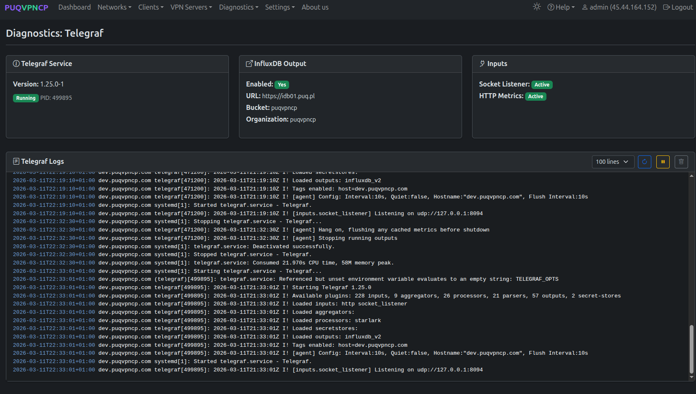
*Diagnostics: Telegraf — service status, InfluxDB config, inputs, logs*

### Service Info

Three cards are displayed:

**Telegraf Service:**

| Field | Description |
|-------|-------------|
| **Version** | Installed Telegraf version |
| **Status** | Running (with PID) or Stopped |

**InfluxDB Output:**

| Field | Description |
|-------|-------------|
| **Enabled** | Whether InfluxDB output is enabled |
| **URL** | InfluxDB server URL |
| **Bucket** | InfluxDB bucket name |
| **Organization** | InfluxDB organization |

**Inputs:**

| Field | Description |
|-------|-------------|
| **Socket Listener** | Whether the Unix socket input is active (receives metrics from PUQVPNCP) |
| **HTTP Metrics** | Whether the HTTP metrics endpoint is active |

### Telegraf Logs

Displays Telegraf service logs from `journalctl` with color coding:
- **Red** — Error messages (`E!`)
- **Yellow** — Warning messages (`W!`)
- **Gray** — Debug messages (`D!`)

---

## System

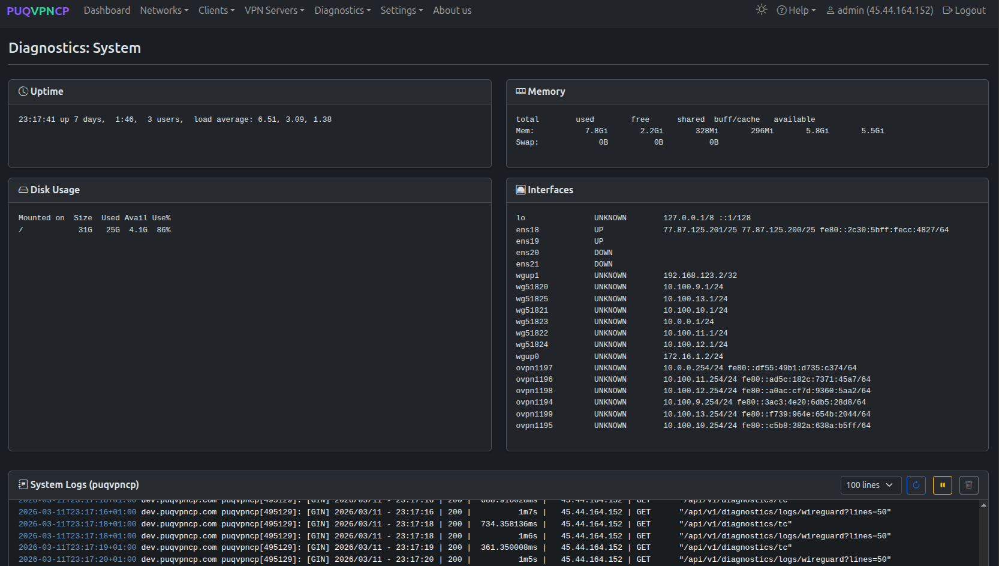
*Diagnostics: System — uptime, memory, disk usage, interfaces*

### System Info Cards

Four cards are displayed:

**Uptime** — output of the `uptime` command showing server uptime, number of users, and load averages.

**Memory** — output of `free -h` showing total, used, free, shared, buffers/cache, and available memory for both RAM and swap.

**Disk Usage** — output of `df -h` showing mounted filesystem, size, used space, available space, and usage percentage for the root partition.

**Interfaces** — output of `ip -br addr` showing all network interfaces with their status (UP/DOWN) and assigned IP addresses. Includes physical interfaces, WireGuard interfaces, OpenVPN tunnel interfaces, and upstream tunnels.

### System Logs (puqvpncp)

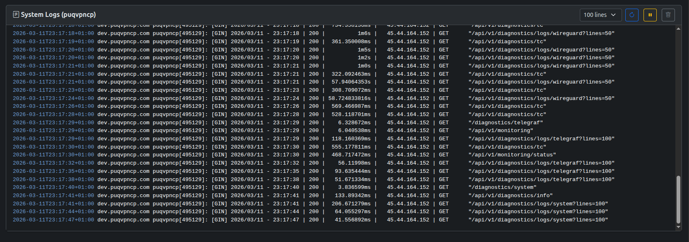
*Diagnostics: System — PUQVPNCP system logs*

Displays PUQVPNCP service logs from `journalctl` (syslog tag `puqvpncp`). Shows application events such as API requests, system operations, network changes, and service lifecycle events.

---

## Panel Log

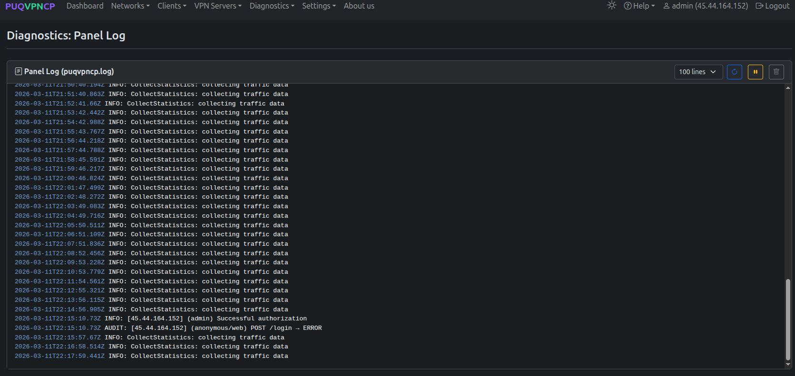
*Diagnostics: Panel Log — puqvpncp.log viewer*

Displays the PUQVPNCP application log file (`puqvpncp.log` in the configured `LogDir` directory, default `/var/log/puqvpncp/`).

This is the application's own log file (separate from journalctl system logs). Log entries are color-coded by level:
- **Red** — `ERROR:` messages
- **Yellow** — `WARN:` messages
- **Gray** — `DEBUG:` messages
- **Normal** — `INFO:` messages

The log format is: `timestamp LEVEL: message` (e.g., `2026-03-11T17:18:00.000Z INFO: ReloadNetworks: setting iptables`).

---

## Integrity Check

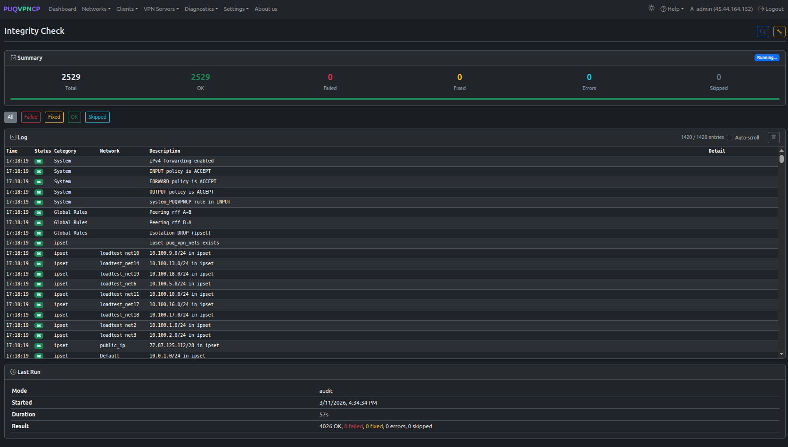
*Integrity Check — summary, log table, and last run info*

The Integrity Check performs a comprehensive audit of the entire PUQVPNCP system configuration. It verifies that all firewall rules, routing tables, ipset entries, traffic control classes, and network interfaces are correctly configured and match the expected state.

### Running a Check

Two buttons are available in the page header:

| Button | Description |
|--------|-------------|
| **Audit** (magnifying glass) | Run a read-only audit — checks all rules and reports issues without making changes |
| **Audit & Fix** (wrench) | Run an audit and automatically fix any issues found |

The check runs in the background. Results stream in real-time via Server-Sent Events (SSE), with automatic polling fallback if SSE disconnects.

### Summary

The summary card shows counters for each check result:

| Counter | Color | Description |
|---------|-------|-------------|
| **Total** | — | Total number of checks performed |
| **OK** | Green | Checks that passed |
| **Failed** | Red | Checks that failed (in audit mode, these need fixing) |
| **Fixed** | Yellow | Checks that were failed but successfully repaired (fix mode only) |
| **Errors** | Blue | Checks where the fix was applied but still failing |
| **Skipped** | Gray | Checks that were skipped (e.g., ipset not installed, mangle overflow) |

A progress bar shows the proportion of each result type.

### Filter Buttons

Filter the log table by status:
- **All** — show all entries
- **Failed** — show failed, fixed, error, and skipped entries (default)
- **Fixed** — show only fixed entries
- **OK** — show only passed entries
- **Skipped** — show only skipped entries

### Log Table

| Column | Description |
|--------|-------------|
| **Time** | Timestamp of the check |
| **Status** | Result badge (OK / FAILED / FIXED / ERROR / SKIPPED) |
| **Category** | Check category (see below) |
| **Network** | Network and/or client name (if applicable) |
| **Description** | What was checked |
| **Detail** | Additional information (e.g., "Fixed", error message) |

### Check Categories

The integrity check performs 9 phases, covering all aspects of the system:

| Category | Phase | What is Checked |
|----------|-------|-----------------|
| **System** | 1 | IPv4 forwarding enabled, INPUT/FORWARD/OUTPUT chain policies, system_PUQVPNCP rule |
| **Global Rules** | 2 | Pre-filter rules, peering ACCEPT rules (A→B, B→A), intra-network ACCEPT, isolation DROP (ipset), post-filter rules |
| **ipset** | 3 | `puq_vpn_nets` ipset exists, each network subnet is a member |
| **Chains** | 4 | Per-network chains exist in filter (`PQ_`), nat SNAT (`PQN_`), nat DNAT (`PQD_`), mangle (`PQM_`) — plus jump rules from built-in chains |
| **NAT** | 5 | SNAT rules for each network's upstream IP |
| **Mangle** | 5 | Per-client mangle marks for download (dst) and upload (src) traffic |
| **Network Rules** | 5 | Route ACCEPT rules for custom routes |
| **Policy Routing** | 6 | Upstream WG tunnel `ip rule` / `ip route table`, WG/OpenVPN fwmark-based policy routing |
| **CONNMARK** | 7 | WG and OpenVPN CONNMARK rules in PREROUTING (mangle) |
| **Traffic Control** | 8 | Root HTB qdisc on gateway, VPN, and upstream interfaces; per-client TC classes |
| **Interfaces** | 9 | WireGuard interfaces are UP, upstream WG tunnel interfaces are UP |

### Last Run

The **Last Run** card shows information about the most recent integrity check:

| Field | Description |
|-------|-------------|
| **Mode** | `audit` or `fix` |
| **Started** | When the check started |
| **Duration** | How long the check took |
| **Result** | Summary of OK, failed, fixed, errors, and skipped counts |

---
