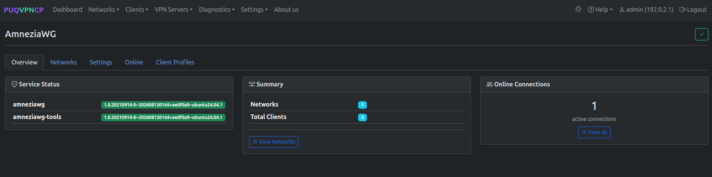
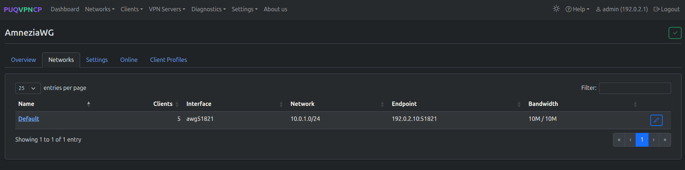
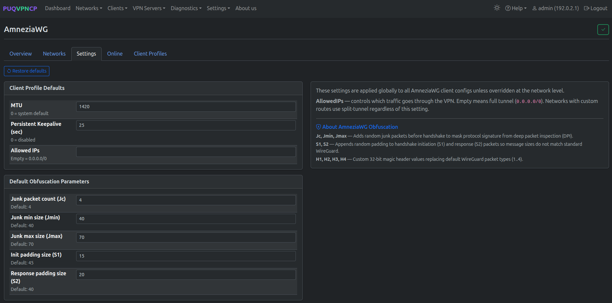
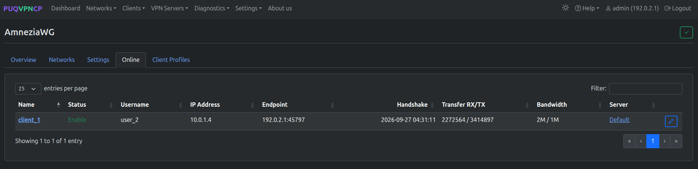
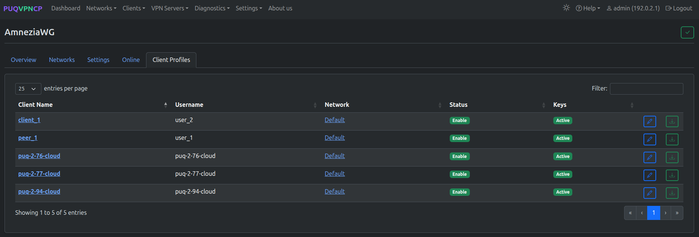
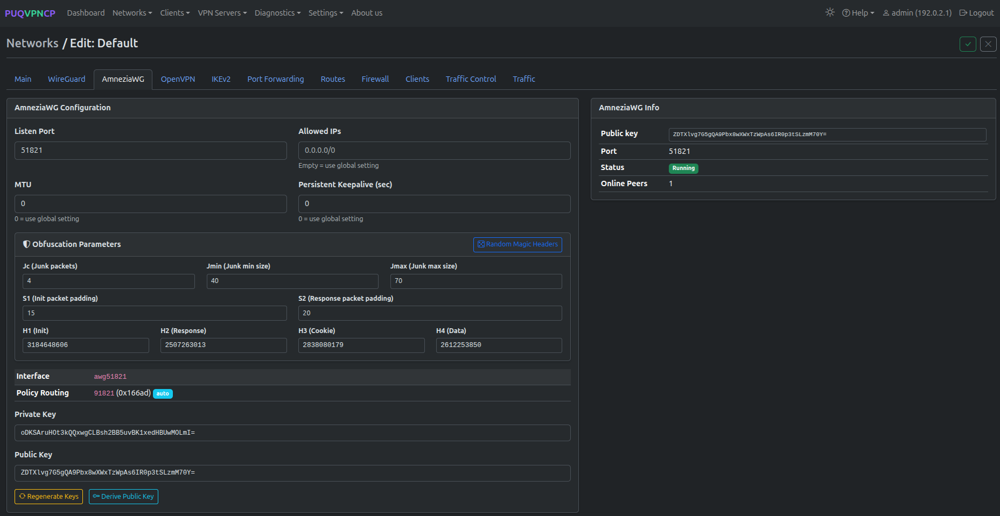
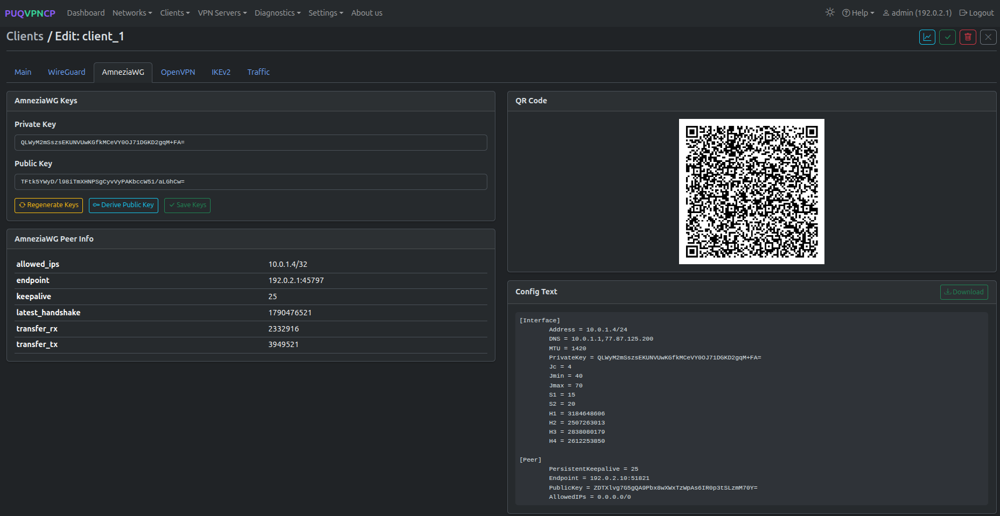
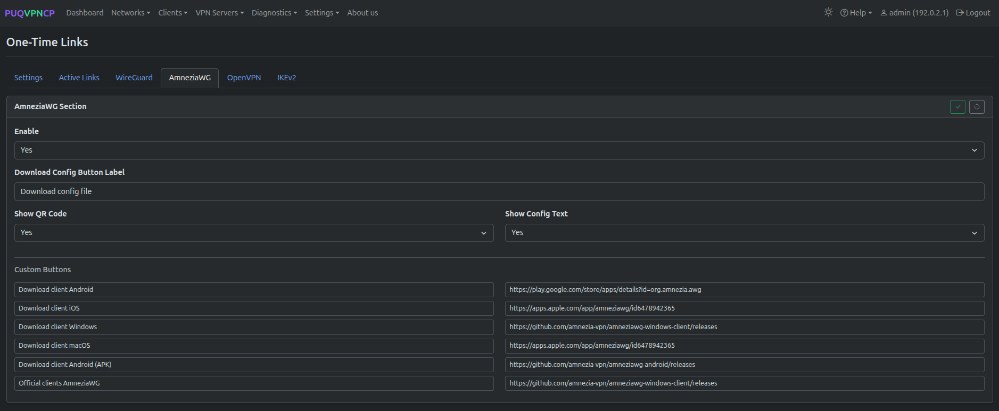
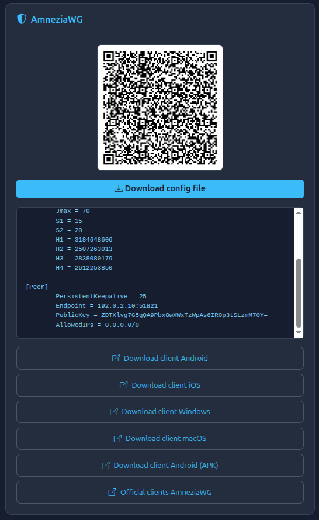

# AmneziaWG (Anti-Censorship)


## Overview

**AmneziaWG** is a specialized fork of WireGuard designed to evade Deep Packet Inspection (DPI) and strict internet censorship systems. While standard WireGuard has easily detectable packet signatures, AmneziaWG obfuscates traffic while retaining WireGuard's speed and performance.

### Key Capabilities

- **Header Obfuscation** — randomizes message headers (H1, H2, H3, H4) so DPI firewalls cannot detect WireGuard handshakes or data packets
- **Junk Packet Injection** — sends random junk packets (Jc count, within Jmin–Jmax byte size) before connection initiation to confuse DPI pattern analyzers
- **Variable Junk Packet Sizes** — custom sizes for initiation junk (S1) and response junk (S2)
- **High Performance** — runs with kernel module speed (`amneziawg`), offering WireGuard throughput with anti-censorship resistance
- **Cross-Platform Clients** — supported on Windows, macOS, Linux, Android, and iOS via Amnezia VPN client applications

> **Requirement:** `amneziawg` (kernel module or DKMS) and `amneziawg-tools` packages must be installed on the host. Check via **Settings > Environment**.

### Installation

AmneziaWG requires the kernel module (`amneziawg-dkms`) and CLI tools (`amneziawg-tools`). Choose the instructions corresponding to your operating system:

#### Debian (11 / 12 / 13)

> **Important for Debian:** AmneziaWG is compiled on your server as a kernel module via DKMS. On Debian, DKMS requires kernel headers (`linux-headers-$(uname -r)`) and build tools (`build-essential`). Without them, the DKMS build will fail.

Copy and run the complete installation block as root:

```bash
# 1. Install build tools, DKMS, and current kernel headers
apt-get update && apt-get install -y build-essential dkms linux-headers-$(uname -r)

# 2. Add the official Amnezia PPA repository keyring and source
mkdir -p /etc/apt/keyrings && curl -fsSL "https://keyserver.ubuntu.com/pks/lookup?op=get&search=0x75C9DD72C799870E310542E24166F2C257290828" | gpg --dearmor --yes -o /etc/apt/keyrings/amnezia.gpg
echo "deb [signed-by=/etc/apt/keyrings/amnezia.gpg] https://ppa.launchpadcontent.net/amnezia/ppa/ubuntu noble main" > /etc/apt/sources.list.d/amnezia.list

# 3. Install the DKMS module and tools
apt-get update && apt-get install -y amneziawg-dkms amneziawg-tools

# 4. Load the kernel module
modprobe amneziawg
```

#### Ubuntu (22.04 / 24.04 LTS)

**Option 1: Using `add-apt-repository` (standard):**

```bash
add-apt-repository -y ppa:amnezia/ppa
apt-get update && apt-get install -y amneziawg-dkms amneziawg-tools
modprobe amneziawg
```

**Option 2: Using GPG keyring (minimal systems):**

```bash
mkdir -p /etc/apt/keyrings && curl -fsSL "https://keyserver.ubuntu.com/pks/lookup?op=get&search=0x75C9DD72C799870E310542E24166F2C257290828" | gpg --dearmor --yes -o /etc/apt/keyrings/amnezia.gpg
echo "deb [signed-by=/etc/apt/keyrings/amnezia.gpg] https://ppa.launchpadcontent.net/amnezia/ppa/ubuntu noble main" > /etc/apt/sources.list.d/amnezia.list
apt-get update && apt-get install -y amneziawg-dkms amneziawg-tools
modprobe amneziawg
```

#### Verification

Verify that the module has been compiled and loaded into the kernel:

```bash
# Check DKMS compilation status (should show 'installed')
dkms status

# Check that the kernel module is active
lsmod | grep amneziawg

# Check that the awg CLI utility is available
awg --version
```

#### Troubleshooting DKMS Compilation & Kernel Updates

If `dkms status` shows `added` or `error`, or if you upgrade the system kernel:

```bash
apt-get install -y build-essential dkms linux-headers-$(uname -r)
dpkg-reconfigure amneziawg-dkms
modprobe amneziawg
```

> **Note on DNS / resolvconf:** If you run `awg-quick` manually and receive `/usr/bin/awg-quick: resolvconf: command not found`, install `openresolv`:
> ```bash
> apt-get install -y openresolv
> ```

Navigate to **VPN Servers > AmneziaWG** to access AmneziaWG management. The page provides 5 tabs: Overview, Networks, Settings, Online, and Client Profiles.

---

## Obfuscation Parameters Explained

| Parameter | Default | Description |
|-----------|---------|-------------|
| **H1** | Random | Header type for handshake initiation packets |
| **H2** | Random | Header type for handshake response packets |
| **H3** | Random | Header type for cookie reply packets |
| **H4** | Random | Header type for data transport packets |
| **Jc** | 4 | Number of junk packets injected before handshake (1–128) |
| **Jmin** | 40 | Minimum byte size of junk packets |
| **Jmax** | 70 | Maximum byte size of junk packets |
| **S1** | 15 | Initiation packet junk size in bytes |
| **S2** | 20 | Response packet junk size in bytes |

Each network can inherit the global defaults or define custom obfuscation values to match specific ISP bypass requirements.

---

## Overview Tab



The Overview tab displays:

| Card | Description |
|------|-------------|
| **Service Status** | Installed `amneziawg` kernel module and `amneziawg-tools` package versions |
| **Summary** | Total number of AmneziaWG networks and clients configured |
| **Online Connections** | Real-time count of connected AmneziaWG peers with live bandwidth stats |

---

## Networks Tab



Lists all networks that have AmneziaWG enabled:

| Column | Description |
|--------|-------------|
| **Name** | Network name (link to network edit page) |
| **Clients** | Number of AmneziaWG clients in this network |
| **Interface** | Interface name (e.g., `awg51821`) |
| **Network** | Subnet assigned to this network |
| **Endpoint** | Server IP and UDP port for AmneziaWG client connections |
| **Bandwidth** | Upload / download bandwidth limits |

---

## Settings Tab



Global defaults for AmneziaWG client profiles:

- **Default MTU** — interface MTU (recommended: 1420 or 1280 for mobile networks)
- **Persistent Keepalive** — interval in seconds to keep NAT sessions active (default: 25s)
- **AllowedIPs** — default route pushed to clients (default: `0.0.0.0/0, ::/0`)
- **Global Junk Settings** — default Jc, Jmin, Jmax, S1, S2 values

---

## Online Peers Tab



Shows real-time connected peers with active session data:
- **Client Name & Username** — client identity
- **IP Address & Endpoint** — assigned tunnel IP and client remote IP:port
- **Latest Handshake** — timestamp of most recent successful handshake
- **Transfer RX/TX** — live byte counters
- **Bandwidth** — configured bandwidth limit for the client

---

## Client Profiles Tab



Lists all configured AmneziaWG client profiles across networks, indicating network membership, activation status, and cryptographic key status.

---

## Network Configuration



When configuring AmneziaWG inside a network:
- **Listen Port** — UDP port on which AmneziaWG listens
- **Allowed IPs** — IP ranges routed through the tunnel
- **MTU & Persistent Keepalive** — per-network overrides
- **Obfuscation Parameters** — custom H1–H4 headers and Jc/Jmin/Jmax/S1/S2 values

---

## Client Configuration & QR Codes



In the client management page, enabling AmneziaWG automatically generates:
1. Standard cryptographic keys adapted for AmneziaWG
2. Obfuscation parameters embedded into client `.conf`
3. QR code for instant mobile setup via AmneziaWG apps on iOS and Android

---

## One-Time Links (OTL) for AmneziaWG



Administrators can configure the AmneziaWG download page on One-Time Links, setting custom button labels and download links for all supported platforms (Android, iOS, Windows, macOS).



The end-user sees a clean, self-service page with QR code, configuration preview, config file download button, and direct app store links to the official AmneziaWG clients.

